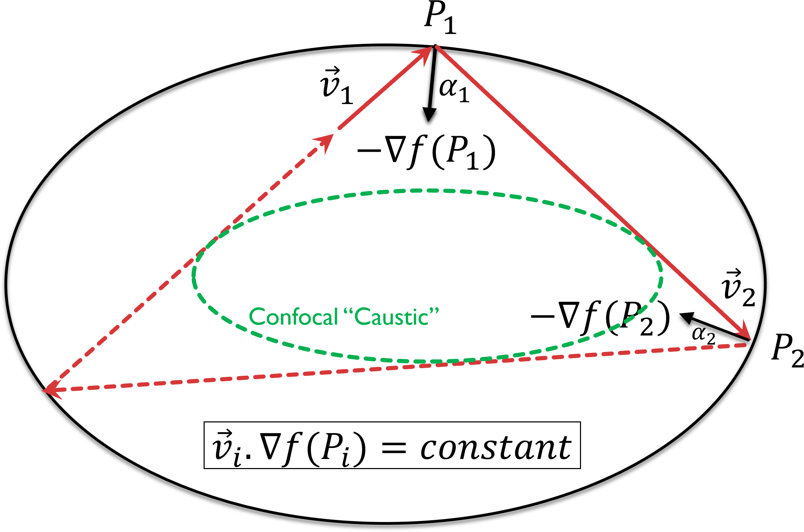
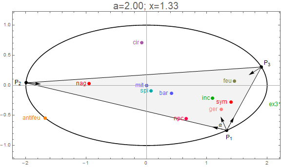
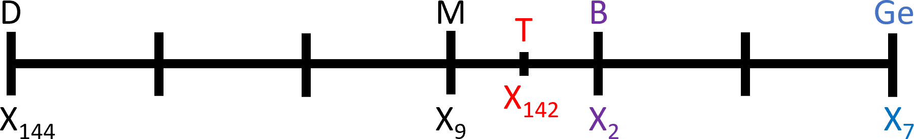

--- 
title: "Appendices for Elliptic Billards and Family of Orbits"
author: Dan Reznik, Ronaldo Garcia, Jair Koiller
date: August, 2019
output:
    bookdown::html_document2:
      theme: readable
      css: style.css
      toc_depth: 1
      toc: true
      toc_float:
        toc_collapsed: true
        smooth_scroll: yes
      fig_caption: yes
      highlight: haddock
      keep_md: yes
      number_sections: yes
link-citations: yes
bibliography:  ["elliptic_billiards_v2.bib","media.bib"]
csl: computer.csl
---

# Presentation

Below we provide the Appendices to "Properties of Triangular (and Polygonal) orbits in Elliptic Billiards" available [here](index.html).

# Geometry of Conservation in Elliptic Billiards

* The equation of an ellipse and its gradient:

* The law of reflection:

* The Joachimsthal Conservation Law

# Jacobi and Poncelet's Porism

Did Jacobi think of elliptic billiards to prove Poncelet's Porism?

It was a cold starry Friday night in Könisberg, 28 of December 1838. Karl-Gustav Jacobi was writing a note to Friedrich Wilhelm Bessel, the leading astronomer of Prussia, twenty years his senior, boasting:

>The day before yesterday, I reduced to quadrature the problem of geodesic lines on an ellipsoid with three unequal axes. They are the simplest formulas in the world, Abelian integrals, which become the well-known elliptic integrals if 2 axes are set equal. [@jacobi1839]

The short paper he published [@jacobi1839] is said to mark the birth of *Integrable Hamiltonian Systems*. He further developed his ideas, now called the Hamilton-Jacobi method, in the 1842-3 winter lectures [@jacobi1884]. A few years later, Carl Neumann [@neumann1859] and others  found other special yet interesting mechanical problems solvable by separation of variables.

Had Jacobi made the smaller axis of the ellipsoid go to zero, he would have gotten an explicit integration of the elliptic billiard, in planar confocal coordinates, exactly the same Euler used for his solution to the fixed two centers' problem. But Jacobi did not care about doing it. Most likely what he wanted was to impress his mentor, which was also a geodesist, and of course Gauss, who could only find geodesics for an ellipsoid of revolution.

At that time mathematicians could not justify an addiction to *billiards*. This changed  after Birkhoff's Acta Mathematica 1927 paper [@birkhoff1927], where he further developed geometric ideas from Poincaré.

Ten years before the starry night where he found the geodesic curves of the triaxial ellipsoid, Jacobi was developing the foundations of elliptic functions. He then published a paper [@jacobi1849], where he used addition properties of his (then) new functions on two geometric problems: Steiner's and Poncelet's Porisms.

## Integrable Systems are Porismatic

It is common knowledge that an $n$-degree-of-freedom Hamiltonian system is *integrable* if one can always find local coordinates $(I_1, \cdots, I_n, \theta_1, \cdots \theta_n), \,  \theta_i  \equiv \theta_i + 2\pi$ in which the Hamiltonian becomes only a function of the $I_j$. The coordinates are known as *action angles* and the $I_j$'s are constants of motion.

Trajectories wind invariant tori (called Lagrangian) with frequencies  $\omega_j = \partial H/\partial I_j$. For $n$=2, if the ratio  $\omega_1 / \omega_2 = p/q$ is rational, the torus is called *resonant* because all trajectories are periodic and of the same period. Taking $(p,q)=1$, the fundamental period $T = 2\pi p/\omega_1 = 2\pi q/\omega_2$. They all wind around  $p$ times in  $\theta_1$ and $q$ times in   $\theta_2$.

If this is not a *Porism*, what is? Most frequency pairs  $\left(\omega_1,\omega_2\right)$ are not rationally related, but if a single trajectory is closed, all others in the same torus will also be closed, with the *same* period. Trajectories in an elliptic billiard are polygonal, but they  are in fact projections of winding curves in Lagrangian tori. The nice coordinates for this problem are the confocal conic coordinates. Poncelet's Porism can be derived as a consequence of the fact that any pair of conics, say two nested ellipses, can be obtained by a projective transformation from two confocal ones. The oldest reference we found was [@darboux1870]. Darboux attributes to Chasles the proof that all closed trajectories of the same type have the same length. But as we saw this is also an immediate consequence of integrability.

# Experimental Method

Computer-aided experimental geometry [@grozdev17] is an effective tool for identifying properties of geometric objects.

## Methodology

Our approach has been mostly simulation/synthetic, using Mathematica [@mathematica_v10] and more recently the [p5.js](https://p5js.org/) package. We wrote interactive simulations with which to render the loci of *triangular centers* [@mw] of triangular orbits, e.g., the centroid, the incenter, etc. Using [R](https://www.r-project.org/) and the [tidyverse](https://www.tidyverse.org/) package, we "scraped" hundreds of trilinear equations [@mw] from Kimberling's Encyclopedia of Triangular Centers [@etc], where centers are identified as $X_i$: $X_{1}$ for the incenter, $X_{2}$ for the barycenter, etc.

All of our simulation code and some interactive applets are available on a separate [webpage](videos.html). This exploration led us to the following observations, some old, some new:

A key simulation tool is the closed-form expression for the cosine of the exit angle $\alpha$ (with respect to the normal) which produces a 3-gon orbit [@ronaldo19]:

$$
\cos(\alpha) = \frac{A^2 \sqrt{2\delta-A^2-1}}{\left(A^2-1\right) \sqrt{A^4-\left(A^2-1\right) {x_1}^2}}
(\#eq:cosa)
$$

Where $\delta = \sqrt{A^4-A^2+1}$, $A=a/b$ is the ratio of semiaxes, and the $x_1$ is the horizontal coordinate of the orbit's starting vertex. In turn, this allowed us to quickly parametrize an orbit by starting location and observe the distribution of its triangular centers:

## Exploring Non-Elliptic Loci

While certain triangular centers and/or points produce elliptic loci, others do not. Consider the figure below with several loci superimposed. Notice that while incenter (and excenters, not shown), Feuerbach, and extouch points do produce elliptic loci (shown dashed), intouchpoints and external Feuerbach points do not (shown solid). Surprisingly, even the *medians* (shown red) will trace higher-order loci.

Non-elliptic loci arise for example from (i) the intouch points (pedals of the contact triangle), shown in this [video](https://youtu.be/9xU6T7hQMzs, and (ii) external Feuerbach points (point of tangency of nine-point circle with the three excircles), shown in this [video](https://youtu.be/BBsyM7RnswA). A snapshot of the latter is reproduced below:

If we consider convex combinations of (i) barycenter-with-one-median, and (ii) incenter-with-one-touchpoint, e.g., as parametrized by $s$ in $(0,1)$ we observe a transition from a perfectly elliptic locus to a higher order curve:

Convex transitions of loci between a triangular center and one of its generating points can be viewed for:

* the barycenter $<=>$ Median and Incenter $<=>$ Intouchpoint, [video](https://youtu.be/3Gr3Nh5-jHs)
* Orthocenter $<=>$ Foot and Circumcenter $<=>$ Orbit Vertex, [video](https://youtu.be/HZFjkWD_CnE)
* Excenter $<=>$ Extouch point, [video](https://youtu.be/OD8Ah0hf8yQ)

## Webscraping Kimberling Centers

Using web-scraping techniques, we obtained trilinear equations for the first 100 Kimberling Centers [@etc] and for each center rendered loci for the orbit triangle and 7 derived triangles (medial, orthic, contact, excentral, ex-contact, anti-complement, ex-Feuerbach). We then placed plots in a single [webpage](loci_6tri.html) which became a tool to explore interesting phenomena in some 800 loci, showing the richness and non-linearity of the geometry obtainable. As an example consider the richness of loci for points $X(k),k=52,49,99$ produced by the orbit triangle and 7 triangles derived from it:

As we reviewed all curves we took notes about interesting phenomena which later pointed us to possible properties. As an example, here are a few notes obtained from a visual review of orbit and excenter loci only (referred below as $X(k)$ and $X'(k)$, respectively):

* $X'_{6}$, the excentral Symmedian, is congruent with $X_{9}$, the Mittenpunkt, and both loci are a point.
* $X_{9}$, the Mittenpunkt, fixed at the origin.
* $X_{11}$, the Feuerbach point, tracing the caustic.
* $X_{14}$, 2nd Isogonic, closely tracking the billiard.
* $X_{30}$, Euler Infinity Point, is the intersection of the Euler line with the line at infinity. Is there any interesting info here?
* $X_{37}$, the crosspoint of incenter and centroid, seem to generate identical perpendicular loci, with major semiaxis = $1/2$, i.e, one third of the original.
* $X'_{41}$ generates a nearly circular locus.
* $X'_{46}$ horizontal axis is exactly 1.
* $X_{49}$ has cusps.
* $X_{50}$ has lines to infinity at intriguing directions.
* $X'_{56}$ is an almost perfect circle, std. dev. of radius within 0.75% of its average.
* $X_{59}$ and $X'_{59}$ are marvelously self-intersecting.
* $X_{67}$ tracks the billiard.
* $X_{73}$ is diamond-shaped, though smooth.
* $X_{74}$ has north-south cusps.
* $X_{76}$ Brocard point ellipse is almost flat along $y$.
* $X_{77}$ nicely self-intersecting.
* $X_{87}$ nicely self-intersecting.
* $X_{88}$ locus = billiard.
* $X_{89}$ axes *almost* vanish, Mittenpunkt-style. Why?
* $X_{92}$ pillow-shaped, with north and south inward concavities.
* $X_{93}$ has interesting escape directions.
* $X_{94}$ has a high-order curvature function.
* $X_{94}$ has a very small, hourglass locus.
* $X_{99}$, the Steiner point, almost perfectly tracks the billiard. What is the reason for this close tracking?
* $X_{100}$, the anticomplement of the Feuerbach point, has the billiard as locus.

# Computing the *Circumbilliard*

Given a generic triangle $T=(P_1,P_2,P_3)$, it will be associated with a unique 
elliptic billiard $E_0$ that has $T$ as an *orbit*. We call $E_0$ T's *circumbilliard*, shown below (we know the Mittenpunkt $M=X_9$ must be at its center):

Let equation of $E_0$ be the points $(x,y)$ for which a 5-parameter quadric vanishes:

$$
E_0: f(x,y)=1 + c_1 x + c_2 y + c_3 x y + c_4 x^2 + c_5 y^2 = 0
$$

To solve for the parameters, consider the following 5 constraints. $E_0$ must pass through vertices $P_1,P_2,P_3$:

$$
f(P_i)=0,\,i=1,2,3
$$

The center of the conic (where the gradient vanishes) must coincide with the Mittenpunkt $X_9=(x_m,y_m)$:

$$
\begin{array}{cccc}
\frac{df}{dx}(x_m,y_m)&=&c_1+c_3 y_m+2c_4 x_m=0\\
\frac{df}{dy}(x_m,y_m)&=&c_2+c_3 x_m+2c_5 y_m=0\\
\end{array}
$$

The coordinates of $X_9=(x_m,y_m)$ can be obtained by converting its trilinears $\{b + c - a : c + a - b : a + b - c\}$ [@etc]to cartesian coordinates [@mw].

In turn the above produce the following 5x5 linear system:

$$
\left[
\begin{array}{ccccc}
x_1&y_1&x_1 y_1&x_1^2&y_1^2\\
x_2&y_2&x_2 y_2&x_2^2&y_2^2\\
x_3&y_3&x_3 y_3&x_3^2&y_3^2\\
1&0&y_m&2\,x_m&0\\
0&1&x_m&0&2\,y_m
\end{array}
\right] .
\left[\begin{array}{c}c_1\\c_2\\c_3\\c_4\\c_5\end{array}\right] =
\left[\begin{array}{c}-1\\-1\\-1\\0\\0\end{array}\right]
$$

Principal axes' directions are given by the eigenvectors and of the Hessian matrix $H$ (the jacobian of the gradient), whose entries only depend on $c_3$, $c_4$, and $c_5$:

$$
H = J(\nabla{f})=\left[\begin{array}{cc}2\,c_4&c_3\\c_3&2\,c_5\end{array}\right]
$$

The ratio of semiaxes' lengths is given by the square root of the ratio of $H$'s eigenvalues:

$$
a/b=\sqrt{\lambda_2/\lambda_1}
(\#eq:ratiolambda)
$$

Let $u=(u_x,y_y)$ be an eigenvector of $H$, and $M=(x_m,y_m)$ the aforecomputed center of the circumbilliard. The length of the semiaxis along $u$ is given by the distance $t$ which satisfies:

$$
f(M + t\,u) = 0
$$

This yields a two-parameter quadratic $d_0 + d_2 t^2$, where:

$$
\begin{array}{cll}
d_0 & = & 1 + c_1 m_x + c_4 m_x^2 + c_2 m_y + c_3 m_x m_y + c_5 m_y^2 \\ 
d_2 & = & c_4 u_x^2 + c_3 u_x u_y + c_5 u_y^2
\end{array}
$$

The length of the semi-axis associated with $u$ is then $t=\sqrt{-d_0/d_2}$. The other axis can be computed via \@ref(eq:ratiolambda).

This [video](https://youtu.be/vSCnorIJ2X8) shows a triangle with dynamically-varying vertices and the corresponding circumbilliard drawn around it, a snapshot of which is shown below:

## Compute any circumconic

To compute the circumconic centered on any point $P=(x_p,y_p)$, one can use the same method described above, substituting $M$ for the coordinates of $P$.

# Incenter and Barycenter Circumellipses

Circumconics $E_1$ and $E_2$ centered respectively on $X_1$ and $X_2$ are shown below, as well as the locus of their fourth intersection, viewable on this [video](https://youtu.be/PTkpvvsjqNc):

$E_1$ is the orbit's Steiner Circumellipse [@mw], least-area across all circumellipses. Apart from the orbit's vertices, $E_1\cap E_2$ intersect at a point $P^*$ whose locus can contain two lobes above a certain $a/b$. The line $X_{75}X_{77}$ passes through $P^*$.

Additional observations about the above include:

* $E_1$:
    - It intersects the billiard and the circumcircle at $X_{100}$, the anticomplement of the orbit's Feuerbach Point, shown as $\bar{F}$ [@etc].
    - Its axes have a constant ratio $\frac{e_1}{e_2}=\frac{-a^2+2+2\delta}{a^4(2 a^2-1+2\delta)}$.
    - Its axes are aligned with the billiard's over all orbits.
* $E_2$:
    - It intersects the billiard at $X_{190}$, the Yff Parabolic Point [@etc].
    - Its axes are related as $e_1 = c_0 + c_1 e_2$, with $c_0,c_1$ constant for all orbits.
    - Its axes are only aligned with the billiard when orbits are isosceles triangles (4 discrete cases).

# Proof Vertices of Contact Triangle of the Anticomplementary Lie on the Billiard

This proof is due to Prof Igor Minevich.

This fact has to do with the nine-point conic and the circumconic. The nine-point conic of the quadrangle $ABCH$ is the locus of the centers of all conics that go through the points $A,B,C$, and $H$; it goes through the midpoints of each the six sides formed by drawing segments between any 2 vertices of the quadrangle, and also through the three points $D = AB.CH$, $E = AC.BH$, and $F = BC.AH$, where "." represents intersection.

In our papers [@igor17] we define specific points $H$ and $O$ that depend on the starting point $P$ (the definitions of $H$ and $O$ don't really matter for this discussion); note that $O$ is the complement of $H$. Then we define the circumconic $C_O$ to be the conic through $A$, $B$, and $C$ with center $O$ and prove in Theorem 3.1 in Part III that the nine-point conic for the quadrangle $ABCH$ is the complement of the circumconic.

The reason both ellipses go through the three points where the incircle of $T'$ (the anticomplementary triangle) touches the sides of $T'$ is as follows. Let $D$, $E$, $F$ be the traces of the Gergonne Point for $T$, so $D$, $E$, $F$ are the places where the incircle of $T$ touches the sides of $T$. Then the anticomplements, say, $D'$, $E'$, $F'$ of $D$, $E$, $F$, respectively, are the places where the incircle of $T'$ touches the sides of $T'$. In our theory, $O$ would be $X_9$, so $H$ would be the anticomplement of $X_9$, which is the Gergonne Point $X_7$. By Theorem 3.1 in our Part III, the nine-point conic of $ABCH$ is the complement of the circumconic. The traces of $H$ on $ABC$, i.e. $D$, $E$, $F$ here, are on the nine-point conic of $ABCH$, so their anticomplements are on the anticomplement of the nine-point conic, which is the circumconic in question. 

Here is why both ellipses also go through $X_{100}$. Obviously, the anticomplement of the Feuerbach point $X_{11}$ lies on the anticomplement of the incircle, i.e. the incircle of $T'$ (since $X_{11}$ is the point of tangency of the incircle and nine-point circle). We just have to prove that the $X_{11}$ lies on the nine-point conic of $ABCH$ since then the anticomplement of $X_{11}$ would lie on the complement of the nine-point conic, which is *again* the circumconic in question. Now that nine-point conic is the locus of the centers of all conics that go through $A$, $B$, $C$, and $X_7$. In particular, the Feuerbach hyperbola passes through $A ,B,C,X_7$, the Nagel point, and more, and has center $X_{11}$, the Feuerbach point. That's why $X_{11}$ lies on the nine-point conic of ABCH too, and hence its anticomplement lies on the circumconic.

# Anticomplementary and Medial Circumbilliards 

Below we depict an $a/b=1.5$ elliptic billiard $E$ (black) and one of its $N=3$ orbits $T$ (black). Also shown are $T'$ and $T''$, the orbit's anticomplementary [@mw] and medial triangles [@mw], in blue and red respectively.

Also drawn (in blue) the incircle of $T'$, whose center is at the anticomplement [@mw] of the orbit's incenter. Its touchpoints define $T'_c$, the contact triangle. We have observed these will always lie on $E$. 

Also drawn (in blue) is the circumbilliard of $T'$. By the above, it will be centered on the (moving) Mittenpunkt of $T'$, congruent with the anticomplement of the orbit's (stationary) Mittenpunkt, i.e., the Gergonne Point $X_7$ [@etc].

Also shown is $X_{144}$, endearingly named as $D$, the "Darboux Point". This is the perspector of $T'$ and $T'_c$, congruent with the anticomplement of $X_7$ since the perspector of a triangle with its contact triangle is $X_7$. Fortuitously, $X_7$ is also the anticomplement of $X_9$, i.e., the (moving) center of the the circumbilliard of $T'$.

Regarding $T''$, the orbit's medial triangle (drawn red), an identically-structured set of properties apply: the orbit's incircle (shown green) will intersect $E''$, the circumbilliard of $T''$ (also red) precisely at the vertices of the orbit's contact triangle (shown as green dots). The (moving) center of $E''$ will be located at the complement of $X_9$, stationary at the origin.

All the above properties can be observed dynamically in a [video](https://youtu.be/xyHUwpvAj3g).

Points $D=X_{144}, M=X_9, B=X_2, X_{142}, Ge=X_7$ are collinear since they stem from complements/anti-complements of $X_9$ with respect to $X_2$. In particular, we have the following properties:

- $X_9$ is the midpoint of $X_7X_{144}$
- $X_{142}$ is the midpoint of $X_7X_9$
- $|X_9X_2|=|X_9X_7|/3$.
- $X_{142}$ is the midpoint of $X_9X_7$

We call this line the "Darboux Line", depicted with the above proportions below:

## Peter Moses' Billiard Points

On July 1st, 2019, a total of 29 points lying on an $X_9$-centered circumellipse, discovered by Mr. Peter J.C. Moses were publicized on ETC [@etc] under the $X(9)$ entry, specifically, $X_i$, for $i$ in: 190, 651, 655, 658, 660, 662, 673, 771, 799, 823, 897, 1156, 1492, 1821, 2349, 2580, 2581, 3257, 4598, 4599, 4604, 4606, 4607, 8052, 20332, 23707, 24624, 27834, 32680. 

These points are shown on the billiard below:

In a [video](https://youtu.be/JdcJt5PExsw) it can be verified these do stay on the billiard for all $N=3$ orbits as well as the fact that the vertices of the anticomplementary's contact triangle are not congruent with the above.

Note: $X_{100}$ and $X_{88}$, also shown, have been known to lie on the billiard from ETC [@etc] and via independent experimentation. These are known to be collinear with $X(1)$ [@etc], shown in the video as a dashed green line.

## Isogonal and Isotomic Axes

Given a triangle, the isogonal (or isotomic) conjugate of any one circumellipse is a line [@mw],[@mw]. For the specific case of $X_9$-centered circumellipses (the billiard), it turns out the former will be generated by $L_1$, the orbit's antiorthic axis [@mw] (the perspectrix of the orbit and its anti-orthic triangle, i.e., the excentral triangle), perpendicular to $X_1X_3$. We have not yet found a name for the latter, so we are calling it the "isotomic axis"; we have found it to be the perspectrix [@mw] of the anticomplementary triangle and its contact triangle, and to be perpendicular to $X_1X_7$. Both of these are shown below:

To state that the vertices of the anticomplementary's contact triangle (as well as any of Peter Moses' centers) lie on the billiard is equivalent to stating that these are collectively incident (under conjugation) upon one of the above lines. Algebraically, simple transformations of their trilinears (isogonal corresponds to reciprocals, and isotomic to reciprocals divided by the square of the side-lengths) satisfy the equation of either line, still to be determined as a function of an orbit's starting vertex.

# Orthic Phenomena

## Locus of Orthic's Incenter

Let $T=ABC$ be a triangle and $T_h$ be its *orthic* [@mw], defined by the feet of $T$'s three altitudes. It turns out $T_h$'s geometry depends on  $T$'s acuteness [@coxeter67], namely:

* When $T$ is *acute*, $T_h$'s vertices lie within $T$'s edges, and $I_h$, the *incenter* of $T_h$, coincides with T's orthocenter $H$.
* For $T$ *obtuse*, say at $C$, one of $T_h$'s vertices will be the foot of $C$'s altitude on $AB$, while the other two will lie *outside* of $T$ (near $C$ when $T$ is slightly obtuse). $I_h$ will coincide with $C$, and $H$ becomes an *excenter* of $T_h$.  
* If $T$ is a right-triangle, say at $C$, $T_h$ collapses to a *segment* connecting $C$ to its foot on $AB$, while $I_h$ and $H$ coincide with $C$. 

Furthermore, as shown on this [video](https://youtu.be/-bLuvICzmqM), for $T$ acute, $T_h$'s *excentral* triangle [@mw] is $T$ itself (the excentral triangle of any triangle is always acute), i.e., computing the excentral is a proper inverse of computing the orthic.

However, for $T$ obtuse, the excentral of the orthic will be $ABH$, acute, i.e., the pre-image of an obtuse's orthic contains two elements: the obtuse itself and an acute made up of $T$'s two vertices opposite from $C$ and its orthocenter $H$.

If $T$ is a right-triangle, its excentral triangle will be degenerate and composed of (i) the line passing through $AB$ and (ii) a line parallel to $AB$ and passing through $C$.

As we will see, such non-linear, switching behavior of the orthic cause the loci of some of its triangular centers to exhibit interesting phenomena.

When $A\leq 1.35$, the locus of the orthocenter is within the billiard, therefore all orbits are acute and the orthic's incenter locus will be congruent with the orthocenter's. However, at $A>1.35$ the orthocenter locus will "pierce" through the billiard, and in those regions, the orbit will be an obtuse triangle, i.e., at every point the incenter of its orthic will be fixed to the orbit vertex subtending the obtuse angle, causing the orthic's incenter to follow a 4-piecewise elliptic locus, containing four corners:

This phenomenon can also be viewed in a [video](https://youtu.be/3qJnwpFkUFQ).

**Theorem 2**: The locus of the incenter of the orbit's orthic triangle is identical to the orthocenter elliptic locus if $a/b\leq 1.35$ and is 4-piecewise elliptic if $a/b > 1.35$, i.e., it contains 4 sharp corners [@garcia19a].

## Locus of Orthic's Orthocenter

Non-trivial changes in the topology/continuity of orthocenter and orthic incenter loci occur as the aspect ratio $a/b$ of the elliptic billiard is varied, as shown in this [video](https://youtu.be/HY577AZVi7I). A snapshot of this phenomenon is shown below:

The interesting changes in loci topology are a result of the orbit (and/or its orthic) transitioning from acute to obtuse triangles. As stated above, the orthocenter H of an obtuse triangle T will not coincide with its orthic incenter. Instead the latter will stay "stuck" at T's obtuse vertex, while H will be external to T and its orthic. In fact H will coincide with one of the orthic's excenters [@coxeter67]. So we notice:

* when the orbit is obtuse, the locus of its orthocenter (orange) will be separated from that of its incenter (green).
* when the orbit's orthic is obtuse, the locus of its orthocenter (blue) will detach from the orthic orthic's incenter (red). 

In turn, this gives rise to many many critical points of locus topology change vs $a/b$, to be determined, including:

1. obtuse orbits can only occur if $a/b > 1.35$, we have an expression for that.
1. obtuse orbit orthics start occurring at $a/b > 1.17$. we don't have an expression for that yet.
1. what's the $a/b$ above which the locus of the orthic's othocenter become self-intersecting
1. when does (c) become concave
1. etc.

We also note the locus of the orthic's orthocenter and/or its orthic produce "bow-tie" shaped curves, implying there's some frequency doubling or tripling in its motion with respect to the orbit itself.

# Locus of Incenter

Our original [video](https://youtu.be/BBsyM7RnswA) shows the elliptic path of the 3-periodic incenter, for a billiard with $a/b=1.5$ centered at the origin (the "x"). The ellipse's foci, at $\pm\sqrt(a^2-b^2) = \pm\sqrt(5)/2$, are shown as black dots. A base vertex $P(t)$ is chosen on the ellipse at $\left(a\cos(t),b\sin(t)\right)$, for some $t$ in $\left(0,2\pi\right)$ (red dot). In 2011 when this video was produced we did not have \@ref(eq:cosa), so we used numeric optimization to compute the other two vertices. For a given $t$ the incenter (shown as a green dot) is computed by intersecting any two normals. Its locus (shown green) was rendered by chaining all points under some angular step.

Notice that the two foci are always contained within the orbits, which must be true since the internal caustic is confocal with the billiard.

## Constant Perimeter

Perimeter constancy of N-gon orbits stems from the fact that such N-gons are extrema of the perimeter function on *inscribed* N-gons. This function is constant on the curve consisting of its critical points. Furthermore, constancy of length also follows from Hamiltonian Dynamics: The family of triangles forms an abstract 2-torus in phase space, all trajectories having same velocity and period, hence same length.

Darboux derived the following explicit formula for the perimeter [@darboux1917]: 

$$
\begin{array}{rcl}
P&=&\frac{2\left(A^2+1+\delta\right)\sqrt{2\delta-A^2-1}}{A^2-1}\\
\delta&=&\sqrt{A^4-A^2+1}
\end{array}
$$

Where $A=a/b$, the ratio of semiaxis lengths.

For an ellipse with $A=2$, the the above predicts $P=8.53084$, confirmed by the plot below of numerically-calculated perimeter and area of orbits starting at $t$ in $(0,2\pi)$ on the ellipse.

## Locus Extrema

We developed a constructive geometric method which yields closed-form expressions for the *extrema* in x and y of the incenter locus. Since we know the latter is elliptic, these correspond to the length of the two semi-axes. Below, and ellipse $E$ is shown in gray, with semi-axes $a=1.5$, and $b=1$, along with its incenter locus $C$, shown green:

The method assumes, w.l.o.g., $b=1$ (refer to annotations in the above picture):

* Construct a "sideways" elementary orbit (red triangle) LPP':
    + Start w/ one vertex at the left apex of the billiard $L=(-a,0)$.
    + The top right vertex $P$ in this orbit is s.t. $(L-P)$ is reflected about the normal at $P$ into a *vertical* line, obtained algebraically.
    + The third vertex $P'$ is vertically-symmetric to $P$.
    + The normals at $P$ and $P'$ will meet at  $C_P$ (shown red), the x-extremum of the locus. By symmetry, it is sufficient to obtain the intersection of the ray shot from $P$ along its normal with the x axis.
* Construct an "upright" elementary orbit (blue triangle) TQQ':
    + Start w/ one vertex at the top apex of the billiard $T=(0,1)$.
    + The bottom right vertex $Q$ in this orbit is s.t. $(T-Q)$ is reflected about the normal at $Q$ into a *horizontal* line, obtained algebraically.
    + The third vertex $Q'$ is horizontally-symmetric to $Q$
    + The normals at $Q$ and $Q'$ will meet at $C_Q$ (shown blue), the y-extremum of the locus. By symmetry it is sufficient to obtain the intersection of the ray shot from $Q$ along its normal with the y axis.

We obtain the following expressions for the boundary points $P$ and $Q$, and for the lengths $C_P$ and $C_Q$ of the locus' semi-axes. Assume w.l.o.g., $E: (x/A)^2+y^2 = 1$:

$$
\begin{array}{rcl}
P&=&\left(\frac{A^3}{\delta+1},W\;\right)^T\\
Q&=&\left(A^2 W,-\frac{1}{A^2+\delta}\;\right)^T\\
\mbox{where}:&&\\
\delta&=&\sqrt{A^4-A^2+1}\\
W&=&\frac{\sqrt{2\delta-A^2-1}}{\left| A^2-1\right|}
\end{array}\\[10pt]
$$

So the semi-axes of incenter locus ellipse $C: (x/C_P)^2+(y/C_Q)^2=1$ will be given by:

$$
\begin{array}{lcl}
C_P & = & (\delta-1)/A \\
C_Q & = & A^2-\delta
\end{array}
$$

Note: For the case of the generic $b\neq 1$ ellipse, $A=a/b$ and $P$, $Q$, $C_P$, and $C_Q$ should be scaled by $b$.

Note: Using $W$ as defined above, Darboux's perimeter formula becomes $P=2W(\delta+A^2+1)$.

## Tangency to elementary orbits

As shown below, there are three ways in which the *horizontal* triangular orbit can be tangent to the incenter locus:

We derived the three values of "a" for the ellipse $(x/a)^2+y^2=1$ which generate the above tangencies, respectively:

$$
\begin{array}{cclcl}
a_1 & = & \sqrt{\frac{1}{6} \left(3+\sqrt{3 \left(23+8 \sqrt{7}\right)}\right)} & \approx & 1.555 \\[10pt]
a_2 & = & \sqrt{\frac{1}{6} \left(3-\sqrt{3 \left(23-8\sqrt{7}\right)}\right)} & \approx & 0.330 \\[10pt]
a_3 & = & 1/\sqrt{2} & \approx & 0.707
\end{array}
$$

It can be shown that the *upright* triangular orbit will be tangent to the locus at the *reciprocals* of the above:

# Paul Lockhart's Lamentations

In this section we list a few thoughts by Paul Lockhart [@lockhart09] on the wrongs of Math education and the role of curiosity and experimentation in understanding and discovery of Mathematics:

## Philosophy of Math

* The task of the mathematician is not only to discover fascinating truths but also to explain them. It’s one thing to draw some ellipses and lines and say that such and such  is happening—it’s quite another to prove it.

* Mathematics is the music of reason. To do mathematics is to engage in an act of discovery and conjecture, intuition and inspiration; to be in a state of confusion— not because it makes no sense to you, but because you gave it sense and you still don’t understand what your creation is up to; to have a breakthrough idea; to be frustrated as an artist; to be awed and overwhelmed by an almost painful beauty; to be alive, damn it. Remove this from mathematics and you can have all the conferences you like; it won’t matter. Operate all you want, doctors: your patient is already dead.

* Mathematics is not about erecting barriers between ourselves and our intuition, and making simple things complicated. Mathematics is about removing obstacles to our intuition, and keeping simple things simple.

## Education System

* In place of meaningful problems, which might lead to a synthesis of diverse ideas, to uncharted territories of discussion and debate, and to a feeling of thematic unity and harmony in mathematics, we have instead joyless and redundant exercises.

* Of course it is far easier to test someone’s knowledge of a pointless definition than to inspire them to create something beautiful and to find their own meaning. Even if we agree that a basic common vocabulary for mathematics is valuable, this isn’t it. How sad that fifth-graders are taught to say “quadrilateral” instead of “four-sided shape,” but are never given a reason to use words like “conjecture,” and “counterexample.”

* Mathematics is about problems, and problems must be made the focus of a students mathematical life. Painful and creatively frustrating as it may be, students and their teachers should at all times be engaged in the process— having ideas, not having ideas, discovering patterns, making conjectures, constructing examples and counterexamples, devising arguments, and critiquing each other’s work. Specific techniques and methods will arise naturally out of this process, as they did historically: not isolated from, but organically connected to, and as an outgrowth of, their problem-background.

* Two weeks of [trigonometry] content are stretched to semester length by masturbatory definitional runarounds. Truly interesting and beautiful phenomena, such as the way the sides of a triangle depend on its angles, will be given the same emphasis as irrelevant abbreviations and obsolete notational conventions, in order to prevent students from forming any clear idea as to what the subject is about. And there you have it. A complete prescription for permanently disabling young minds— a proven cure for curiosity. What have they done to mathematics!

* Our present system of mathematics education is precisely this kind of nightmare. In fact, if I had to design a mechanism for the express purpose of destroying a child’s natural curiosity and love of pattern-making, I couldn’t possibly do as good a job as is currently being done— I simply wouldn’t have the imagination to come up with the kind of senseless, soul-crushing ideas that constitute contemporary mathematics education.

* Worse, the perpetuation of this “pseudo-mathematics,” this emphasis on the accurate yet mindless manipulation of symbols, creates its own culture and its own set of values. Those who have become adept at it derive a great deal of self-esteem from their success. The last thing they want to hear is that math is really about raw creativity and aesthetic sensitivity. Many a graduate student has come to grief when they discover, after a decade of being told they were “good at math,” that in fact they have no real mathematical talent and are just very good at following directions. **Math is not about following directions, it’s about making new directions**.

# References {-}

