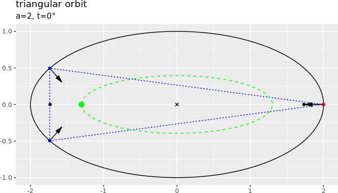
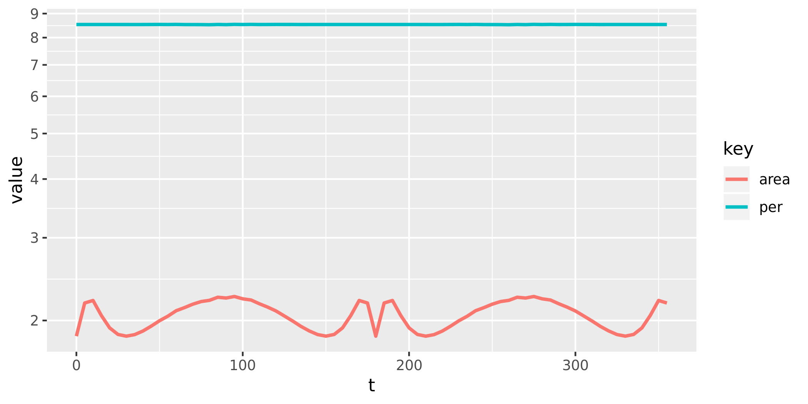
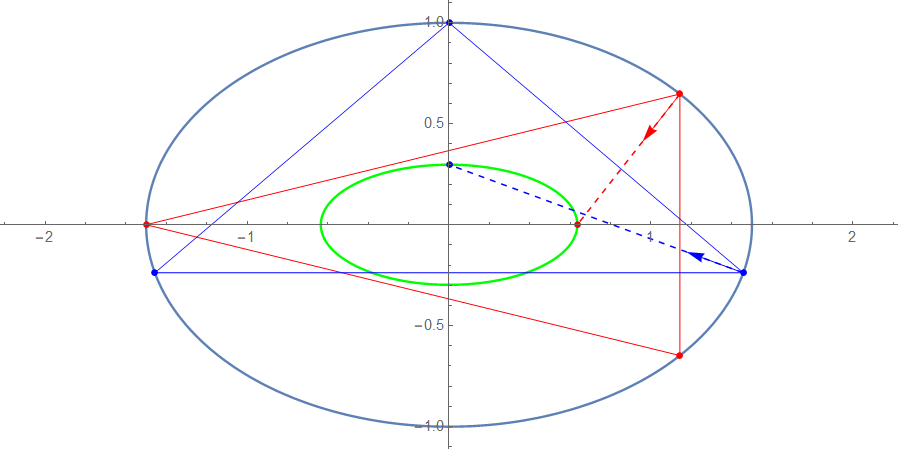

```{r,echo=F}
knitr::opts_chunk$set(
  cache=T,
  collapse=T,
  comment="#>",
  dpi=96,
  out.width="100%",
  fig.align = "center"
)
```

# Introduction

Previous experience with ray-tracing sun-disk images on off-axis [concave mirrors](https://www.youtube.com/watch?v=IDrjUXa9-cc), led us to investigate trajectories within [elliptical billiards](http://mathworld.wolfram.com/Billiards.html).

In 2011, we produced the following [animation](https://www.youtube.com/watch?v=A7mPzrNJHkA), which uncovered that certain trajectories were perioic *orbits*, a gallery of which can be found [here](https://photos.app.goo.gl/87CHxKmmmkPa9Att5).

Shortly after, we created the following [video](https://www.youtube.com/watch?v=BBsyM7RnswA) to study the geometry of *triangular* orbits in the ellipse, where we showed the locus of the orbits' *incenters* were apparently elliptical.

Then the following fortuitous sequence of events took place (corrections welcome `r emo::ji("smile")`):

* Sometime after 2011, possibly via Prof. Koiller, this video was viewed by [Prof. Serge Tabachnikov](https://www.math.psu.edu/tabachni/) (known for his immortal work on the [Geometry of Billiards](http://descartes.math.psu.edu/tabachni/Books/billiardsgeometry.pdf)), who shared it w/ [Prof. Alexey Glutsyuk](https://www.hse.ru/en/org/persons/36590644). 
* Prof. Glutsyuk shared the problem with [Prof. Olga Romaskevich](https://romaskevich.carrd.co/), at the time a Ph.D. student at ENS de Lyon. Prof. Romaskevich, now a postdoc at IRMAR (Rennes, France), proved the ellipticity of the locus using *complexification* [here](https://arxiv.org/pdf/1304.7588.pdf).
* A couple of years later, in 2016, [Prof. Ronaldo Garcia](https://ronaldo.ime.ufg.br/p/2319-apresentacao) of IMPA, produced an elegant complement to Prof. Romaskevich's proof, using only (computational) algebra and differential curve geometry, published [here](https://arxiv.org/pdf/1607.00179v1.pdf). Prof. Garcia has subsequently proven the ellipticity of loci traced by other triangular orbit centers (baricenter, circumcenter. etc.).
* More recently, Prof. Glutsyuk's graduate student [Corentin Fierobe](https://arxiv.org/pdf/1807.11903v1.pdf) has proven, using complexification methods, that the locus of *circumcenters* is elliptical

To summarize: indeed, the locus of triangular orbits' incenters is elliptical as are that of many other triangular orbit centers!

# Simulation

Below we reproduce the original animation this time using the [R](https://www.r-project.org/) ecosystem. Without loss of generality, an ellipse is shown with semi-axes of lengths $a=2$, $b=1$ centered at the origin (the "x"). The ellipse's foci, at $\pm$sqrt(a²-b²) = $\pm$sqrt(3), are shown as black dots. A base vertex $P(t)$ is chosen on the ellipse at $\left[a*\cos(t),b*\sin(t)\right]$, for some $t$ in $\left[0,2\pi\right]$ (red dot). Via numeric optimization we compute the other two vertices, shown blue, under the constraint they be bisected by their local normals, shown as inward-pointing arrows. For a given $t$ the incenter (shown as a green dot) is computed by intersecting any two normals. Its locus (shown as dashed green ellipse) is obtained by chaining all points under some angular step.

```{r,echo=F,out.width="75%"}

```

Notice that the two foci are always contained within the orbits, owing to the fact that via Poncelet's theorem, the orbits' caustics are confocal with the original ellipse [insert ref].

# Constant Perimeter

We also verify a fascinating property about triangular orbits in the elliptic billiard: the *perimeter* of all orbits is constant (though not the area). The graph below shows the perimeter and area numerically calculated for triangular orbits for all $t$.

```{r,echo=F,out.width="75%"}

```

On perimeter constancy, via email Prof. Tabachnikov points out that:

>the perimeter of a periodic orbit is constant (for any period, starting with three) since these n-gons are extrema of the perimeter function on inscribed n-gons. This function is constant on the curve consisting of its critical points. A somewhat related fact: the centers of mass (with two possible meanings) of a Poncelet polygon move along conics, as proven in our [hoax paper](http://www.math.psu.edu/tabachni/prints/Poncelet5.pdf) with Rich Schwartz.

And Prof. Koiller adds that:

>constancy of length comes from Hamiltonian Dynamics. The family of triangles forms an abstract 2-torus in phase space, all trajectories having same velocity and period, hence same length.

# Addendum

We developed a geometric method which yields closed-form expressions for the *extrema* in x and y of the incenter locus. Since we know the latter is elliptical, these correspond to the length of the two semi-axes.

```{r,echo=F,out.width="66%"}

```

Namely, the method comprises the following steps:

* Compute a "sideways" elementary orbit (red triangle):
    + Start w/ one vertex at the left apex of the billiard $L=(-a,0)$.
    + The top right vertex in this orbit lies at $P$ on the boundary s.t. $(L-P)$ is reflected about the normal at $P$ into a *vertical* line.
    + The third vertex $P'$ is vertically-symmetric to $P$.
    + The normals at $P$ and $P'$ will meet at the x-extremum of the locus (shown red), i.e., at the intersection of the ray shot from $P$ along its normal, and the x axis.
* Compute an "upright" elementary orbit (blue triangle):
    + Start w/ one vertex at the top apex of the billiard $T=(0,1)$.
    + The bottom right vertex in this orbit lies at $Q$ on the boundary s.t. $(T-Q)$ is reflected about the normal at $Q$ into a *horizontal* line.
    + The third vertex $Q'$ is horizontally-symmetric to $Q$
    + The normals at $Q$ and $Q'$ will meet at the y-extremum of the locus (shown blue), i.e., at the intersection of the ray shot from $Q$ along its normal, and the y axis.


# Code

Simulation code (in R) can be found [here](https://dan-reznik.github.io/Elliptical-Billiards-Triangular-Orbits/)

# Future work

* display the loci of other triangle centers such as circumcenter, baricenter, etc.
* draw vertices and incenter ellipse using formulae derived by Ronaldo Garcia

# References

1. Fierobe, C., "On the circumcenters of triangular orbits in elliptic billiard", 2018, [link](https://arxiv.org/pdf/1807.11903v1.pdf)
1. Garcia, R., "Centers of Inscribed Circles in Triangular Orbits of an Elliptic Billiard", 2016, [link](https://arxiv.org/pdf/1607.00179v1.pdf)
1. Schwartz R. and Tabachnikov, S., "Centers of mass of Poncelet polygons, 200 years
after", 2016, [link](http://www.math.psu.edu/tabachni/prints/Poncelet5.pdf)
1. Glutsyuk, A., "On odd-periodic orbits in complex planar billiards", 2014, [link](https://arxiv.org/pdf/1309.1849.pdf)
1. Romaskevich, O., "On the Incenters of Triangular Orbits in Elliptic Billiard", 2013, [link](https://arxiv.org/pdf/1304.7588.pdf)
1. Tabachnikov, S., "Geometry and Billiards", 1991, [link](http://descartes.math.psu.edu/tabachni/Books/billiardsgeometry.pdf)
1. Birkhoff, G., "Dynamical Systems", 1927, [1966 edition](http://www.freeinfosociety.com/media/pdf/2219.pdf)

***
© Dan S. Reznik, 2019
