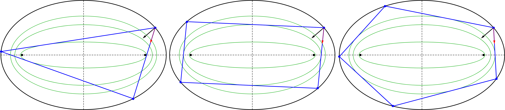

```{r,echo=F,fig.align="center",out.width="33%"}
knitr::include_graphics("pics/ronaldo_dan_jair_impa_31-jul-2019.png")
```

# Introduction

Experimental investigation of N-Periodics in an Elliptic Billiard [@reznik2019-intelligencer],[@garcia2020-properties],[@garcia2020-ellipses]. The seminal work on this subject is [@sergei91].

Triangle Centers of 3-periodics are referred to as "X(i)", after Kimberling's Encyclopedia [@etc]. A glossary of planar geometry concepts is provided at [the end](#glossary) of this document, and can be looked up in [@mw].

Recent talks/presentations:

* 7/29/19 IMPA Talk [video](https://youtu.be/t872mftaI2g) (enable English subtitles)
* Talk Slides:

  - 7/29/19 [IMPA](ppt/IMPA_Adventures_in_Ellipses_Triangles.pdf) 
  - 9/10/19 [PUC-RJ](papers/PUC_Billiard_Surprises.pdf)
  - 9/17/19 [UFF-RJ](papers/UFF_Billiard_Surprises.pdf)
  - 12/3/19 [UFMG](papers/UFF_Billiard_Surprises.pdf)

Check out our [media page](videos.html) and our recent publication [@reznik2019-intelligencer].

```{r,out.width="100%",echo=F,fig.cap="N-Periodics and their confocal caustics, N=3,4,5"}

```

```{r test-main, child="index_expositional.Rmd"}
```