```{r,echo=F}
knitr::opts_chunk$set(
  cache=T,
  collapse=T,
  comment="#>",
  dpi=300,
  fig.align="center",
  out.width='100%',
  fig.cap="",
  fig.pos="H"
)
```

# Introduction

Polygonal trajectories in Elliptic Billiards can be thought of the motion of a point mass in an elliptic boundary undergoing elastic collisions against the boundary. A few examples, taken from [@mw_billiards], are shown below:

```{r,echo=F,out.width="50%"}
knitr::include_graphics("pics/orbits_mathworld.png")
```

Trajectories which return to their starting locations are known as *orbits*. The simplest polygonal orbit is degenerate: a 2-sided "polygon". In an ellipse, it can only occur between the two opposite vertices of the billiard, i.e., along each axis. 
Next level up are 3-gon orbits. Poncelet's Porism [@poncelet1822] states that if one triangular orbit can be found starting from a point on the billiard, all other points can also initiate similar orbits, i.e., a given billiard is associated with a *family* of triangular orbits. The primary goal here is to study geometric properties of such families.

With 3-gon orbits, a natural step is to study the *locus* of triangular *centers* [@mw_tricenter] such as the centroid or incenter. Triangular centers are invariant under similarity transformations and are typically represented using trilinear [@mw_trilinears] or barycentric [@mw_barycentrics] coordinates. Thousands of such centers have been catalogued by Clark Kimberling [@etc], using the $X(k)$ notation: $X(1)$ is the incenter, $X(2)$ the baricenter, etc.

It has been recently shown that the loci of certain major triangular centers (incenter, circumcenter, baricenter, etc.) are elliptical (see "Related Work" below). However many triangular centers (and points not considered centers, such as medians and vertices of derived triangles) do produce non-elliptic loci sometimes exhibiting self-intersections and/or even cusps.

Our main contribution has been to developed graphical interactive tools with which to experiment with thousands of points and their loci so as to identify novel dynamic phenomena and/or geometric properties. This non-algebraic approach has led us to identify the following new facts:

1. The locus of the orthocenter $X(4)$ is elliptic and similar to a 90-degree rotated billiard. When $a/b \approx 1.5099$ (the root of a sextic), the orthocenter locus is the exact copy of the 90-degree rotated billiard;
1. The locus of the incenter of the orbit's *orthic* triangle is identical to the orthocenter elliptic locus if $a/b\leq 1.35$ and it is 4-piecewise elliptic if $a/b > 1.35$, i.e., it contains 4 sharp corners;
1. All orbits have a constant inradius-to-circumradius ratio (equivalently, the sum of their internal cosines is constant), which, together with a perimeter specification completely defines the family;
1. The locus of of the Feuerbach point $X(11)$ is the confocal caustic, as are the loci of the orbits' 3 extouchpoints;
1. The locus of the anticomplement of the Feuerbach $X(100)$ point is the elliptic billiard as is the locus of $X(88)$.
1. The Mittenpunkt $X(9)$ of all orbits is *stationary* and lies at the center of the billiard.

In what follows we will (i) overview both historical and recent work on this topic, (ii) describe our experimental method, and (iii) cover details about the 6 above results. A collection of videos showing dynamic phenomena is provided in the end which illustrate many of the phenomena discussed below.

# Previous Work

## Historical Approaches

In 1822 Jean-Victor Poncelet proved [@poncelet1822], in what became known as Poncelet's *Porism*, that given two smooth (real) planar conics, if there exists an N-sided polygon inscribed in one conic and circumscribed about the other, then there are infinitely many such polygons, and every point of the first conic is a vertex of one of them  [@centina15], as depicted below:

```{r,echo=F,out.width="25%"}
knitr::include_graphics("pics/porism.jpg")
```

A fascinating aspect of elliptic billiards is that they are *integrable*. Namely, if we "shoot a ray" from a point $P$ on the billiard, choosing an exit angle $\alpha$ with the normal such that after $N-1$ reflections the ray comes back to $P$, the entering angle is guaranteed to be $-\alpha$.

In 1832 Carl Gustav Jacobi found that geodesics on the ellipsoid form an integrable Hamiltonian System, the elliptic billiard being the limit case of vanishing minor axis [@jacobi1837]. In 1927 George David Birkhoff produced a formal proof to the integrability of elliptic billiards [@birkhoff66].

Another fascinating property of N-gon orbits, $N\geq 3$ in elliptic billiards is that their perimeter is *constant*, a fact observed by Darboux in 1870 and published in [@darboux1917]. Perimeter constancy also follows from Hamiltonian Dynamics: The family of triangles forms an abstract 2-torus in phase space, all trajectories having same velocity and period, hence the same length.

## Recent Work

In 2011 we published an experimental video [@dsr_vid11d] showing that the locus of the *incenter* of a 3-periodic orbit is an ellipse. Via complexification, this result was proven a few years later [@olga14]. The ellipticity of *circumcenter* loci for 3-periodics was subsequently shown using algebra and differential geometry [@ronaldo16], as well as complexification [@corentin19].The ellipticity of the *baricenter* locus was subsequently proven [@serge2016]. Recently, Vladimir Dragović and Milena Radnović characterized N-periodic orbits in terms in terms of polynomial functional equations [@dragovic88].

# Experimental Method

Computer-aided experimental geometry [@grozdev17] is an effective tool for identifying properties of geometric objects. A key simulation tool is the closed-form expression for the cosine of the exit angle $\alpha$ (with respect to the normal) which produces a 3-gon orbit [@ronaldo19]:

$$
\cos(\alpha) = \frac{A^2 \sqrt{2\delta-A^2-1}}{\left(A^2-1\right) \sqrt{A^4-\left(A^2-1\right) {x_1}^2}}
(\#eq:cosa)
$$

Where $\delta = \sqrt{A^4-A^2+1}$, $A=a/b$ is the ratio of semiaxes, and the $x_1$ is the horizontal coordinate of the orbit's starting vertex. In turn, this allowed us to quickly parametrize an orbit by starting location and observe the distribution of its triangular centers:

```{r,echo=F,out.width="50%"}
knitr::include_graphics("pics/basic_orbit.png")
```

## Exploring Non-Elliptic Loci

While certain triangular centers and/or points produce elliptic loci, others do not. Consider the figure below with several loci superimposed. Notice that while incenter (and excenters, not shown), Feuerbach, and extouch points do produce elliptic loci (shown dashed), intouchpoints and external Feuerbach points do not (shown solid). Surprisingly, even the *medians* (shown red) will trace higher-order loci.

```{r,echo=F,out.width="66%"}
knitr::include_graphics("pics/various_loci.png")
```

Non-elliptic loci inarise for example from (i) the intouch points (pedals of the contact triangle)  [@dsr_vid11e], and (ii) external Feuerbach points (point of tangency of nine-point circle with the three excircles) [@dsr_vid19d]. A snapshot of the latter is reproduced below:

```{r,echo=F,out.width="50%"}
knitr::include_graphics("pics/exfeuerbach_locus.png")
```

If we consider convex combinations of (i) baricenter-with-one-median, and (ii) incenter-with-one-touchpoint, e.g., as parametrized by $s$ in $(0,1)$ we observe a transition from a perfectly elliptic locus to a higher order curve:

```{r,echo=F}
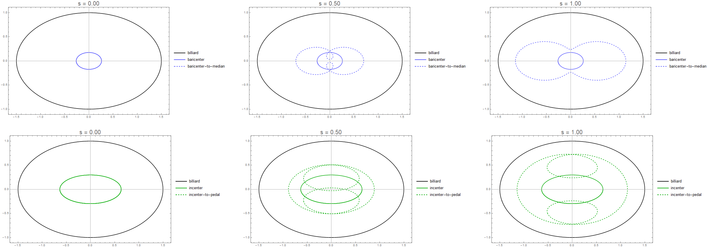
```

Convex transitions of loci between a triangular center and one of its generating points can be viewed for:

* the Baricenter $<=>$ Median and Incenter $<=>$ Intouchpoint [@dsr_vid19g]
* Orthocenter $<=>$ Foot and Circumcenter $<=>$ Orbit Vertex [@dsr_vid19h]
* Excenter $<=>$ Extouch point [@dsr_vid19i]


## Interactive Analysis of Kimberling Centers

Using web-scraping techniques, we obtained trilinear equations for the first 100 Kimberling Centers [@etc] and for each center rendered loci for the orbit triangle and 7 derived triangles (medial, orthic, contact, excentral, ex-contact, anti-complement, ex-Feuerbach). We then placed plots in a single [webpage](loci_6tri.html) which became a tool to explore interesting phenomena in some 800 loci, showing the richness and non-linearity of the geometry obtainable. As an example consider the richness of loci for points $X(k),k=52,49,99$ produced by the orbit triangle and 7 triangles derived from it:

```{r,echo=F,out.width="100%"}
knitr::include_graphics("pics/x49_52_99.png")
```

As we reviewed all curves we took notes about interesting phenomena which later pointed us to possible properties. As an example, here are a few notes obtained from a visual review of orbit and excenter loci only (referred below as $X(k)$ and $X'(k)$, respectively):

* $X'(6)$, the excentral Symmedian, is congruent with $X(9)$, the Mittenpunkt, and both loci are a point.
* $X(9)$, the Mittenpunkt, fixed at the origin.
* $X(11)$, the Feuerbach point, tracing the caustic.
* $X(14)$, 2nd Isogonic, closely tracking the billiard.
* $X(30)$, Euler Infinity Point, is the intersection of the Euler line with the line at infinity. Is there any interesting info here?
* $X(37)$, the crosspoint of incenter and centroid, seem to generate identical perpendicular loci, with major semiaxis = $1/2$, i.e, one third of the original.
* $X'(41)$ generates a nearly circular locus.
* $X'(46)$ horizontal axis is exactly 1.
* $X(49)$ has cusps.
* $X(50)$ has lines to infinity at intriguing directions.
* $X'(56)$ is an almost perfect circle, std. dev. of radius within 0.75% of its average.
* $X(59)$ and $X'(59)$ are marvelously self-intersecting.
* $X(67)$ tracks the billiard.
* $X(73)$ is diamond-shaped, though smooth.
* $X(74)$ has north-south cusps.
* $X(76)$ Brocard point ellipse is almost flat along $y$.
* $X(77)$ nicely self-intersecting.
* $X(87)$ nicely self-intersecting.
* $X(88)$ locus = billiard.
* $X(89)$ axes *almost* vanish, Mittenpunkt-style. Why?
* $X(92)$ pillow-shaped, with north and south inward concavities.
* $X(93)$ has interesting escape directions.
* $X(94)$ has a high-order curvature function.
* $X(94)$ has a very small, hourglass locus.
* $X(99)$, the Steiner point, almost perfectly tracks the billiard. What is the reason for this close tracking?
* $X(100)$, the anticomplement of the Feuerbach point, has the billiard as locus.

# Main Results

## Locus of the Orthocenter is Elliptic

The elliptic loci of a few major triangular centers is shown below -- "bar", "inc", "cir", "npc" stand for baricenter, incenter, circumcenter, and 9-point-center, respectively. The locus of the orthocenter $X(4)$ is labeled "ort" and shown orange:

```{r,echo=F,out.width="50%"}
knitr::include_graphics("pics/orthocenter_locus.png")
```

It can be shown that the orthocenter's locus is elliptic of the form $(x/a_H)^2+(y/b_H)^2=1$ where:

$$
\begin{array}{rcl}
a_H^2 & = & Z/A^2 \\
b_H^2 & = & Z \\
Z & = &  {\frac {-4\,\delta\,{A}^{2} \left( {A}^{2}+1 \right)+ \left( {A}^{4}+1 \right) ^{2}+{A}^{2
} \left( {A}^{2}+1 \right) ^{2}}{ \left( {A}^{2}-1 \right) ^{2}}}
\end{array}
$$

Notice that $a_H/b_H=1/A$, i.e., the orthocenter ellipse is similar to the billiard with its axes exchanged (rotated by 90 degrees).

**Theorem 1**: The locus of the orthocenter is elliptic and similar to the 90-degree rotated billiard [@garcia19a].

### Critical points of the orthocenter

Using \@ref(eq:cosa) it can be shown that if $A<\sqrt{2 \sqrt{2}-1}\approx 1.352$, the orthocenter lies completely inside the billiard, and at $A\approx 1.5099$ the locus of the orthocenter is *identical* to the billiard rotated 90 degrees. The latter value is the only positive (real) root of equation $A^6 + A^4 - 4\,A^3-A^2-1=0$, obtained by setting $b_H$ above to $A$ and solving for $A$.

### Locus of Orthic's Incenter

Let $T=ABC$ be a triangle and $T_h$ be its *orthic* [@mw_orthic], defined by the feet of $T$'s three altitudes. It turns out $T_h$'s geometry depends on  $T$'s acuteness [@coxeter67], namely:

* When $T$ is *acute*, $T_h$'s vertices lie within $T$'s edges, and $I_h$, the *incenter* of $T_h$, coincides with T's orthocenter $H$.
* For $T$ *obtuse*, say at $C$, one of $T_h$'s vertices will be the foot of $C$'s altitude on $AB$, while the other two will lie *outside* of $T$ (near $C$ when $T$ is slightly obtuse). $I_h$ will coincide with $C$, and $H$ becomes an *excenter* of $T_h$.  
* If $T$ is a right-triangle, say at $C$, $T_h$ collapses to a *segment* connecting $C$ to its foot on $AB$, while $I_h$ and $H$ coincide with $C$. 

Furthermore, as shown on this [@dsr_vid19l], for $T$ acute, $T_h$'s *excentral* triangle [@mw_excentral] is $T$ itself (the excentral triangle of any triangle is always acute), i.e., computing the excentral is a proper inverse of computing the orthic.

However, for $T$ obtuse, the excentral of the orthic will be $ABH$, acute, i.e., the pre-image of an obtuse's orthic contains two elements: the obtuse itself and an acute made up of $T$'s two vertices opposite from $C$ and its orthocenter $H$.

If $T$ is a right-triangle, its excentral triangle will be degenerate and composed of (i) the line passing through $AB$ and (ii) a line parallel to $AB$ and passing through $C$.

As we will see, such non-linear, switching behavior of the orthic cause the loci of some of its triangular centers to exhibit interesting phenomena.

When $A\leq 1.35$, the locus of the orthocenter is within the billiard, therefore all orbits are acute and the orthic's incenter locus will be congruent with the orthocenter's. However, at $A>1.35$ the orthocenter locus will "pierce" through the billiard, and in those regions, the orbit will be an obtuse triangle, i.e., at every point the incenter of its orthic will be fixed to the orbit vertex subtending the obtuse angle, causing the orthic's incenter to follow a 4-piecewise elliptic locus, containing four corners:

```{r,echo=F,out.width="50%"}
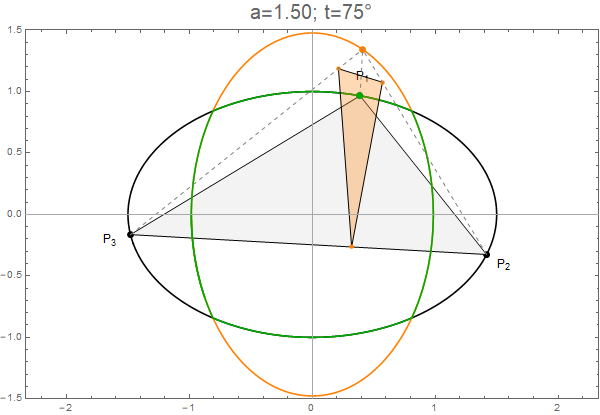
```

This phenomenon can also be viewed in a video [@dsr_vid19j].

**Theorem 2**: The locus of the incenter of the orbit's orthic triangle is identical to the orthocenter elliptic locus if $a/b\leq 1.35$ and is 4-piecewise elliptic if $a/b > 1.35$, i.e., it contains 4 sharp corners [@garcia19a].

### Locus of Orthic's Orthocenter

Non-trivial changes in the topology/continuity of orthocenter and orthic incenter loci occur as the aspect ratio $a/b$ of the elliptic billiard is varied [@dsr_vid19k]. A snapshot of this phenomenon is shown below:

````{r,echo=F,out.width="100%"}
knitr::include_graphics("pics/ortortinc-all-captioned.png")
```

The interesting changes in loci topology are a result of the orbit (and/or its orthic) transitioning from acute to obtuse triangles. As stated above, the orthocenter H of an obtuse triangle T will not coincide with its orthic incenter. Instead the latter will stay "stuck" at T's obtuse vertex, while H will be external to T and its orthic. In fact H will coincide with one of the orthic's excenters [@coxeter67]. So we notice:

* when the orbit is obtuse, the locus of its orthocenter (orange) will be separated from that of its incenter (green).
* when the orbit's orthic is obtuse, the locus of its orthocenter (blue) will detach from the orthic orthic's incenter (red). 

In turn, this gives rise to many many critical points of lcus topology change vs $a/b$, to be determined, including:

1. obtuse orbits can only occur if $a/b > 1.35$, we have an expression for that.
1. obtuse orbit orthics start occurring at $a/b > 1.17$. we don't have an expression for that yet.
1. what's the $a/b$ above which the locus of the orthic's othocenter become self-intersecting
1. when does (c) become concave
1. etc.

We also note the locus of the orthic's orthocenter and/or its orthic produce "bowtie" shaped curves, implying there's some frequency doubling or tripling in its motion wrt orbit itself.

## Constant Inradius-to-Circumradius Ratio

We plotted inradius, circumradius, and 9-point-circle $X(5)$ radius with respect to starting vertex $P_1=(a \cos(t),\sin(t)),\;t\in(0,2\pi)$ for a triangular orbit in an ellipse with $A=1.5$:

```{r,echo=F,out.width="75%"}
knitr::include_graphics("pics/r_over_R_vs_t.png")
```

It is known the 9-point circle radius is twice the circumradius, however in general $r/R$ is a a non-linear expression of triangle sides lengths [@mw_inradius]. We had noticed all 3 curves above have proportional shapes, and we then verified algebraically that *all* triangular orbits in a given elliptic billiard have a constant inradius-to-circumradius ratio $r/R$ which is only a function of the ratio of billiard semiaxes:

$$
\begin{array}{rcll}
\frac{r}{R}&=&\frac{2(\delta-1)}{(A^2-1)(A^2+\delta)}&\mbox{[1]}\\
\delta&=&\sqrt{A^4-A^2+1}
\end{array}
$$

Where $A=a/b$ the ratio of the semiaxes. Below we show $r/R$ versus various ratios of semiaxes $A=a/b$:

```{r,echo=F,out.width="50%"}
knitr::include_graphics("pics/r_over_R_curve.png")
```

$(r/R)$ maximum is $1/2$ at $A=1$, i.e., the billiard is a circle and all 3-gon orbits are equilateral.

Furthermore, it can be shown that this property is independent of perimeter constancy, and in fact, when both are specified (a particular $r/R\in (0,1/2)$ and a non-negative perimeter), the 3-gon orbit is completely specified.

### Sum of Cosines

Let $ABC$ be the internal angles of a generic triangle. These relations [@mw_inradius]:

$$
\begin{array}{ccc}
\frac{r}{R} & = & \cos(A)+\cos(B)+\cos(C)-1 \\[10pt]
            & = & 4\,\sin(\frac{A}{2})\,\sin(\frac{B}{2})\,\sin(\frac{C}{2})
\end{array}
$$

Therefore, the sum of cosines of the internal angles and/or the product of the sines of the half-angles is an invariant of the orbit family.

### Excentral Invariants

Consider the excentral triangle $A'B'C'$ [@mw_excentral], tangent to the ellipse at the orbits' vertices $ABC$.

```{r,echo=F,out.width="33%"}
knitr::include_graphics("pics/extriangle.jpg")
```

Since $A'=\frac{\pi-A}{2}$, $B'=\frac{\pi-B}{2}$, and $C'=\frac{\pi-C}{2}$, the family of orbit excentral triangles will only contain acute triangles. Direct derivation produces:

$$
\begin{array}{rcll}
-\cos(2A')-\cos(2B')-\cos(2C') & = & \\ \cos(A)+\cos(B)+\cos(C) & = & 1+\frac{r}{R} & = \text{invariant}
\end{array}
$$

Furthermore, since the orbit will be the excentral's *orthic* triangle [@mw_orthic], (i) the excentral's circumradius $R'$ will be twice the orbit's ($R'=2R$), and (ii) the orbit's inradius $r$ will be given by the following relation [@mw_orthic]:

$$
\begin{array}{rcl}
r  & = & 2 R'\;|\cos(A')\cos(B')\cos(C')| = \\
  & = & 4 R\;|\cos(A')\cos(B')\cos(C')|
\end{array}
$$

Since $r/R$ of the orbit is an invariant, the family of excentral triangles will conserve the *product* of its internal cosines:

$$
|\cos(A')\cos(B')\cos(C')| = \frac{r}{4R} = \text{constant}
$$

Furthermore since (i) the area of any triangle is given by the product of its inradius by its semiperimeter, and (ii) by the product of its cirumradius by its orthic semiperimeter [@mw_orthic], we can state, about the excentral triangle:

$$
\begin{array}{rclll}
A' & = & r'\,P'/2 & = & R'\,P/2 \\
P'\frac{r'}{R'} & = & P & = & \text{constant}
\end{array}
$$


**Theorem 3**: The inradius-to-circumradius ratio for all orbits is invariant.

+ **Corollary 3.1** The sum of cosines of orbits' internal angles is constant and equal to $1+r/R$.
+ **Corollary 3.2** The negative of sum of double-angle cosines of the excentral triangle is constant and equal to $1+r/R$.
+ **Corollary 3.3** The product of cosines of the excentral triangle is constant and equal to $r/(4R)$.
+ **Corollary 3.4** The excentral triangle conserves the product of its perimeter by the ratio of its inradius by circumradius. This quantity is equal to the orbits' constant perimeter.

### Orthic Invariants

Extending this analysis to the orbits' orthic triangles, for acute orbits, orthic angles $\theta_i'', i=1,2,3$ will be equal to $\pi-2\theta_i$, i.e., $\sin(\theta_i''/2)=cos(\theta_i)$. Given constancy of sum of orbit cosines, acute orbit orthics will conserve the sum of *half-angle* sines.

Likewise, since the area $A$ of a triangle is $r\,P/2$ and, if acute, also $R\,P''/2$ [@mw_orthic], it can be shown acute orbits' orthics will have constant perimeter $P''=P\,r/R$, i.e., the product of the two orbit invariants. The orthic does not conserve the sum of half-angle sines nor its perimeter for *obtuse* orbits. 

### Summary of Invariants

We can summarize the following characteristics for orbit, its excentral triangle, and its orthic:

$$
\begin{array}{|c|c|c|c|c|}
\hline
\bf{\text{Triangle}} & \bf{\text{All Acute}} & \bf{\text{Some Obtuse}} & \bf{\text{Angular Invariance}} & \bf{\text{Metric Invariance}} \\
\hline
\text{Orbit} & a<1.35 & a>1.35 & \sum{\cos(\theta_i)} = 1+r/R & P \\
\text{Excentral} & \forall a & \varnothing  & \prod{\cos(\theta_i')}=r/(4R) & P'\frac{r'}{R'} = P  \\
\text{Orthic} & a<1.17 & a>1.17 & \sum{\sin{(\theta_i''/2)}}=1+r/R\;^\dagger &  P'' = P\frac{r}{R}\;^\dagger \\
\hline
\end{array}
$$
$^\dagger$only when the orbit is acute.

## Locus of Feuerbach point and Extouch points is the caustic

Returning to Poncelet's Porism, it turns out the conic to which all 3-orbits are tangent is an ellipse, known as the *caustic* is confocal with the billiard [@serge91]. A first observation is that since the three the 3 [extouchpoints](https://en.wikipedia.org/wiki/Incircle_and_excircles_of_a_triangle) are, by definition, locally tangent to each orbit's side, their locus must be the caustic. The caustic is therefore the Mandart Inellipse of the orbit [@mw_mandart].

It can also be shown that the locus of the [Feuerbach point](https://en.wikipedia.org/wiki/Feuerbach_point) $X(11)$, where incircle and 9-point-circle touch, also traces out the caustic, as shown below:

```{r,echo=F,out.width="50%"}
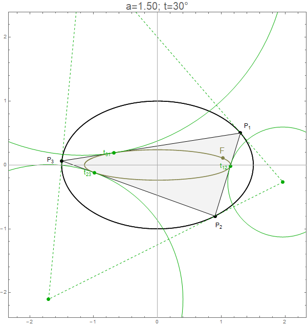
```

Interestingly, if the orbit's starting vertex sweeps the billiard counterclockwise, so will the three extouch points, while the Feuerbach will move in the opposite direction, i.e., *clockwise* [@dsr_vid19b].

**Theorem 4**: The locus of the Feuerbach point and that of the three extouch points is the confocal caustic [@garcia19a]

## Anticomplement of the Feuerbach sweeps the billiard.

Karl Wilhelm von Feuerbach (1800–1834), shown below, proved in 1822 that the nine-point circle is tangent to the three excircles of the triangle as well as its incircle [@mw_feuerbach].

```{r,include=F,out.width="33%",echo=F}

```

It can be shown that the locus of the *anticomplement* of the Feuerbach point ($X(100)$ in [@etc]), shown below as $\bar{F}$, is the billiard itself:

```{r,out.width="66%",echo=F}
knitr::include_graphics("pics/antifeuerbach.png")
```

The anticomplement $P'$ of a point $P$ in a triangle is $P'=B-2(P-B)$. This surprising result has been depicted in a video [@dsr_vid19e].

We found experimentally that the locus of $X(88)$, the isogonal complement of $X(44)$ [@etc], is also the billiard. For a particular starting point P1 of the orbit, $X(100)$ and $X(88)$ will appear at different positions on the billiard, as shown below:

```{r,out.width="66%",echo=F}
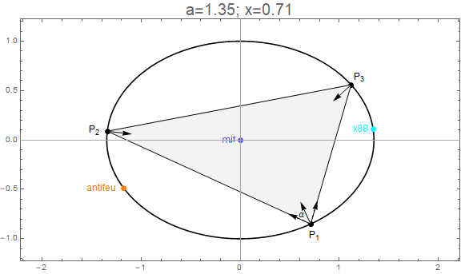
```

**Theorem 5**: The locus of the anticomplement of the Feuerbach point is the billiard. [@garcia19a]

**Conjecture 5.1**: The locus of $X(88)$ is also the billiard.

## Mittenpunkt is stationary across all orbits

Observing that several triangular centers produce elliptic loci, we wondered if one of the loci could be pathologic, e.g., collapse to a point. Observing the cyclic symmetry of trilinear coordinates, we reckoned the billiard's center as a likely candidate for such a point-like locus.

Displaying billiard, orbit, and a few triangular centers on the screen (see below), we began to examine lines between points and the origin, hoping they might cross another triangular center over several orbits. However none did.

```{r,echo=F,out.width="50%"}
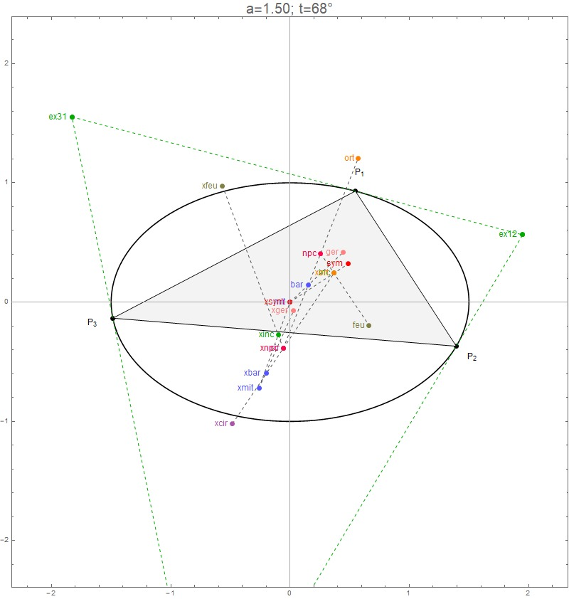
```

We did notice however that the line from an *excenter* to the origin crossed the corresponding orbit near its midpoint and that this relationship seemed to be preserved. We then lit up the medians on each side (medians are not proper triangular centers), we were amazed to discover that the crossing of medians was exact for each excenter-to-origin line. Most shockingly, this arrangement was preserved for *all* orbits! The construction we made was like this:

```{r,echo=F,out.width="50%"}
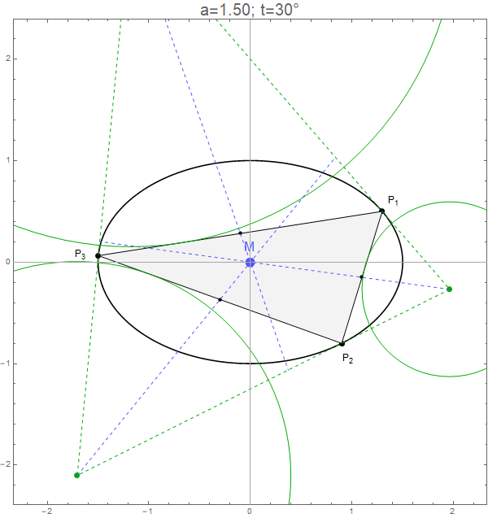
```

The point at which excenter-to-median lines concur is called the [Mittenpunkt](https://en.wikipedia.org/wiki/Mittenpunkt) $X(9)$, described in 1836 by German geometer Christian Heinrich von Nagel (1803-1882).

```{r,include=F,out.width="33%",echo=F}
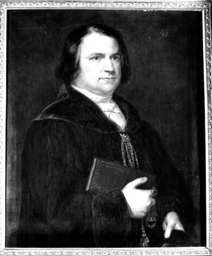
```

You can view this amazing phenomenon here [@dsr_vid19c].

**Theorem 6**: The Mittenpunkt $X(9)$ of all triangular orbits in an elliptic billiard is the center of the ellipse [@garcia19a].

### Application: the "Circumbilliard"

Given a generic triangle $T=(P_1,P_2,P_3)$, it will be associated with a unique 
elliptic billiard $E_0$ that has $T$ as an *orbit*. We call $E_0$ T's *circumbilliard*, shown below (we know the Mittenpunkt $M$ must be at its center):

```{r,echo=F,out.width="50%"}
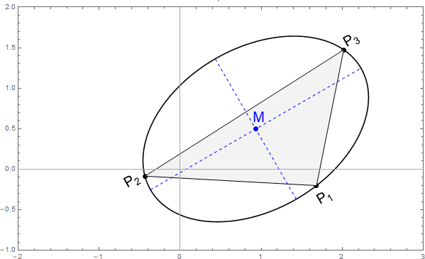
```

$E_0$ has 5 degrees of freedom: $(x_0,y_0,\theta,a,b)$, i.e., the coordinates of its center, the major axis' angle with the horizontal, and the lengths of the two semiaxes. For $E_0$ to be a circumbilliard, it must (i) pass through the vertices of $T$ *and* (ii) be locally *tangent* to the vertex bisectors, i.e., for $i=1,2,3$:

$$
\begin{array}{rcl}
(x'_i/a)^2+(y'_i/b)^2 & = & 1 \\
\left(x'_i/a^2,y'_i/b^2\right)^\perp .N_i & = & 0 \\
\mbox{where:}\\
x'_i & = & (x_i \cos\theta+y_i \sin\theta)-x_0 \\
y'_i & = & (-x_i \sin\theta+y_i \cos\theta)-y_0 \\
N_1 & = & (P_2-P_1)/s_{12}+(P_3-P_1)/s_{13}\\
N_2 & = & (P_3-P_2)/s_{23}+(P_1-P_2)/s_{12}\\
N_3 & = & ... \mbox{ (overconstraint, not needed)}
\end{array}
$$

Where $s_{ij}$ are the sidelengths. Notice the 6th constraint is not needed, as the billiard's integrability implies that if two normals are satisfied the third will be too. Can the above non-linear system be solved in closed-form?

We point out the Mittenpunkt of $T$ yields $(x_0,y_0)$ directly. Secondly, we can *invert* equation $[1]$ above to find the required $A$ for a triangle with a given $\rho=r/R$:

$$
A=f(\rho)=\sqrt{\frac{\rho ^2+2 \sqrt{1-2 \rho } (\rho +1)+2}{\rho  (\rho +4)}}
$$

Below we show (i) left: $\rho$ vs $A$ and (ii) right: $A$ as a function of $\rho$, obtained from the above equation:

```{r,echo=F}

```

So using the above we can calculate the ratio of semiaxes $A=f(\rho)$ and the Mittenpunkt $M=(M_x,M_y)$, eliminating variables $a$, $x_0$, and $y_0$. We are then left with 2 degrees of freedom, namely $\theta$ and $b$ (since $a=A b$), which can be obtained numerically from the following non-linear system:

$$
\begin{array}{lcr}
(-M_y+x_1\cos(\theta)+y_1\sin(\theta))^2+A^2(M_x-x_1\sin(\theta)+y_1\cos(\theta))^2-A b^2&=&0 \\
(-M_y+x_2\cos(\theta)+y_2\sin(\theta))^2+A^2(M_x-x_2\sin(\theta)+y_2\cos(\theta))^2-A b^2&=&0
\end{array}
$$

We built an interactive applet to allow the user to position the three vertices in the plane while the circumbilliard is drawn around it [@dsr_vid19f], a snapshot of which is shown below:

```{r,echo=F,out.width="33%"}
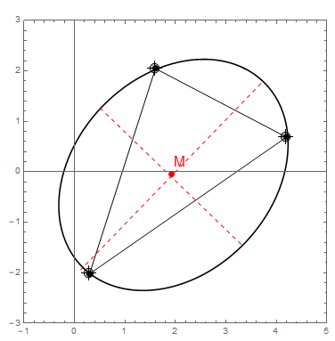
```

### 2-dimensional Triangle family

All triangles (up to a rigid transformation with isotropic scaling) can be represented by triangle $T_0=\{(0,0),\;(1,0),\;(u,v)\}$, where $u$ and $v$ are non-negative numbers. Equivalently, given a generic triangle $ABC$, two translations, one rotation, and one scaling can be computed which will (i) place $A$ at the origin, (ii) make $AB$ horizontal, and (iii) make $|AB|=1$. Transformed vertex $C$ will now contain the values for $u$ and $v$.

A generic ellipse is defined by 5 parameters (two semiaxis lengths, two translations, and a rotation). We can derive explicit expressions for all of these in terms of $u$ and $v$ above. Once we do that we can apply the inverse transformation used above to send the ellipse back to the original coordinates of the $ABC$ triangle.  

# Conclusion

Through interactive experimentation we have identified and proved new dynamic properties for the family of triangular orbits involving triangular centers and their loci. The following issues are also of interest:

1. Are there implications of this study for 4-periodic orbits? Is there a stationary point there?
1. What are other interesting loci, say beyond $X(100)$?
    1. Webscrape 1000 triangle center trilinears from the [ETC](https://faculty.evansville.edu/ck6/encyclopedia/ETC.html) site.
1. Are all elliptic loci axis-aligned with billiard?
1. Are there algebraic requirements for triangular centers (e.g., in their trilinears) such that they yield elliptic loci?
1. Are there salient formations among a few triangular centers (e.g., equilateral triads, n-point-circles, collinearity) which are specific to 3-orbits?
1. Can similar invariance properties exhibited by triangular orbits be proven for:
    1. Non-euclidean embeddings of such orbits (sphere, etc.)
    1. Other kinds of billiards (e.g., external ones)

# Media by the Authors

## Videos

Videos below have been organized in a single [playlist](https://www.youtube.com/playlist?list=PLTgIq68k2wHFjqCC708m2aNo8LWh6_m4p).

1. "Periodic trajectories in elliptic billiards", 2011. [video1](https://youtu.be/9zAr5-nm7mw), [video2](https://youtu.be/A7mPzrNJHkA), [video3](https://youtu.be/6yXA0dyWhFY)
1. "Locus of incenter is elliptic for family of triangular orbits in elliptic billiard", 2011. [video](https://youtu.be/BBsyM7RnswA)
1. "Locus of the incircle touchpoints is a higher-order curve", 2011. [video](https://youtu.be/9xU6T7hQMzs) 
1. "Locus of several triangular centers is elliptic", 2019. [video](https://youtu.be/f84W2aVnMpU)
1. "Locus of Feuerbach point and the three extouch points is the internal caustic to the orbits", 2019. [video](https://youtu.be/1gYb5Y3-rQI)
1. "Locus of the Mittenpunkt is the center of the elliptic billiard", 2019. [video](https://youtu.be/AoCWcza95OA)
1. "Locus of ex-Feuerbach points is non-elliptic", 2019. [video](https://youtu.be/YPz0_xbit2I)
1. "Locus of the anticomplement of the Feuerbach point is the billiard itself", 2019. [video](https://youtu.be/8JKevLpteQk) 
1. "Every triangle has a unique circumbilliard", 2019. [video](https://youtu.be/vSCnorIJ2X8)
1. "Loci of Convex combinations of (1) Baricenter with Median and (2) Incenter with Intouchpoint", 2019. [video](https://youtu.be/3Gr3Nh5-jHs)
1. "Loci of Convex Combinations of (1) Orthocenter w/ one Foot and (2) Circumcenter with one Vertex", 2019. [video](https://youtu.be/HZFjkWD_CnE)
1. "Locus of Convex Combinations of one Excenter and its corresponding Extouch point", 2019. [video](https://youtu.be/OD8Ah0hf8yQ)
1. "3-periodic orbits in Elliptic Billiards: locus orthic triangle's incenter is a 4-arc ellipse", 2019. [video](https://youtu.be/3qJnwpFkUFQ)
1. "Locus of triangular orbit orthocenter, orthic orthocenter, incenter, and orthic orthic's incenter", 2019. [video](https://youtu.be/HY577AZVi7I)
1. "Excentral of Orthic for Acute and Obtuse Triangles", 2019. [video](https://youtu.be/-bLuvICzmqM)
1. "Quadrangular (4-periodic) Orbits in an Elliptic Billiard", 2019. [video](https://youtu.be/BTSNc_YN0lo)
1. "Quadrangular Orbits in Elliptic Billiards: Loci of Triangle Centers for Vertex Triad", 2019. [video](https://youtu.be/y2bnml8heGg)

## Images

1. "Gallery of periodic orbits in elliptic billiards", 2011. [images](https://photos.app.goo.gl/87CHxKmmmkPa9Att5)
1. "Loci of triangular centers $X(1)$ to $X(100)$ for orbit and excentral triangle", 2019. [images](loci.html)
1. "Loci of triangular centers $X(1)$ to $X(100)$ for orbit and 6 derived triangles", 2019. [images](loci_6tri.html)

## Code

* R Simulation code can be found [here](code.html)
* Wolfram Mathematica notebook with some of the above results can be found [here](math/orbits_v3.pdf).
* An interactive applet showing trajectories in ellipses can be found [here](http://demonstrations.wolfram.com/DynamicBilliardsInEllipse/)

***
# Appendix: Locus of Incenter

Our original video [@dsr_vid11d] shows the elliptic path of the 3-periodic incenter, for a billiard with $a/b=1.5$ centered at the origin (the "x"). The ellipse's foci, at $\pm\sqrt(a^2-b^2) = \pm\sqrt(5)/2$, are shown as black dots. A base vertex $P(t)$ is chosen on the ellipse at $\left(a\cos(t),b\sin(t)\right)$, for some $t$ in $\left(0,2\pi\right)$ (red dot). In 2011 when this video was produced we did not have \@ref(eq:cosa), so we used numeric optimization to compute the other two vertices. For a given $t$ the incenter (shown as a green dot) is computed by intersecting any two normals. Its locus (shown green) was rendered by chaining all points under some angular step.

```{r,include=F,echo=F,out.width="75%"}
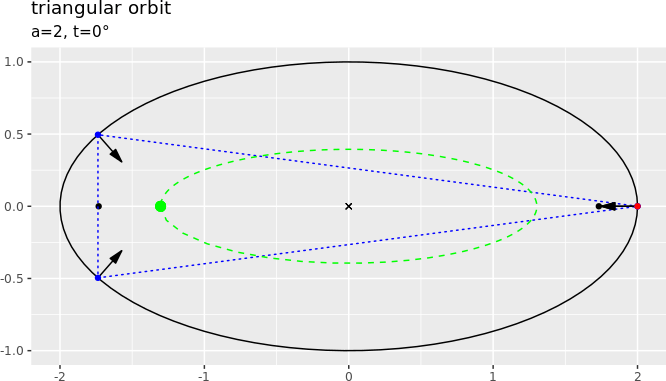
```

Notice that the two foci are always contained within the orbits, which must be true since the internal caustic is confocal with the billiard.

## Constant Perimeter

Perimeter constancy of N-gon orbits stems from the fact that such N-gons are extrema of the perimeter function on *inscribed* N-gons. This function is constant on the curve consisting of its critical points. Furthermore, constancy of length also follows from Hamiltonian Dynamics: The family of triangles forms an abstract 2-torus in phase space, all trajectories having same velocity and period, hence same length.

Darboux derived the following explicit formula for the perimeter [@darboux1917]: 

$$
\begin{array}{rcl}
P&=&\frac{2\left(A^2+1+\delta\right)\sqrt{2\delta-A^2-1}}{A^2-1}\\
\delta&=&\sqrt{A^4-A^2+1}
\end{array}
$$

Where $A=a/b$, the ratio of semiaxis lengths.

For an ellipse with $A=2$, the the above predicts $P=8.53084$, confirmed by the plot below of numerically-calculated perimeter and area of orbits starting at $t$ in $(0,2\pi)$ on the ellipse.

```{r,echo=F,out.width="75%"}
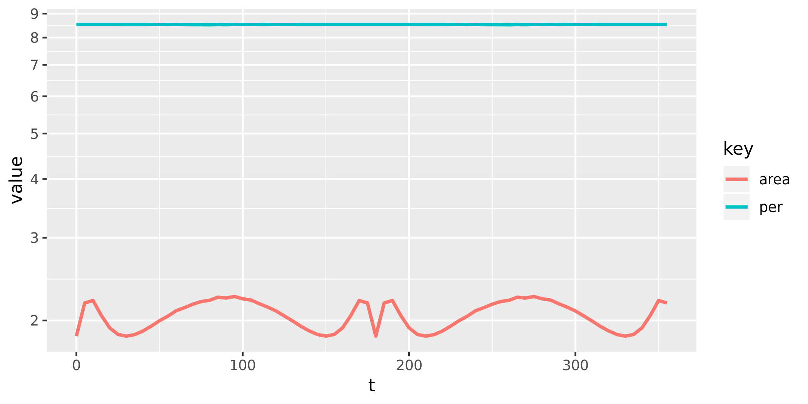
```

## Locus Extrema

We developed a constructive geometric method which yields closed-form expressions for the *extrema* in x and y of the incenter locus. Since we know the latter is elliptic, these correspond to the length of the two semi-axes. Below, and ellipse $E$ is shown in gray, with semi-axes $a=1.5$, and $b=1$, along with its incenter locus $C$, shown green:

```{r,echo=F,out.width="66%"}
knitr::include_graphics("pics/extrema_annotated.png")
```

The method assumes, w.l.o.g., $b=1$ (refer to annotations in the above picture):

* Construct a "sideways" elementary orbit (red triangle) LPP':
    + Start w/ one vertex at the left apex of the billiard $L=(-a,0)$.
    + The top right vertex $P$ in this orbit is s.t. $(L-P)$ is reflected about the normal at $P$ into a *vertical* line, obtained algebraically.
    + The third vertex $P'$ is vertically-symmetric to $P$.
    + The normals at $P$ and $P'$ will meet at  $C_P$ (shown red), the x-extremum of the locus. By symmetry, it is sufficient to obtain the intersection of the ray shot from $P$ along its normal with the x axis.
* Construct an "upright" elementary orbit (blue triangle) TQQ':
    + Start w/ one vertex at the top apex of the billiard $T=(0,1)$.
    + The bottom right vertex $Q$ in this orbit is s.t. $(T-Q)$ is reflected about the normal at $Q$ into a *horizontal* line, obtained algebraically.
    + The third vertex $Q'$ is horizontally-symmetric to $Q$
    + The normals at $Q$ and $Q'$ will meet at $C_Q$ (shown blue), the y-extremum of the locus. By symmetry it is sufficient to obtain the intersection of the ray shot from $Q$ along its normal with the y axis.

We obtain the following expressions for the boundary points $P$ and $Q$, and for the lengths $C_P$ and $C_Q$ of the locus' semi-axes. Assume w.l.o.g., $E: (x/A)^2+y^2 = 1$:

$$
\begin{array}{rcl}
P&=&\left(\frac{A^3}{\delta+1},W\;\right)^T\\
Q&=&\left(A^2 W,-\frac{1}{A^2+\delta}\;\right)^T\\
\mbox{where}:&&\\
\delta&=&\sqrt{A^4-A^2+1}\\
W&=&\frac{\sqrt{2\delta-A^2-1}}{\left| A^2-1\right|}
\end{array}\\[10pt]
$$

So the semi-axes of incenter locus ellipse $C: (x/C_P)^2+(y/C_Q)^2=1$ will be given by:

$$
\begin{array}{lcl}
C_P & = & (\delta-1)/A \\
C_Q & = & A^2-\delta
\end{array}
$$

Note: For the case of the generic $b\neq 1$ ellipse, $A=a/b$ and $P$, $Q$, $C_P$, and $C_Q$ should be scaled by $b$.

Note: Using $W$ as defined above, Darboux's perimeter formula becomes $P=2W(\delta+A^2+1)$.

## Tangency to elementary orbits

As shown below, there are three ways in which the *horizontal* triangular orbit can be tangent to the incenter locus:

```{r,echo=F}
knitr::include_graphics("pics/tang_horiz.png")
```

We derived the three values of "a" for the ellipse $(x/a)^2+y^2=1$ which generate the above tangencies, respectively:

$$
\begin{array}{cclcl}
a_1 & = & \sqrt{\frac{1}{6} \left(3+\sqrt{3 \left(23+8 \sqrt{7}\right)}\right)} & \approx & 1.555 \\[10pt]
a_2 & = & \sqrt{\frac{1}{6} \left(3-\sqrt{3 \left(23-8\sqrt{7}\right)}\right)} & \approx & 0.330 \\[10pt]
a_3 & = & 1/\sqrt{2} & \approx & 0.707
\end{array}
$$

It can be shown that the *upright* triangular orbit will be tangent to the locus at the *reciprocals* of the above:

```{r,echo=F}
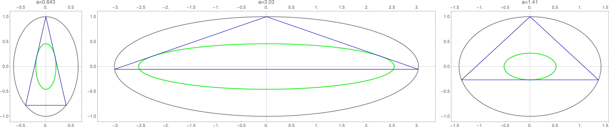
```

***
# References {-}
