```{r,echo=F}
knitr::opts_chunk$set(
  cache=T,
  collapse=T,
  comment="#>",
  dpi=300,
  fig.align="center",
  out.width='100%',
  fig.cap="",
  fig.pos="H"
)
```

# Introduction

Elliptic billiards are *integrable*: both energy and Joachimsthal's Integral [@kozlov91] are conserved. The latter is given by the scalar product of the velocity vector with the gradient to the ellipse at the point of reflection:

```{r,echo=F,out.width="50%"}
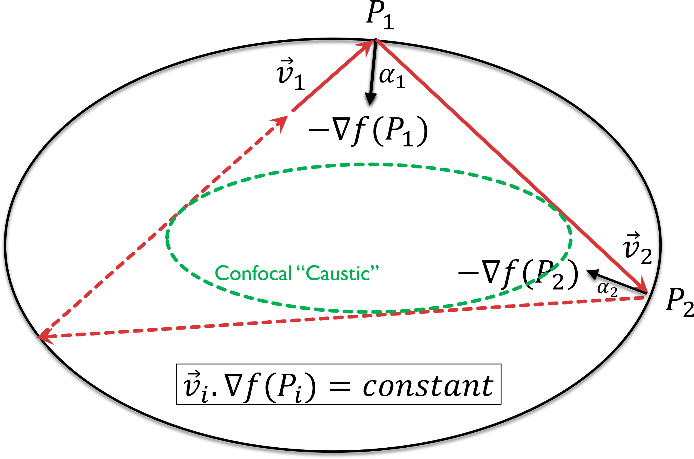
```

This implies (i) that all trajectories are caustic to a confocal conic [@sergei91], shown above, and (ii) Poncelet's Porism [@dragovic11] illustrated below:

```{r,echo=F,out.width="50%"}
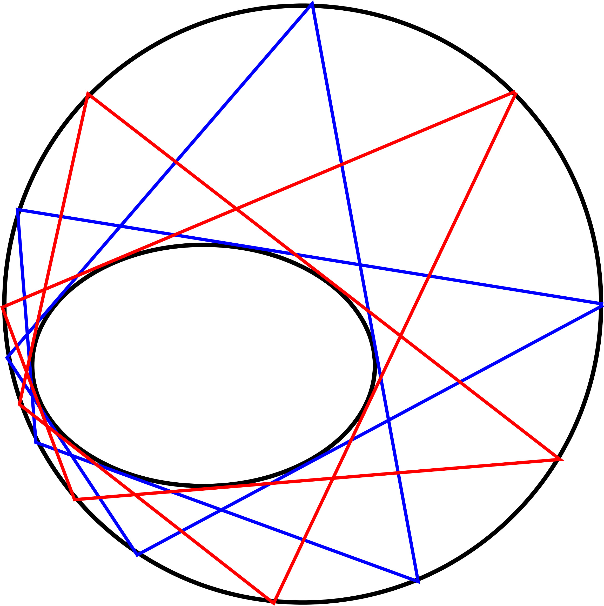
```

Historic notes are included in the [Appendix](appendices.html).

A *trajectory* in an elliptic billiard can be thought of as the motion of a point mass undergoing elastic collisions against the boundary. Below we provide a few examples [@mw]:

```{r,echo=F,out.width="50%"}
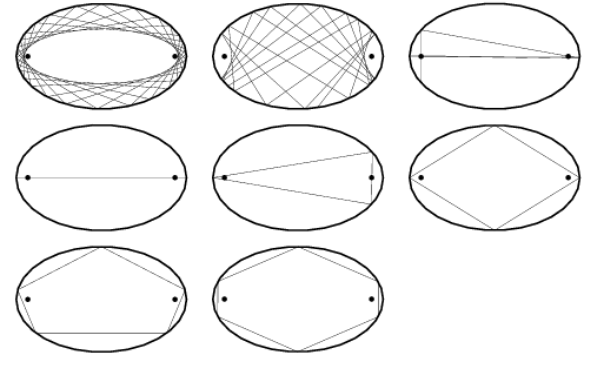
```

Trajectories which are periodic after $N$ collisions ($N$-periodic) are called *orbits*. Poncelet's Porism implies that if one $N$-periodic trajectory can be found from a point on the boundary, all other points will also initiate closed trajectories of the same type and perimeter.

# Summary of Results {.tabset .tabset-fade .tabset-pills}

## Main {-}

1. $N=3$:
    1. The Mittenpunkt $X_{9}$ is *stationary* at the center of the billiard. [video](https://youtu.be/AoCWcza95OA).
   1. The inradius-to-circumradius ratio is constant over all orbits. Equivalently, the *sum* of cosines is conserved over the orbit family
   1. The *product* of excentral triangle cosines is conserved.
   1. The ratio of excentral-to-orbit areas is constant and equal to $2R/r$.
   1. The center of the Cosine Circle [@mw] of the orbit family is stationary and its radius is constant [video](https://www.youtube.com/watch?v=hCQIT6_XhaQ).
1. $N>3$:
    1. Lines drawn from tangential vertex through the midpoint of corresponding orbit side concur at the center of the billiard. [video](https://www.youtube.com/watch?v=4lj9yQ-e_cE)
    1. Polygonal orbits (self-intersecting or not) conserve the *sum* of internal cosines
    1. Tangential polygons conserve the *product* of their internal cosines.
    1. The area ratio of tangential and orbit polygons is conserved, but only for odd $N$. 
    1. The locus of intersection of an edge of an orbit's tangential polygon with its next edge reflected about the center of the billiard is circular and stationary. $N=5$ [video](https://www.youtube.com/watch?v=dINE4aH1cvk) and $N=3,\ldots,8$ [video](https://www.youtube.com/watch?v=EFeINGIDFrg)

## Secondary {-}

1. $N=3$
    1. The three vertices of the intouch triangle of the orbit's anticomplementary triangle are on the billiard [video](https://www.youtube.com/watch?v=50dyxWJhfN4).
    1. The locus of of the Feuerbach point $X_{11}$ is the confocal caustic, as are the loci of the orbits' 3 extouchpoints [video](https://youtu.be/1gYb5Y3-rQI).
    1. At a first billiard axis ratio ($a/b\simeq 1.51$), the locus of $X_{4}$, the orthocenter, is identical to a perpendicular copy of the billiard [video1](https://youtu.be/tanxwG0LcZM). Above a second axis ratio ($a/b\simeq 1.35$), the locus of the incenter of the orbit's *orthic* triangle ($X_{2503}$) becomes piecewise elliptic, with 4 corners [video2](https://youtu.be/3qJnwpFkUFQ).
    1. The isotomic conjugate of the billiard with respect to an orbit is the trilinear polar of $X_{144}$ with respect to the orbit's anticomplementary triangle, i.e., the latter's Gergonne Line [@mw], and this line is perpendicular to $X_1X_7$.
    1. The $X_1$-centered orbit circumellipses are axis-aligned with the billiard and have constant ratio of axes over the entire family.
1. $N>3$
    1. Area stability: odd-$N$ orbits have far stabler areas (over the family) than their even counterparts. In particular, the area z-score of an an odd $N$ orbit family is smaller than the same for $N+1$ and $N+3$ even orbits.
    1. Given an ellipse $E$, the locus of points tangent to the pencil of confocals is circular with respect to any one of $E$'s 4 vertices. [video1](https://www.youtube.com/watch?v=NsZUyDJ6IOs) and [video2](https://www.youtube.com/watch?v=EL4vgcJaktc)

## Rediscovered {-}

1. $N=3$:
    1. The locus of $X_{100}$,the anticomplement of the Feuerbach point, is on the elliptic billiard. [video](https://youtu.be/8JKevLpteQk).
    1. The locus of $X_{88}$, the isogonal conjugate of $X_{44}$, is on-the billiard [video](https://www.youtube.com/watch?v=vyHZ8fwyiE8).
    1. The isogonal conjugate [@mw] of the billiard is the antiorthic axis [@mw], i.e., the perspectrix [@mw] of an orbit with its excentral triangle.
1. $N>3$:
    1. The "Poncelet Grid" [@schwartz07]: the loci of the intersection of alternate edges of the orbit polygon are external ellipses confocal with the billiard [video](https://www.youtube.com/watch?v=xgdgx0erM58&list=PLTgIq68k2wHE1gJSCYmFjG05EsEDwXiCR).
    1. Chasles' Theorem for confocals: a point on the caustic can be found by dropping a perpendicular from a vertex of the tangential polygon to the corresponding side, as an alternative to the method presented in [@himmelstrand12] [video](https://www.youtube.com/watch?v=PRkhrUNTXd8)
    
## Creative {-}

1. The Brazilian flag is an elliptic billiard :^) [video](https://www.youtube.com/watch?v=PHitZFbps8M)

## Table of Invariants {-}

The table below summarizes the invariants observed for $N=3$, some of which were generalized to $N\geq 3$:

$$
\begin{array}{r|l|l}
N=3\,\mbox{invariant}& \mbox{formula for}\,N=3 & N\geq3\,\mbox{generalization}  \\
\hline
\mbox{perimeter [known result]} & P=\frac{2(\delta+a^2+1)\sqrt{2\delta-a^2-1}}{a^2-1} & \mbox{constant perimeter} \\
\mbox{stationary Mittenpunkt} & X_9=0 & \mbox{medians from tangential vertices concur at origin} \\
\mbox{constant}\,\frac{r}{R} & \frac{r}{R}=\frac{2(\delta-1)}{(a^2-1)(\delta+a^2)} & \mbox{constant}\,\sum_{i=1}^N{\cos\theta_i} \\
\mbox{constant}\,\prod_{i=1}^{3}{\cos(\theta_i')} & \frac{r}{4R} & \mbox{constant}\,\prod_{i=1}^N{\cos\theta_i'} \\
\mbox{constant}\,A_{exc}/A_{orbit} & \frac{2R}{r} & \mbox{constant}\,A_{tangential}/A_{orbit},\forall\mbox{odd}\,N \\
\mbox{stationary excentral cosine circle} & r^*=\frac{\sqrt{3}}{3}\sqrt{2\delta+a^2+1} & \mbox{locus of}\,E_i\cap-E_{i+1}\,\mbox{is stationary circle} \\
\mbox{area ratio of incenter locus to billiard} & \frac{A_{inc}}{A_{billiard}} = \frac{r}{2R} & \mbox{n/a} \\
\mbox{area ratio of billiard to locus of excenters} & \frac{A_{billiard}}{A_{exc}} = \frac{r}{2R} & \mbox{n/a} \\
\mbox{axis ratio of }X_1\mbox{-centered circumellipse} & \frac{e_1}{e_2}=\frac{-a^2+2+2\delta}{a^4(2 a^2-1+2\delta)} & \mbox{n/a}
\end{array}
$$

Where $\delta=\sqrt{a^4-a^2+1}$; $\theta_i'$ refer to tangential polygon angles (for $N=3$ this is the excentral triangle).

## Related Work {-}

In 2011 we published an interactive [applet](http://demonstrations.wolfram.com/DynamicBilliardsInEllipse/) to study trajectories in elliptic billiards, as well as a [video](https://youtu.be/BBsyM7RnswA) showing that the locus of the *incenter* of a 3-periodic orbit was elliptical though the vertices of the incenter's pedal triangle [@mw] was a higher-order curve [video](https://youtu.be/9xU6T7hQMzs). A few years later ellipticity of the incenter locus was was proven using complexification [@olga14]. The ellipticity of the *circumcenter* locus for 3-periodics was subsequently proven through algebra and differential geometry [@garcia2019-monthly], as well as complexification [@corentin19]. Shortly thereafter, the ellipticity of the *barycenter* was also proven [@sergei2016]. Following our IMPA talk, Mark Helman proved the ellipticity of $X_7,X_{142},X_{144}$ and that of $X_{57},X_{63}$ [@helman19].

Recently, Vladimir Dragović and Milena Radnović characterized N-periodic orbits in terms in terms of polynomial functional equations [@dragovic88].

Our results concerning the loci of the Feuerbach Point and the extouch points has been formulated using Isogonal and Isotomic conjugation in [@akopyan12]. Our observations for the circularity of loci of $N>3$ tangential polygon intersections is related to the Poncelet Grid [@schwartz07] and the Pentagram Map [@sergei10_pentagram]. An impressive survey on the experimental methodology in mathematics is available in [@dekov05].

In what follows we (i) overview our results, (ii) propose a few new questions, (iii) provide links to all images and videos produced. In the [Appendix](appendices.html) we cover historical notes on integrability, our experimental method, and details about our experiments: visually analyzing loci (elliptic or not), the "circumbilliard" of any triangle, and a more detailed exploration of the locus of the incenter.

A glossary of terms used below is given in the Glossary. 80+experimental videos are available on a separate [webpage](videos.html).

## Acknowledgements {-}

We would like to warmly thank Professor Sergei Tabachnikov for his availability for communication and elliptic billiard mentoring. We thank him as well as Profs. Richard Schwartz and Arseniy Akopyan for their proof of constant sum of cosines for all $N$, as well as the circularity of loci of intersections of tangential polygons with their reflections about the origin. We thank Prof. Olga Romaskevich for the proof on the stationarity of the Mittenpunkt. We thank Prof Igor Minevich for a proof the vertices of the anticomplementary's contact triangle are on the billiard and for insights regarding the excentral's Jerabek Hyperbola [@etc]. We thank Prof Clark Kimberling for promptly including some of our new observations regarding the $X_{9}$-centered circumconic into ETC [@etc]. We also would like to thank Mr. Paulo Ney de Souza for his assistance with mathematical typesetting and making arrangements for our talk at IMPA's [32nd Colloquium](https://impa.br/eventos-do-impa/eventos-2019/32o-coloquio-brasileiro-de-matematica) of Brazilian Mathematics on July 31st, 2019.

# Identifying Elliptic Loci {.tabset .tabset-fade .tabset-pills}

We fitted ellipses to the numerically-obtained loci for $X_1$~$X_{100}$ and selected those which sufficiently small error.

## Elliptic {-}

For the first 100 Kimberling points, the following list of $29$ centers were numerically verified to produce elliptic loci. Those marked with a "*" have been proven as elliptic, and the others still await proof. On the "similarity" column, letters J,B,C refer to excentral locus, billiard, and $N=3$ caustic, respectively. A star there means identical, and a "t" means similar to the perpendicular. On the "proven by" column the initials OR, RG, ST+RS, CF, MH refer to O. Romaskevich [@olga14], R. Garcia [@garcia2019-monthly], S. Tabachnikov and R. Schwartz [@sergei2016], C. Fierobe [@corentin19], and M. Helman [@helman19], respectively.

$$
\begin{array}{cclcc}
\text{index} & \text{kimb} & \text{name} & \text{similarity} & \text{proven by} \\
\hline
 1 & X_{1}^* & \text{Incenter} & \text{J}^t & \text{OR,RG} \\
 2 & X_{2}^* & \text{Centroid} & \text{B} & \text{ST+RS} \\
 3 & X_{3}^* & \text{Circumcenter} & \text{C}^t & \text{RG,CF} \\
 4 & X_{4}^* & \text{Orthocenter} & \text{B}^t & \text{RG}   \\
 5 & X_{5}^* & \text{9-Point Center} & & \text{RG} \\
 6 & X_{7}^* & \text{Gergonne Point} & \text{B} & \text{MH} \\
 7 & X_{8}^* & \text{Nagel Point} & & \text{RG} \\
 8 & X_{10}^* & \text{Spieker Center} & \text{B}^t & \text{MH} \\
 9 & X_{11}^* & \text{Feuerbach Point} & \text{C}^* & \text{RG} \\
 10 & X_{12}^* & \text{$\{X_{1},X_{5}\}$-Harmonic Conjugate of $X_{11}$} & & \text{RG} \\
 11 & X_{20} & \text{de Longschamps Point} & & \\
 12 & X_{21} & \text{Schiffler Point} & & \\
 13 & X_{35} & \text{$\{X_{1},X_{3}\}$-Harmonic Conjugate of $X_{36}$} & & \\
 14 & X_{36} & \text{Inverse-in-Circumcircle of Incenter} & & \\
 15 & X_{40}^* & \text{Bevan Point} & \text{B}^t & \text{MH} \\
 16 & X_{46} & \text{$X_{4}$-Ceva Conjugate of $X_{1}$} & & \\
 17 & X_{55} & \text{Insimilicenter(Circumcircle,Incircle)} & \\
 18 & X_{56} & \text{Exsimilicenter(Circumcircle,Incircle)} & &  \\
 19 & X_{57}^* & \text{Isogonal Conjugate of $X_{9}$} & & \text{MH} \\
 20 & X_{63}^* & \text{Isogonal Conjugate of $X_{19}$} & & \text{MH} \\
 21 & X_{65} & \text{Orthocenter of the Intouch Triangle} & & \\
 22 & X_{72} & \text{Isogonal Conjugate of $X_{28}$} & & \\
 23 & X_{78} & \text{Isogonal Conjugate of $X_{34}$} & & \\
 24 & X_{79} & \text{Isogonal Conjugate of $X_{35}$} & & \\
 25 & X_{80} & \text{Reflection of Incenter in Feuerbach Point} & & \\
 26 & X_{84} & \text{Isogonal Conjugate of $X_{40}$} & & \\
 27 & X_{88}^* & \text{Isogonal Conjugate of $X_{44}$} &  \text{B}^* & \\
 28 & X_{90} & \text{$X_{3}$-Cross Conjugate of $X_{1}$} & \\
 29 & X_{100}^* & \text{Anticomplement of Feuerbach Point} & \text{B}^* & \text{RG} \\
\end{array}
$$

For the above we have identified have similar (or identical) aspect ratio to the billiard and/or the confocal caustic. 

## Similar to billiard {-}

The following 9 centers produce loci similar to the billiard (or a $90\circ$ rotated version thereof). Those marked with a "*" have the similarity property already established:

$$
\begin{array}{cll}
 1 & X_{2}^* & \text{Centroid} \\
 2 & X_{4}^* & \text{Orthocenter} \\
 3 & X_{7}^* & \text{Gergonne Point} \\
 4 & X_{10}^* & \text{Spieker Center} \\
 5 & X_{40}^* & \text{Bevan Point} \\
 6 & X_{57}^* & \text{Isogonal Conjugate of $X_{9}$} \\
 7 & X_{63}^* & \text{Isogonal Conjugate of $X_{19}$} \\
 8 & X_{88} & \text{Isogonal Conjugate of $X_{44}$} \\
 9 & X_{100}^* & \text{Anticomplement of Feuerbach Point} \\
\end{array}
$$

## Identical to billiard {-}

The following centers produce loci identical to the billiard (i.e., they sweep it exactly). $X_{88}$ still awaits proof.

$$
\begin{array}{cll}
 1 & X_{88} & \text{Isogonal Conjugate of $X_{44}$} \\
 2 & X_{100}^* & \text{Anticomplement of Feuerbach Point} \\
\end{array}
$$

## Similar to the $N=3$ caustic {-}

The following centers produce loci similar to the caustic (or its rotated version). For those marked with a star, this has already been established.

$$
\begin{array}{cll}
 1 & X_{3}^* & \text{Circumcenter} \\
 2 & X_{11}^* & \text{Feuerbach Point} \\
 3 & X_{55} & \text{Insimilicenter(Circumcircle,Incircle)} \\
 4 & X_{84} & \text{Isogonal Conjugate of $X_{40}$} \\
\end{array}
$$

## Identical to $N=3$ caustic {-}

Only $X_{11}$, the Feuerbach Point, has been identified as identical to the caustic.

## Confocal with billiard/caustic {-}

The following centers have been identified as having loci confocal with the caustic:

$$
\begin{array}{cll}
 1 & X_{11}^* & \text{Feuerbach Point} \\
 2 & X_{88} & \text{Isogonal Conjugate of $X_{44}$} \\
 3 & X_{100}^* & \text{Anticomplement of Feuerbach Point} \\
\end{array}
$$

## Loci of Incenter and Excenters {-}

Both incenters and excenters describe elliptic loci centered on the Mittenpunkt. The major axis of the locus of the excenters is perpendicular to the billiard's major axis. Below we show the loci of both excenters and incenter for an $a/b=1.25$ billiard:

```{r,echo=F,out.width="33%"}
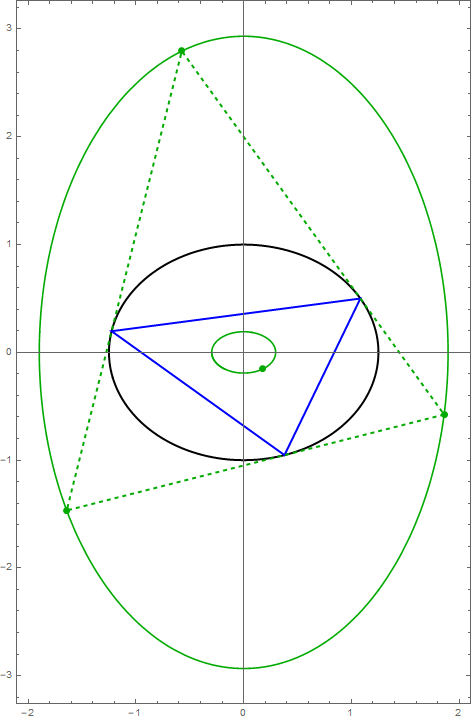
```

The excentral locus is the McBeath Circumconic [@mw] of the excentral triangles (and the orbits are their Orthic Inconic [@mw]). It can be shown the excentral locus is similar to the incentral ellipse. It can also be shown that the ratio of areas between the incentral ellipse and the billiard is given by:

$$
\frac{A_{billiard}}{A_{exc}}=\frac{r}{2R}
$$

Surprisingly, the area of the elliptic locus of the incenter is related to the billiard's in a reciprocal way:

$$
\frac{A_{billiard}}{A_{inc}}=\frac{2R}{r}
$$

The tracing of the excentral locus can be viewed dynamically on this [video](https://youtu.be/EYQhjgM33TQ).


## Locus of the Orthocenter is Elliptic {-}

The elliptic loci of a few major triangular centers is shown below -- "bar", "inc", "cir", "npc" stand for barycenter, incenter, circumcenter, and 9-point-center, respectively. The locus of the orthocenter $X_{4}$ is labeled "ort" and shown orange:

```{r,echo=F,out.width="50%"}
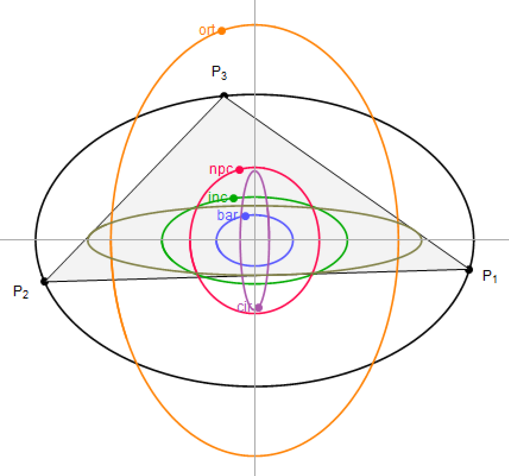
```

It can be shown that the orthocenter's locus is elliptic of the form $(x/a_H)^2+(y/b_H)^2=1$ where:

$$
\begin{array}{rcl}
a_H^2 & = & Z/A^2 \\
b_H^2 & = & Z \\
Z & = &  {\frac {-4\,\delta\,{A}^{2} \left( {A}^{2}+1 \right)+ \left( {A}^{4}+1 \right) ^{2}+{A}^{2
} \left( {A}^{2}+1 \right) ^{2}}{ \left( {A}^{2}-1 \right) ^{2}}}
\end{array}
$$

Notice that $a_H/b_H=1/A$, i.e., the orthocenter ellipse is similar to the billiard with its axes exchanged (rotated by 90 degrees).

**Theorem 1**: The locus of the orthocenter is elliptic and similar to the 90-degree rotated billiard [@garcia2020-properties].

### Critical points of the orthocenter

It can be shown that if $A<\sqrt{2 \sqrt{2}-1}\approx 1.352$, the orthocenter lies completely inside the billiard, and at $A\approx 1.5099$ the locus of the orthocenter is *identical* to the billiard rotated 90 degrees. The latter value is the only positive (real) root of equation $A^6 + A^4 - 4\,A^3-A^2-1=0$, obtained by setting $b_H$ above to $A$ and solving for $A$.

Further phenomena associated with the orbit's orthic are covered in the [Appendix](appendices.html).

# Mittenpunkt X(9) is stationary {.tabset .tabset-fade .tabset-pills}

## A stationary triangle center {-}

Observing that several triangular centers produce elliptic loci, we wondered if one of the loci could be pathologic, e.g., collapse to a point. Observing the cyclic symmetry of trilinear coordinates, we reckoned the billiard's center as a likely candidate for such a point-like locus.

Displaying billiard, orbit, and a few triangular centers on the screen (see below), we began to examine lines between points and the origin, hoping they might cross another triangular center over several orbits. However none did.

```{r,echo=F,out.width="50%"}
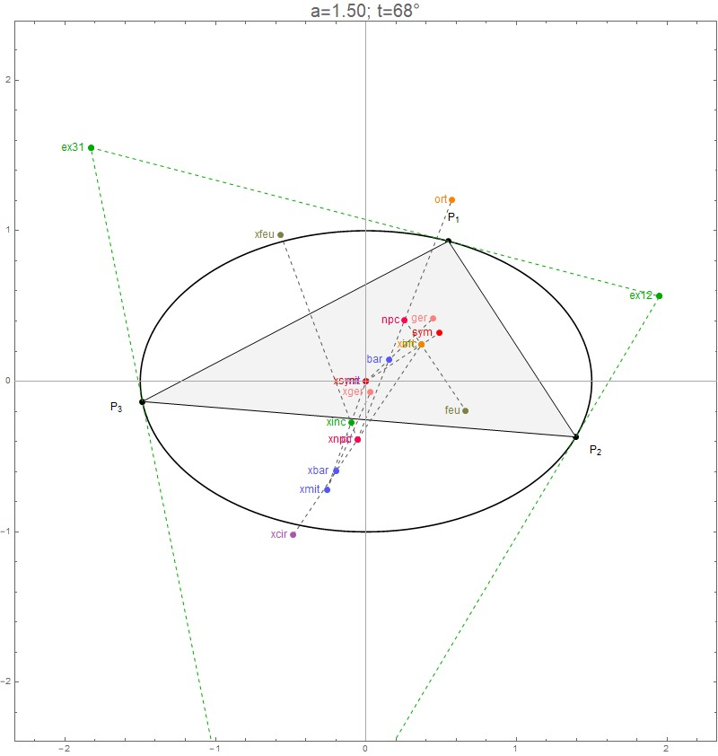
```

We did notice however that the line from an *excenter* to the origin crossed the corresponding orbit near its midpoint and that this relationship seemed to be preserved. We then lit up the medians on each side (medians are not proper triangular centers), we were amazed to discover that the crossing of medians was exact for each excenter-to-origin line. Most shockingly, this arrangement was preserved for *all* orbits! The construction we made was like this:

```{r,echo=F,out.width="50%"}
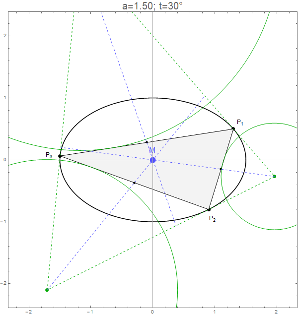
```

The point at which excenter-to-median lines concur is called the [Mittenpunkt](https://en.wikipedia.org/wiki/Mittenpunkt) $X_{9}$, described in 1836 by German geometer Christian Heinrich von Nagel (1803-1882).

```{r,include=F,out.width="33%",echo=F}
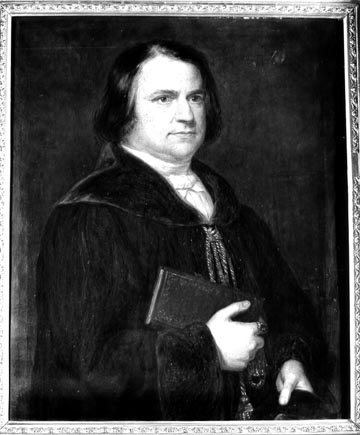
```

You can view this amazing phenomenon in a [video](https://youtu.be/AoCWcza95OA).

## Theorems {-}

**Theorem 6**: The Mittenpunkt $X_{9}$ of all N=3 orbits in an elliptic billiard is stationary at the center of the ellipse [@garcia2020-properties].

Sketch of proof: Let $E$ be an elliptic billiard centered at $O$. Let $P_{12}$ be the intersection of two of the orbit's external bisectors. Let $\bar{P}_{12}=(P_1+P_2)/2$ be the median point of chord $P_1P_2$ and $S_{12}$ be the segment containing $P_{12}$ and $\bar{P}_{12}$. Affinely transform this space so the ellipse becomes circle $E'$ centered on $O$. Since affine transformations preserve tangency and ratio of lengths, line $P'_{12}\bar{P}_{12}'$ will pass through the midpoint of chord $P'_1P'_2$, and by symmetry, through the center of the circle. This means that in the original space, $S$ will be pass through $O$. Repeat this procedure for elliptic chord $P_{23}$, and by the same argument, $S_{23}$ will pass through $O$. Because $S_{23}$ and $S_{12}$ are non-parallel (they stem from a triangle), and both contain $O$, the latter must be their single point of intersection.

**Theorem 7**: An ellipse-inscribed triangle will only be a billiard orbit if its Mittenpunkt is congruent with the center of the ellipse.

## Ellipticity Based on $X_9=0$ {-}

With $X_9$ stationary at the center of the billiard, the following triangular centers also describe elliptic loci (results due to Mark Helman, Aug 4, 2019):

- $X_7$, since the relation $X_7=3X_2-2X_9$ is found under the $X_9$ entry on [@etc].
- $X_{142}$, the midpoint of $X_9$ and $X_2$.
- $X_{144}$, the midpoint of $X_9$ and $X_7$.

Aditionally, because the locus of $X_2$ is similar to the billiard [@garcia2019-monthly], all of the above will have the same property.

# Invariant Quantities {.tabset .tabset-fade .tabset-pills}

## Inradius-to-Circumradius {-}

We plotted inradius, circumradius, and 9-point-circle $X_{5}$ radius with respect to starting vertex $P_1=(a \cos(t),\sin(t)),\;t\in(0,2\pi)$ for a triangular orbit in an ellipse with $A=1.5$:

```{r,echo=F,out.width="75%"}
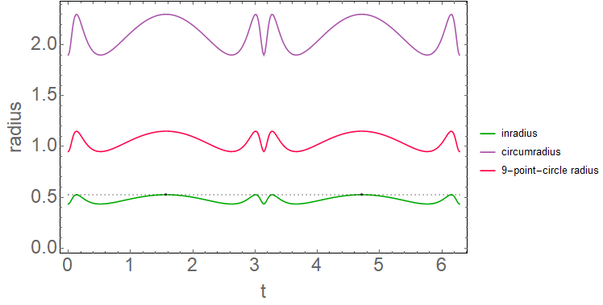
```

It is known the 9-point circle radius is twice the circumradius, however in general $r/R$ is a a non-linear expression of triangle sides lengths [@mw]. We had noticed all 3 curves above have proportional shapes, and we then verified algebraically that *all* triangular orbits in a given elliptic billiard have a constant inradius-to-circumradius ratio $r/R$ which is only a function of the ratio of billiard semiaxes:

$$
\begin{array}{rcll}
\frac{r}{R}&=&\frac{2(\delta-1)}{(A^2-1)(A^2+\delta)}&\mbox{[1]}\\
\delta&=&\sqrt{A^4-A^2+1}
\end{array}
$$
Where $A=a/b$ the ratio of the semiaxes. Below we show $r/R$ versus various ratios of semiaxes $A=a/b$:

```{r,echo=F,out.width="50%"}
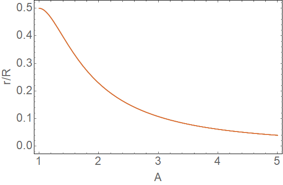
```

$(r/R)$ maximum is $1/2$ at $A=1$, i.e., the billiard is a circle and all 3-gon orbits are equilateral.

Furthermore, it can be shown that this property is independent of perimeter constancy, and in fact, when both are specified (a particular $r/R\in (0,1/2)$ and a non-negative perimeter), the 3-gon orbit is completely specified.

## Sum of Cosines {-}

Let $ABC$ be the internal angles of a generic triangle. These relations [@mw]:

$$
\begin{array}{ccc}
\frac{r}{R} & = & \cos(A)+\cos(B)+\cos(C)-1 \\[10pt]
            & = & 4\,\sin(\frac{A}{2})\,\sin(\frac{B}{2})\,\sin(\frac{C}{2})
\end{array}
$$

Therefore, the sum of cosines of the internal angles and/or the product of the sines of the half-angles is an invariant of the orbit family.

The picture below shows the value of each of the three cosines, vs the parameter for vertex $A$, which moves along the billiard as $(a\cos(t),b\sin(t))$, for $a=1.5,b=1$, as well as their constant sum:

```{r,echo=F,out.width="75%"}
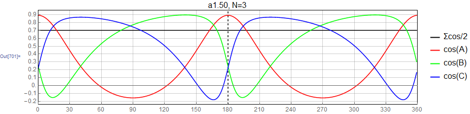
```

We can also show this constant sum by "stacking" each of the above curves and realizing that at any value of parameter $t$ their addition is constant:

```{r,echo=F,out.width="50%"}
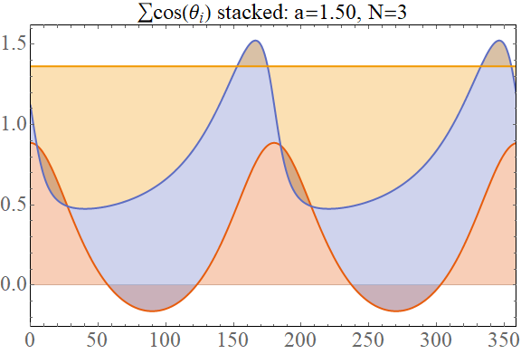
```

We have subsequently verified constant cosine sum to be a property of polygons with $N>3$ non-intersecting, and for $N=4$ self-intersecting. These are described in the [Appendix](appendices.html).

## Visualizing Invariant 2-dimensions {-}

Up to a rigid transformation and isotropic scaling, all triangles in a 2-dimensional space of reference triangles $T_0(u,v)$:

$$
T_0(u,v)=\{(0,0),\;(1,0),\;(u,v)\}
$$

Where $u$ and $v$ are non-negative numbers. In this two-dimensional space we can ask the following questions:

1. what are level curves for $(u,v)$ which preserve the sum of cosines (equivalently, the ratio $r/R$);
2. what portions of such curves correspond to acute vs obtuse triangles?

These two questions can be visualized in the picture below, where level curves correspond to constant sum of cosines:

```{r,echo=F,out.width="50%"}
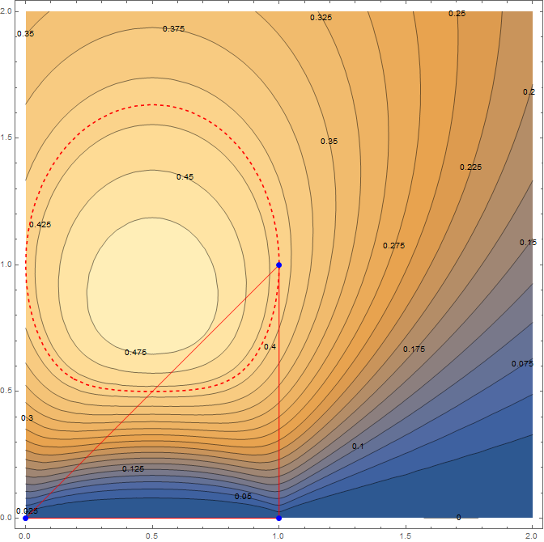
```

Namely the first question corresponds to each "oval" level curve, and the second to those $(u,v)$ which lie to the *right* of the vertical line $u=1$. Notice the highest level curve is at the center of all ovals, corresponding to the family of equilateral triangles.

# Corollary Invariants {.tabset .tabset-fade .tabset-pills}

## Excentral Invariants {-}

Consider the excentral triangle $A'B'C'$ [@mw], tangent to the ellipse at the orbits' vertices $ABC$.

```{r,echo=F,out.width="50%"}
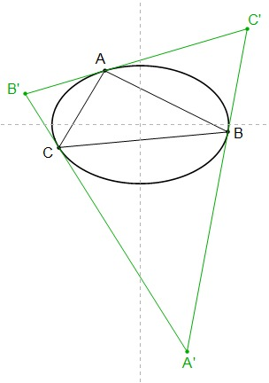
```

Since $A'=\frac{\pi-A}{2}$, $B'=\frac{\pi-B}{2}$, and $C'=\frac{\pi-C}{2}$, the family of orbit excentral triangles will only contain acute triangles. Direct derivation produces:

$$
\begin{array}{rcll}
-\cos(2A')-\cos(2B')-\cos(2C') & = & \\ \cos(A)+\cos(B)+\cos(C) & = & 1+\frac{r}{R} & = \text{invariant}
\end{array}
$$

Furthermore, since the orbit will be the excentral's *orthic* triangle [@mw], (i) the excentral's circumradius $R'$ will be twice the orbit's ($R'=2R$), and (ii) the orbit's inradius $r$ will be given by the following relation [@mw_orthic]:

$$
\begin{array}{rcl}
r  & = & 2 R'\;|\cos(A')\cos(B')\cos(C')| = \\
  & = & 4 R\;\cos(A')\cos(B')\cos(C')
\end{array}
$$

In the above we removed the absolute value since $A'$, $B'$, and $C'$ are acute. Since $r/R$ of the orbit is an invariant, the family of excentral triangles will conserve the *product* of its internal cosines:

$$
\cos(A')\cos(B')\cos(C') = \frac{r}{4R} = \text{constant}
$$

The above relation can be visualized below, where the orbit (resp. excentral) $(u,v)$ triangle is shown blue (resp. green), along with the locus of $(u,v)$. For the orbits (resp. excentrals), this is an iso-curve of cosine *sum* (resp. product), shown as a dotted blue (resp. green) curve. Cosine sum (resp. product) are shown as the left (resp. right) pictures below and they can be seen dynamically on this [video](https://youtu.be/P8ykpE_ZbZ8): 

```{r,echo=F,out.width="75%"}
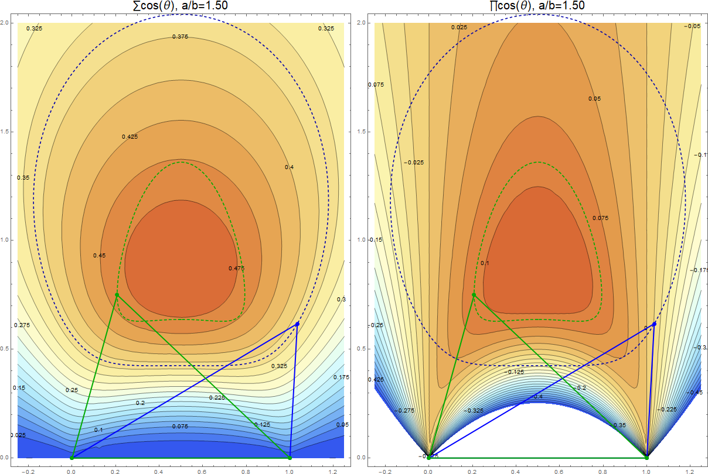
```

Furthermore since (i) the area of any triangle is given by the product of its inradius by its semiperimeter, and (ii) by the product of its circumradius by its orthic semiperimeter [@mw], we can state, about the excentral triangle:

$$
\begin{array}{rclll}
A' & = & r'\,P'/2 & = & R'\,P/2 \\
P'\frac{r'}{R'} & = & P & = & \text{constant}
\end{array}
$$

**Theorem 3**: The inradius-to-circumradius ratio for all orbits is invariant.

+ **Corollary 3.1** The sum of cosines of orbits' internal angles is constant and equal to $1+r/R$.
+ **Corollary 3.2** The negative of sum of double-angle cosines of the excentral triangle is constant and equal to $1+r/R$.
+ **Corollary 3.3** The product of cosines of the excentral triangle is constant and equal to $r/(4R)$.
+ **Corollary 3.4** The excentral triangle conserves the product of its perimeter by the ratio of its inradius by circumradius. This quantity is equal to the orbits' constant perimeter.

A formula derived by Feuerbach states that the ratio of areas between a triangle and its orthic is equal to $2R_h/r_h$, where the subscripted quantities refer to the orthic [@johnson29]. Because the orbits are their excentrals' orthic, we can state that:


$$
A_{exc}/A_{orbit} = 2R/r = \mbox{constant}
$$

+ **Corollary 3.5** The excentral-to-orbit area ratio is constant and equal to $2R/r$.

## Orthic Invariants {-}

Extending this analysis to the orbits' orthic triangles, for acute orbits, orthic angles $\theta_i'', i=1,2,3$ will be equal to $\pi-2\theta_i$, i.e., $\sin(\theta_i''/2)=cos(\theta_i)$. Given constancy of sum of orbit cosines, the orthic of an acute orbit will conserve the sum of *half-angle* sines.

Likewise, since the area $A$ of a triangle is $r\,P/2$ and, if acute, also $R\,P''/2$ [@mw], the orthic of an acute orbit will conserve its perimeter $P''=P\,r/R$, i.e., the product of the two orbit invariants. If the orbit $T$ is *obtuse*, two of its orthic vertices will lie outside $T$ as will $T$'s orthocenter $H$ [@coxeter67]. Let $T_a$, be the excentral triangle of the orthic, always acute. The orthic of $T_a$ is the same as $T$'s, i.e., the orthic *pre-image* contains $T$ obtuse and $T_a$ acute:

```{r,echo=F,out.width="75%"}
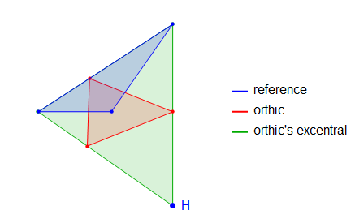
```

Generalizing the above argument, the area $A_a$ of the acute preimage $T_a$ of the orthic will be $r_a\,P_a/2$ and, all extriangles are acute [@mw], also $R_a\,P''/2$. So for both acute and obtuse orbits, the orthic perimeter $P''$ will be given by $P_a\,r_a/R_a$, where $R_a,r_a,P_a$ are the circumradius, inradius, and perimeter of the acute preimage of the orthic: its extriangle (resp. the orbit) for obtuse (resp. acute) orbits.

The angular quantity the orthic conserves for *obtuse* orbits is still under investigation. 

## Summary of Invariants {-}

We can summarize the following characteristics for orbit, its excentral triangle, and its orthic:

$$
\begin{array}{|c|c|c|c|c|}
\hline
\bf{\text{Triangle}} & \bf{\text{All Acute}} & \bf{\text{Some Obtuse}} & \bf{\text{Angular Invariance}} & \bf{\text{Metric Invariance}} \\
\hline
\text{Orbit} & a<1.35 & a>1.35 & \sum{\cos(\theta_i)} = 1+r/R & P \\
\text{Excentral} & \forall a & \varnothing  & \prod{\cos(\theta_i')}=r/(4R) & P'\frac{r'}{R'} = P  \\
\text{Orthic} & a<1.17 & a>1.17 & \sum{\sin{(\theta_i''/2)}}=1+r/R\;^\dagger &  P'' = P_a\frac{r_a}{R_a}\;{^\dagger}{^\dagger} \\
\hline
\end{array}
$$
$^\dagger$for acute orbits only.
${^\dagger}{^\dagger}$for acute orbits, this reduces to $P\,r/R$.


# Stationary Circle {.tabset .tabset-fade .tabset-pills}

## N=3 and the Cosine Circle {-}

Take an $N=3$ orbit in an elliptic billiard, with some ratio $a/b$ of its semiaxes. Take one of its vertices $P$ and reflect it about the origin to $P'$, also on the billiard. Compute the intersections $Q_1$ and $Q_2$ of the tangent to the billiard at $P'$ with the orbit's excentral triangle $T'$ (left below). It turns out the locus of $Q_1$ (or $Q_2$) is a stationary circle, centered on the Mittenpunk $X_9$ of the orbit (right below):

```{r,echo=F,out.width="75%"}
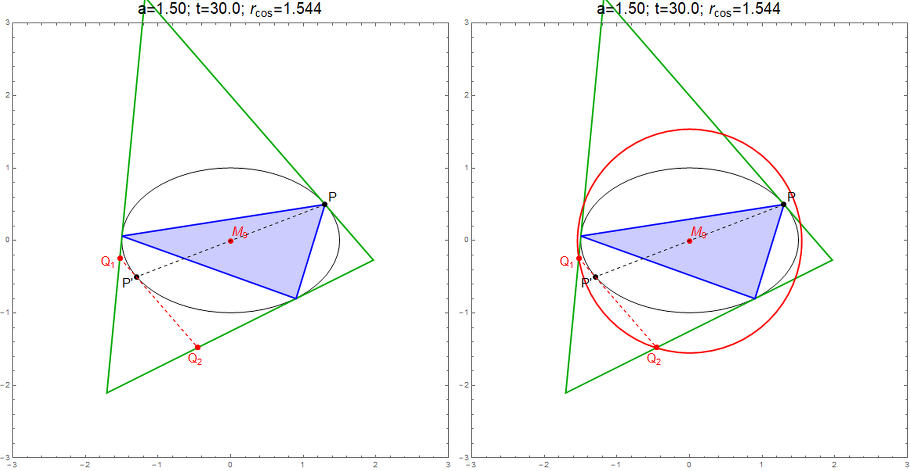
```

In terms of the billiard's axes $a,b$, its radius $r^*$ is given by:

$$
r^* = \frac{\sqrt{3}}{3}\sqrt{a^2+b^2+ 2\sqrt{a^4-a^2 b^2+b^4}}
$$

And $r^*>a/b$, as shown below:

```{r,echo=F,out.width="50%"}
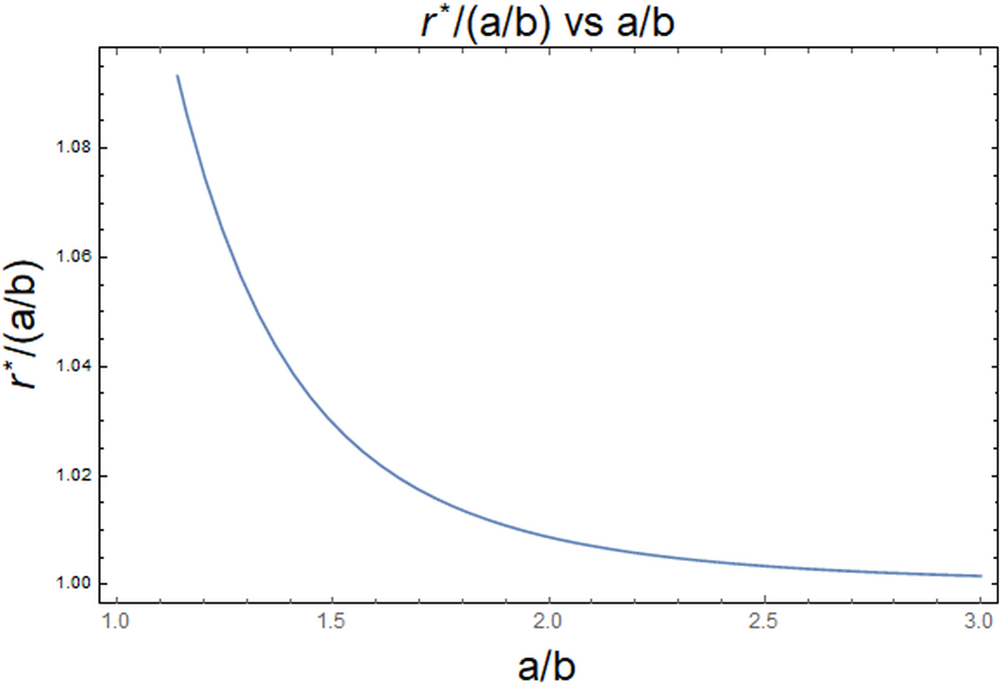
```

It turns out the above construction computes the Excentral Triangle's Cosine Circle [@mw]'(also known as its 2nd Lemoine Circle). The vertices of its Cosine Hexagon [@mw] will lie on this circle.

The vertices of the Cosine Hexagon can also be obtained, for a generic triangle, by intersecting it with its copy reflected about the Symmedian point $X_6$. Because the excentral's Symmedian is the orbit's Mittenpunkt, its center will be stationary:

```{r,echo=F,out.width="100%"}
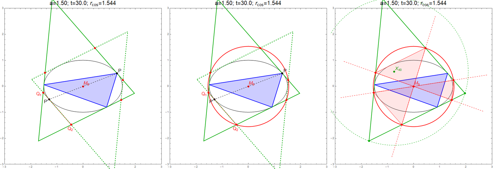
```

This beautiful phenomenon is viewable in the following videos: [video1](https://youtu.be/hCQIT6_XhaQ), [video2](https://youtu.be/CrOSI8d8qDc), [video3](https://youtu.be/ACinCf-D_Ok).

## Cosine Circles for $N>3$ {-}

$N=4$ non-intersecting orbits are parallelograms. The fact that their excentral polygon is rectangular and that the loci of the latter is circular is well-known [@connes07]. Interestingly, we can construct a circular locus for $N=5$ by intersecting an edge of its excentral polygon with the next edge, where the latter is reflected about the center of the billiard. Both cases are shown below:

```{r,echo=F,out.width="75%"}
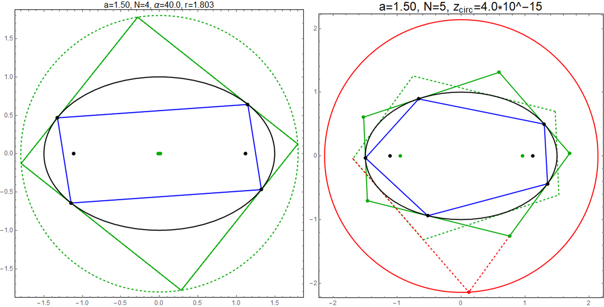
```

The above rule seems to be applicable for all $N$: Let $T'$ be the polygon tangent to the billiard at the orbit's vertices. Let $S_i$ be the segment $P'_iP'_{i+1}$ of two consecutive vertices of $T'$. It turns out that for any $N$, the locus of intersection of $S_iS^*_{i+1}$ is a stationary circle, where $S^*$ is a reflection of the segment endpoints about the center of the billiard. Below we show this phenomenon for $N=3,4,\ldots,8$, with the billiard, orbits, tangential polygon, and loci shown black, green, and red. Also shown at the top of each graph is the radius of the corresponding circular locus:

```{r,echo=F,out.width="100%"}
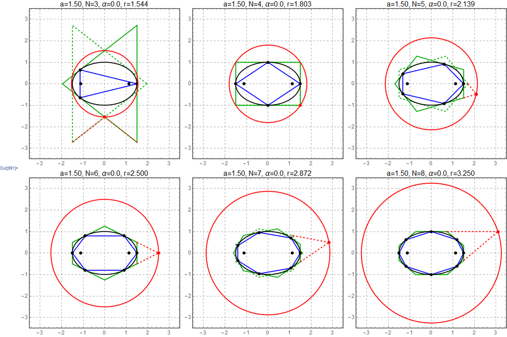
```

This beautiful property can be viewed in a [video](https://youtu.be/dINE4aH1cvk) for $N=5$, and in another [video](https://youtu.be/EFeINGIDFrg) for $N=3,4,\ldots,8$.

Intersections of successive orbit (or tangential polygon) edges is related to the Poncelet Grid [@schwartz07],[@sergei07_grid] and the Pentagram Map [@sergei10_pentagram]. We are currently investigating alongside those authors whether the circular locus is a corollary of the grid/map and/or it is novel. 


# Properties of the Feuerbach Point {.tabset .tabset-fade .tabset-pills}

## Locus of Feuerbach point and Extouch points is the caustic {-}

Returning to Poncelet's Porism, it turns out the conic to which all 3-orbits are tangent is an ellipse, known as the *caustic*, is confocal with the billiard [@sergei91]. The three points of tangency between the excircles and each side are known as the *extouchpoints* [@mw], i.e., they are found by dropping a perpendicular from each excenter (obtained by intersecting consecutive tangents) onto the corresponding side. Chasles' Theorem [@sergei2016proj] implies these will coincide with the tangency point of the one ellipse confocal with the billiard and the corresponding side, i.e., the locus of the extouchpoints will sweep caustic; equivalently, the caustic is the Mandart Inellipse of the orbit [@mw].

It can also be shown that the locus of the [Feuerbach point](https://en.wikipedia.org/wiki/Feuerbach_point) $X_{11}$, where incircle and 9-point-circle touch, also traces out the caustic, as shown below:

```{r,echo=F,out.width="50%"}
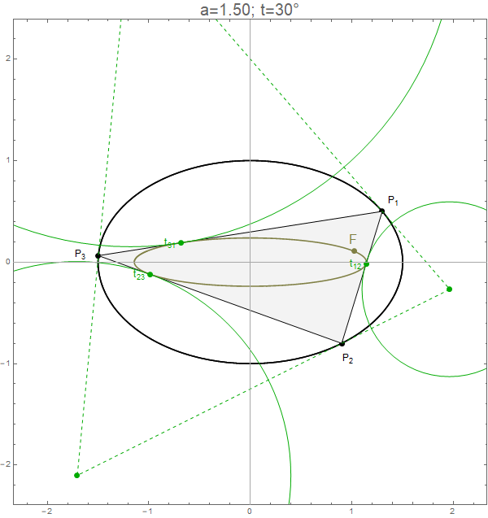
```

Interestingly, if the orbit's starting vertex sweeps the billiard counterclockwise, so will the three extouch points, while the Feuerbach will move in the opposite direction, i.e., *clockwise*, as shown on this [video](https://youtu.be/1gYb5Y3-rQI).

**Theorem 4**: The locus of the Feuerbach point and that of the three extouch points is the confocal caustic [@garcia2020-properties]

## Anticomplement of the Feuerbach sweeps the billiard {-}

Karl Wilhelm von Feuerbach (1800–1834) proved in 1822 that the nine-point circle is tangent to the three excircles of the triangle as well as its incircle [@mw].

```{r,include=F,out.width="50%",echo=F}
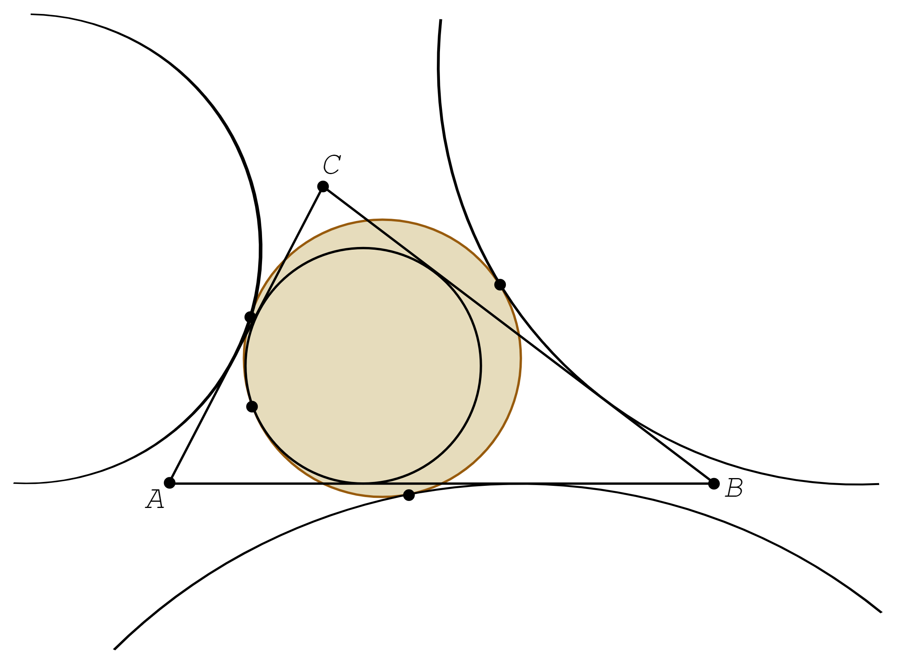
```

It can be shown that the locus of $X_{100}$, the *anticomplement* of the Feuerbach point, shown below as $\bar{F}$, sweeps the billiard:

```{r,out.width="66%",echo=F}
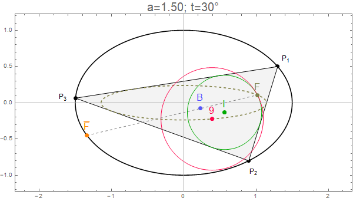
```

The anticomplement $P'$ of a point $P$ in a triangle is $P'=B-2(P-B)$. This surprising result has been depicted in a [video](https://youtu.be/8JKevLpteQk).

We found experimentally that the locus of $X_{88}$, the isogonal complement of $X_{44}$ [@etc], is also the billiard. For a particular starting point P1 of the orbit, $X_{100}$ and $X_{88}$ will appear at different positions on the billiard, as shown below:

```{r,out.width="66%",echo=F}
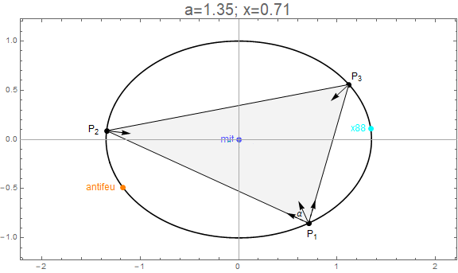
```

**Theorem 5**: The locus of the anticomplement of the Feuerbach point is the billiard. [@garcia2020-properties]

**Conjecture 5.1**: The locus of $X_{88}$ is also the billiard.

## Summary of Feuerbach properties {-}

Consider the picture below. An $a/b=1.5$ elliptic billiard is shown with an $N=3$ orbit. As mentioned above:

* the orbit's Feuerbach point $X_11$ (where incircle and 9-point circle meet) sweeps the caustic.
* perpendiculars dropped from the excenters onto the sides sweep the caustic
* the anticomplement $X_{100}$ of the Feuerbach point (shown as an $\bar{F}$) also sweeps the billiard.

```{r,out.width="75%",echo=F}
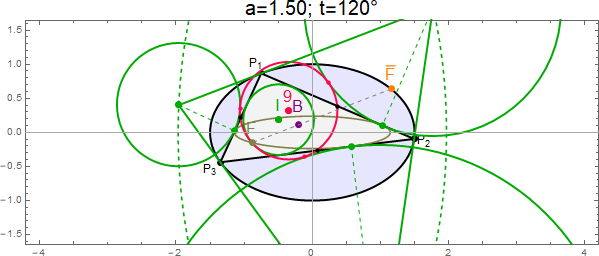
```

# Other N=3 Properties {.tabset .tabset-fade .tabset-pills}
## Vertices of Anticomplementary's Contact Triangle Sweep Billiard {-}

Now consider the construction below where $\bar{F}$ is computed as the Feuerbach point for the orbit's *anticomplementary* [@mw] triangle $T'$, shown in blue, computed from its incircle (green) and 9-point-circle (pink). The latter is congruent with the orbit's circumcircle, i.e., these meet at $X_{100}$, the Feuerbach point of $T'$.

```{r,out.width="75%",echo=F}
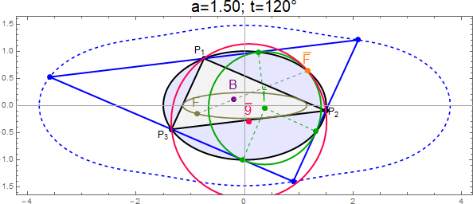
```

A [video](https://youtu.be/18RyUdh8qLk) was constructed from which we derive one main observation.

>The Intouch points of $T'$ sweep the billiard: the incircle of $T'$ crosses the orbit at 4 different points: $X_{100}$ and the vertices of the contact triangle [@mw]. All four will therefore sweep the billiard.

A proof, due to Prof. Igor Minevich, is sketched in the [Appendix](appendices.html). Additionally, we have observed:

a. Non-ellipticity of vertices: though the vertices of the orbit $T$ move along the elliptic billiard, the vertices of its anticomplement $T'$ (drawn dashed blue) do not. The latter's motion is superposed by the elliptic motion of $X_2$ about $X_9$, i.e., the Mittenpunkt of $T'$ is non-stationary, i.e., it will move along the elliptical anticomplement of the origin about $X_2$ (shown as $G$).
a. Non-monotonic motion of contact vertices: if the family of orbits is driven by a continuous CCW motion of $P_1$ on the billiard, $\bar{F}$ will move along the billiard monotonically in the CW direction (opposite). However, the aforementioned contact points will move overall CCW but will occasionally be retrograde.

The next figure depicts relative angular progress of all points mentioned, as they are driven by the parametric motion of $P_1 = (a \cos(t), \sin(t))$, with $a=1.5$. This is shown as the black line below. $P_2$ and $P_3$ are shown gray: these accelerate/decelerate to preserve the orbit's required geometry. The two Feuerbach points $F$ and $\bar{F}$ are shown red and green, respectively. Both move monotonically *opposite* to $P_1$. Shown dashed reds (resp. dashed green) are the monotonic motion of the extouchpoints (resp. the non-monotonic motion of $T'$ intouchpoints), both moving overall in the direction of P1.

```{r,out.width="75%",echo=F}
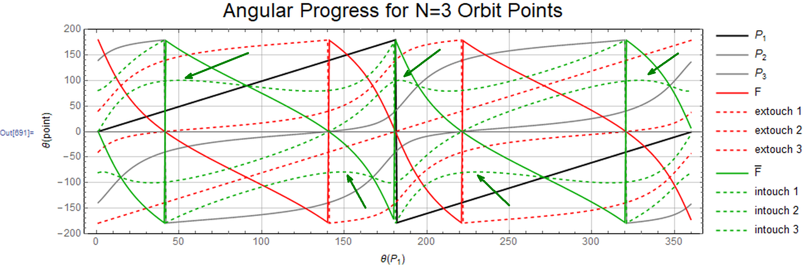
```

## Locus of Tangential Edge Intersections is Circular and Stationary for all N {-}


# Generalizing for N-Periodics {.tabset .tabset-fade .tabset-pills}

## Constant Sum of Cosines for N>3 {-}

We've measured the sum of vertex cosines for $N=4,5,...9$, with $a/b=1.5$, shown below, all of which add to a constant value, indicating this might be a integral of motion of all polygonal orbits.

```{r,echo=F,out.width="100%"}
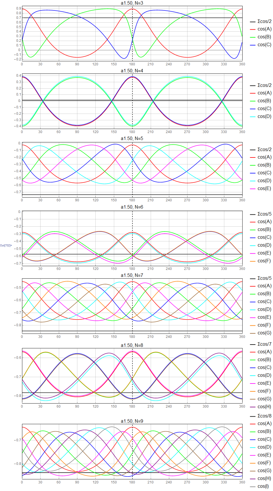
```

As in the above, this can be represented via stacked graphs showing constant accumulation:

```{r,echo=F,out.width="100%"}
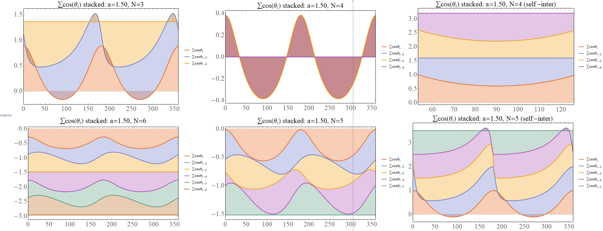
```

We thought the stacked chart of $N=5$ cosines was reminiscent of the patterns seen on the sidewalk of Copacabana Beach designed by Burle Marx: 

```{r,echo=F,out.width="75%"}
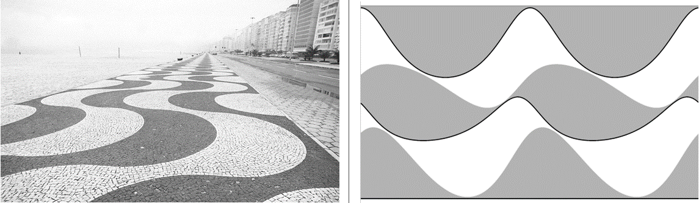
```

We then took hundreds of combinations of $a/b$ and $N$ and verified all produce a constant sum of cosines, depicted below:

```{r,echo=F,out.width="75%"}
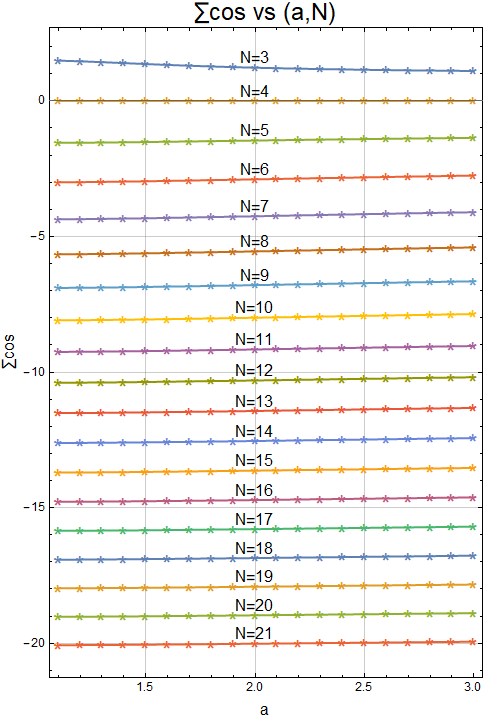
```

Finally, we observed the motion for two self-intersecting orbits:

* the $N=4$ "bowtie", [video](https://youtu.be/cCYxN7ueGV4)
* the $N=5$ pentagram, [video](https://youtu.be/ECe4DptduJY)

These also preserved the sum of their internal cosines, with the former one algebraically proven.

Recently (July 2019), Professors Sergei Tabachnikov, and Richard Schwarz proved constancy of cosine sum for all $N$, and the following is a sketch of their proof.

```{r,echo=F,out.width="100%"}
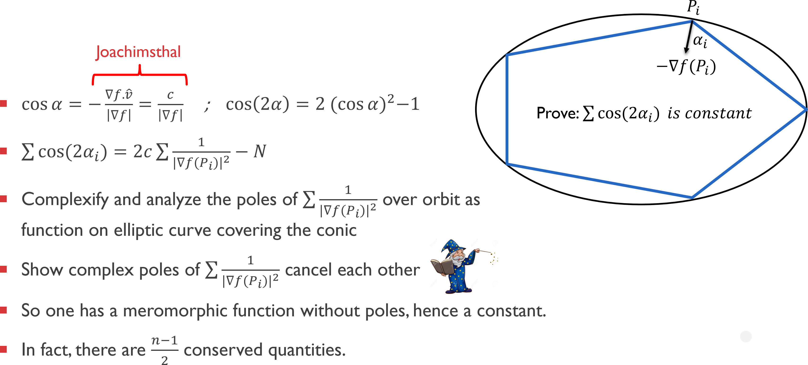
```

## Constant Product of Cosines for Tangential Polygon {-}

We've shown above that for $N=3$ the *product* of cosines of the excentral triangles is constant. Let the *tangential* polygon to to an $N>3$ orbit have sides which are tangent to every orbit vertex. We have verified numerically that the *product* of their cosines also remains constant, graphically:

```{r,echo=F,out.width="50%"}
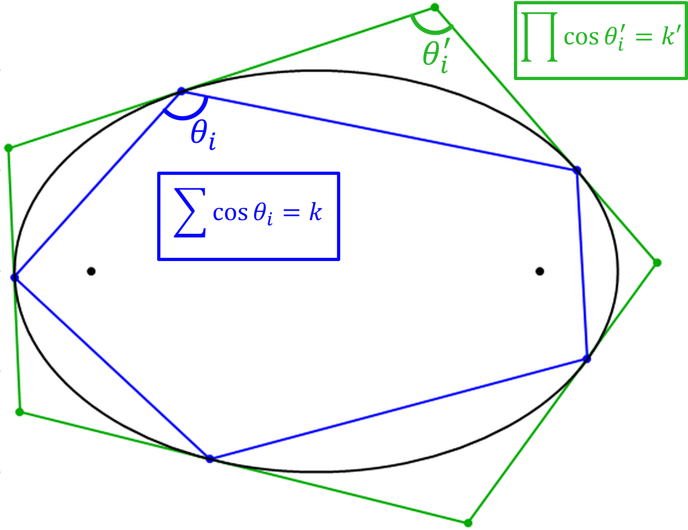
```

The proof for this fact is still being produced.

## Constant Tangential-to-Orbit Area Ratio for Odd-N {-}

The ratio of excentral-to-orbit areas for $N=3$ is constant. It turns out this property generalizes for all *odd* $N>3$. Proof in preparation.

## Orbit Area Stability {-}

Given an $N\geq3$, the family of $N$-periodic, non-intersecting orbits in an elliptic billiard conserves perimeter but does not conserve *area*. Below we plot area vs. $t\in[0,2\pi]$, the angular parameter of a starting vertex for $N=3,4,\ldots,9$, for an elliptic billiard with $a/b=1.5$:

```{r,echo=F,out.width="66%"}
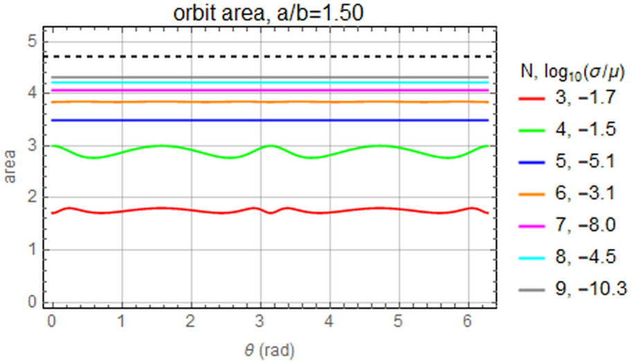
```

As $N$ grows orbits approach the "whispering gallery" configuration (edges become shorter and ever closer to the billiard), and orbit areas approach the billiard's, $A=\pi\,a\,b$, where $a,b$ are the semiaxes (at $a/b=1.5$, $A\approx 4.71$).

Consider the z-score of areas across the family (i.e. the ratio of standard deviation by mean) as a proxy to area *stability*. As depicted below, this decreases with respect to $N$ in a non-monotonic manner (z-score shown on a log scale), with deep valleys for odd $N$: 

```{r,echo=F,out.width="66%"}
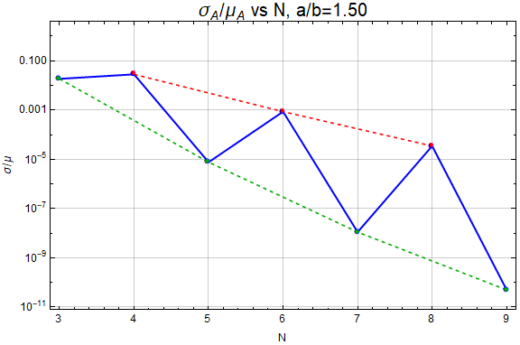
```

Let $z_N$ denote the area z-score for the family of non-intersecting $N-$orbits. The above shows that $z_5$ is an order of magnitude smaller than $z_6$ and still smaller than $z_8$. Similarly, $z_7$ is nearly two orders of magnitude smaller than $z_8$ and (not shown) smaller than $z_{10}$. This seems to imply odd-orbits have areas significantly stabler than their even higher-vertex-count neighbors, despite the fact that even-$N$ orbits have a stationary barycenter while odd ones do not.


# Conclusion

Through interactive experimentation we have identified some new properties for the family of 3-periodic orbits in elliptic billiards. These and other questions may also be of interest:

1. What is the connection of $r/R$ invariance with the known integrals of elliptic billiards (conservation of linear and angular momentum)?
1. What are algebraic requirements of triangular centers (e.g., in their trilinears) which yield elliptic vs. non-elliptic loci?
1. We have found numerically that some two-dozen centers between $X_1$~$X_{100}$ produce elliptic loci, many are still awaiting proof.
1. What are kinematic phenomena for triangular centers beyond $X_{100}$?
1. Are there salient formations among triangular centers (e.g., equilateral triads, n-point-circles, collinearity) which are specific to 3-orbits?
1. Can invariants be found for $N-$orbits for:
    1. Non-euclidean geometries (spherircal, hyperbolic, lorentzian, etc.)
    1. Other billiards: external, polygonal, etc.

# Misc {.tabset .tabset-fade .tabset-pills}

## A few unproven facts {-}

1. $N=3$
    1. Locus of $X_5$ (Center of 9-point Circle) is elliptic.
    1. Locus of $X_{40}$ (Bevan Point) is elliptic and similar to the billiard.
    1. Prove (or disprove) that if $X_i(t)$ an $X_j(t)$ are loci of triangular centers $X_i$ and $X_j$ known to be elliptic, then the locus of the convex combination $(1-k) X_i(t)+k X_j(t),\,k\in\mathbb{R}$ is elliptic.
    1. An elliptic locus deriving from the $N=3$ orbit family is axis-aligned with the billiard.
    1. The axes of the $X_1$-centered circumellipse are aligned with the billiard and their ratio is constant across the orbit family.
    1. The axes $a,b$ of the $X_2$-centered circumellipse are in general not aligned with the billiard and are related as $a=c_0 + c_1 b$, with $c_0,c_1$ constant across the orbit family.
    1. Isotomic conjugate of billiard is trilinear polar of $X_{144}$.
1. $N>4$
    1. The product of cosines of the tangential polygon is constant.
    1. For $N\geq5$, $N$ odd, the z-score of its area distribution (across the family) is smaller than that of $N+1$ and $N+3$.
    
## Not yet written {-}

* $a/b$ for which locus of orthocenter identical to billiard
* perpendicular dropped from excentral vertex is on caustic, $\forall N$.
* $\cos(\alpha)|_{N>3} = (1-c_N)+c_N\cos(\alpha)|_{N=3}$, $c_N$ an $N$-dependent constant.

***
```{r glossary,child="glossary.Rmd"}
```

# Appendix

The appendices have been moved to a dedicated [page](appendices.html).

***
# References {-}
