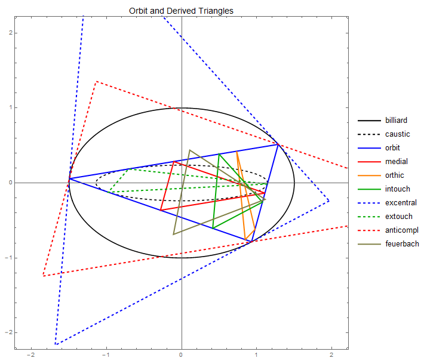

--- 
title: "Triangular Orbits in Elliptic Billards: Loci of Points X(1)~X(100)"
author: Dan Reznik
date: May, 2019
output:
    bookdown::html_document2:
      theme: flatly
link-citations: yes
bibliography: elliptic_billiards.bib
csl: computer.csl
---

```{r,echo=F}
knitr::opts_chunk$set(
  cache=T,
  collapse=T,
  comment="#>",
  dpi=300,
  fig.align="center",
  out.width='100%'
)
```

An elliptic billiard (black), its $N=3$ caustic (dashed black), and a particular $N=3$ orbit (blue) are shown below, as well as the following triangles derived from the orbit:

+ medial: medians of each side
+ orthic: feet of altitudes
+ contact: incircle touchpoints with sides
+ excentral: excenters
+ extouch: excircle touchpoints with sides
+ anticompl: anticomplementary triangle
+ feuerbach: 9-point-circle touchpoints w excircles

```{r,out.width="75%",echo=F}

```

The pictures below show the loci of $X_1$ to $X_{100}$ calculated for the orbit and the above derived triangles, $a/b=1.5$.

```{r,echo=F}
fnames <- as.character(fs::dir_ls("loci_6tri"))
```

```{r,out.width="75%",echo=F}
knitr::include_graphics(fnames)
```

# Notes on the Loci: {-}

* $X'(6)$, the excentral Symmedian, is congruent with $X(9)$, the Mittenpunkt, and both loci are a point.
* $X(9)$, the Mittenpunk, fixed at the origin.
* $X(11)$, the Feuerbach point, tracing the caustic.
* $X(14)$, 2nd Isogonic, closely tracking the billiard.
* $X(30)$, Euler Infinity Point, is the intersection of the Euler line with the line at infinity. Is there any interesting info here?
* $X(37)$, the crosspoint of incenter and centroid, seem to generate identical perpendicular loci, with major semiaxis = $1/2$, i.e, one third of the original.
* $X'(41)$ generates a nearly circular locus.
* $X'(46)$ horizontal axis is exactly 1.
* $X(49)$ has cusps.
* $X(50)$ has lines to infinity at intriguing directions.
* $X'(56)$ is an almost perfect circle, std. dev. of radius within 0.75% of its average.
* $X(59)$ and $X'(59)$ are marvellously self-intersecting.
* $X(67)$ tracks the billiard.
* $X(73)$ is diamond-shaped, though smooth.
* $X(74)$ has north-south cusps.
* $X(76)$ Brocard point ellipse is almost flat along $y$.
* $X(77)$ nicely self-intersecting.
* $X(87)$ nicely self-intersecting.
* $X(88)$ locus = billiard.
* $X(89)$ axes *almost* vanish, Mittenpunk-style. Why?
* $X(92)$ pillow-shaped, with north and south inward concavities.
* $X(93)$ has interesting escape directions.
* $X(94)$ has a high-order curvature function.
* $X(94)$ has a very small, hourglass locus.
* $X(99)$, the Steiner point, almost perfectly tracks the billiard. What is the reason for this close tracking?
* $X(100)$, the anticomplement of the Feuerbach point, has the billiard as locus.
* $X(100)$, the anticomplement of the the Feuerbach point of the intouch triangle sweeps the caustic.

Go back to [main page](index.html).

***
`r if (knitr::is_html_output()) '# References {-}'`
