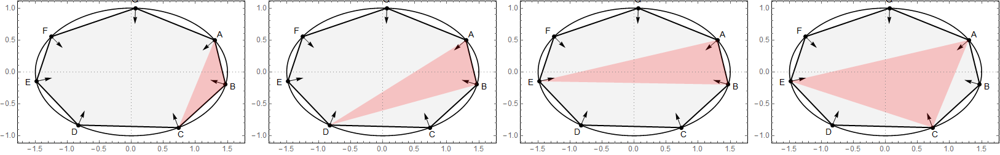

--- 
title: "Heptagonal Orbits in Elliptic Billards: Loci of X(1)~X(100) for Internal Triangles"
author: Dan Reznik
date: May, 2019
output:
    bookdown::html_document2:
      theme: flatly
link-citations: yes
bibliography: elliptic_billiards.bib
csl: computer.csl
---

```{r,echo=F}
knitr::opts_chunk$set(
  cache=T,
  collapse=T,
  comment="#>",
  dpi=600,
  fig.align="center",
  out.width='100%'
)
```

Consider the family of non-intersecting, heptagonal ($N=7$) orbits in an elliptic billiard, $a/b=1.5$. Each heptagon contains four distinct subtriangles (up to cyclic symmetry), e.g., defined by vertices 123, 124, 125 and 135:

```{r,echo=F,out.width="100%"}

```

Each row below depicts the locus of $X(i)$, $i=1,2,\ldots 100$ for those subtriangles shown combined and separately.

```{r,echo=F}
fnames <- as.character(fs::dir_ls("loci_hept"))
```

```{r,echo=F}
knitr::include_graphics(fnames)
```

Go back to [main page](index.html).


