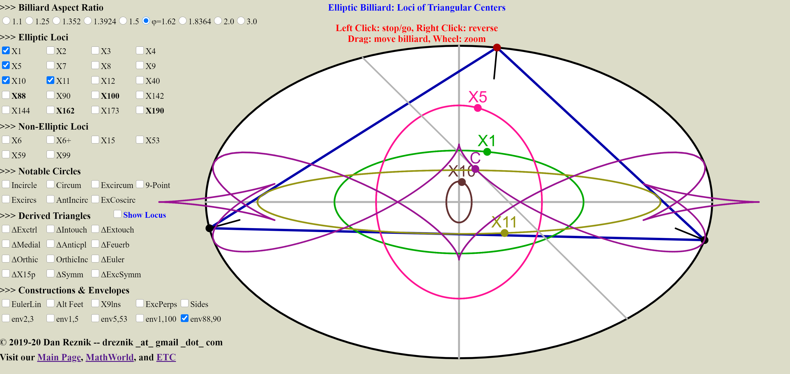

--- 
title: "Triangles and Ellipses: Pages and Media"
author: Dan Reznik
date: "Last update: `r lubridate::with_tz(Sys.time(),tzone='Brazil/East')`"
output:
  bookdown::html_document2:
      theme: cosmo
      highlight: kate
      css: style.css
      toc_depth: 1
      toc: true
      toc_float:
        toc_collapsed: true
        smooth_scroll: yes
      fig_caption: yes
      keep_md: yes
      number_sections: yes
link-citations: yes
bibliography: [elliptic_billiards_v2.bib,authors_rgk_v1.bib]
csl: acm.csl
---

<!--
rmdformats::readthedown:
      number_sections: yes
      toc_depth: 1
      css: style.css
      highlight: tango
-->

<!--
bookdown::html_document2:
      theme: cosmo
      code_folding: show
      highlight: kate
      css: style.css
      toc_depth: 1
      toc: true
      toc_float:
        toc_collapsed: true
        smooth_scroll: yes
      fig_caption: yes
      keep_md: yes
      number_sections: yes
-->

<!-- "default", "cerulean", "journal", "flatly", "darkly", "readable", "spacelab", "united", "cosmo", "lumen", "paper", "sandstone", "simplex", "yeti" -->

```{r,include=F,message=F,warning=F}
library(tidyverse)
library(knitr)
library(kableExtra)
library(googlesheets4)
opts_chunk$set(
  cache=T,
  collapse=T,
  comment="#>",
  dpi=300,
  fig.align="center",
  out.width='100%'
)
source("util.R")
```

<!--  -->
```{r,include=F}
# for googlesheets4
sheets_id <- Sys.getenv("sheet_id")
```
<!--  -->

>I’m going to assume that you love beautiful things and are curious to learn about them. The only things you will need on this journey are common sense and simple human curiosity. --Paul Lockhardt, "A mathematician’s lament" (2009)

Below we provide links to some of the artifacts (webpages, images, videos, applets, code) from ongoing experiments with triangles, billiards, ellipses, and other marvellous geometric objects. The fun and amazement with their beauty truly never ends.

# Our Main Pages
  
1. [Invariants of 3- and N-Periodics in an Elliptic Billiard](index.html), with R. Garcia and J. Koiller.

1. [Loci of N-Periodics and their Derived and Internal Triangles](https://dan-reznik.github.io/billiard-loci/)

1. [Envelopes and Evolutes](https://dan-reznik.github.io/billiard-envelopes/): beautiful curves enveloped by pairs $X_i,X_j$ of Triangle Centers.

1. `r colorize("**new**","red")` [Loci of Centers of Ellipse-Mounted Triangles](https://dan-reznik.github.io/ellipse-mounted-triangles/): astounding loci generated by triangle centers when a vertex slides along and ellipse and the other two vertices are held fixed. With M. Helman.

1. `r colorize("**new**","red")` Artsy Loci of Ellipse-Mounted Triangles: [long](https://docs.google.com/presentation/d/1jAiNvLYjUxUNXQ_Pa_7poxFtGvMcTajVkReupUyUpt8/edit?usp=sharing), [short](https://docs.google.com/presentation/d/1pHPrM3wdiabtE1_gzp5ZUAzMZku1GB0-u0TNQBxEGhM/edit?usp=sharing)

1. `r colorize("**new**","red")` [Extremal-Area Pedal and Antipedal Triangles](https://dan-reznik.github.io/extremal-pedal-antipedal/): a discussion on maximal and minimal pedals and antipedals to a triangle. With M. Helman.

1. `r colorize("**new**","red")` [Loci of 3-periodics in the Elliptic Billiard: Why so many ellipses?](https://dan-reznik.github.io/why-so-many-ellipses/): semi-axes and fit errors for 29 triangles centers (out of the first 100 in [@etc]) whose loci under 3-periodics in the elliptic billiard are ellipses. With R. Garcia and J. Koiller.

# Videos N=3 {.tabset .tabset-fade .tabset-pills}

```{r,include=F,message=F,cache=F}
df_videos <- sheets_read(sheets_id,sheet="videos") %>%
    # read_csv("Elliptic Billiards Videos.csv") %>%
  mutate(Video1=make_href("v1",Video1),
         Video2=if_else(is.na(Video2),NA_character_,
                        make_href("v2",Video2)),
         Video3=if_else(is.na(Video3),NA_character_,
                        make_href("v3",Video3))) %>%
  unite(urls,starts_with("Video"),sep=", ",remove=T,na.rm=T) %>%
  mutate(sound=if_else(is.na(sound),"","T")) %>%
  select("Title",sound,everything())
```

All videos are available as a single [playlist](https://www.youtube.com/playlist?list=PLTgIq68k2wHFjqCC708m2aNo8LWh6_m4p).

```{r,echo=F,cache=F,results='asis'}
res <- lapply(df_videos%>% filter(N=="3")%>%pull(Section)%>%unique, function(sec) {
  df_filt <- df_videos%>%
    filter(N=="3")%>%
    filter(Section==sec)%>%
    select(-id,-Section,-N)
  knit_child('videos_child.Rmd',
             envir = environment(), quiet = TRUE)})
cat(unlist(res), sep = '\n')
```

# Videos N≥3 {.tabset .tabset-fade .tabset-pills}

```{r,echo=F,cache=F,results='asis'}
res <- lapply(df_videos%>%filter(N!="3")%>%pull(Section)%>%unique, function(sec) {
  df_filt <- df_videos%>%
    filter(N!="3")%>%
    filter(Section==sec)%>%
    select(-id,-Section,-starts_with("Kimberling"))
  knit_child('videos_child.Rmd',
                    envir = environment(),
                    quiet = TRUE)})
cat(unlist(res), sep = '\n')
```

# Interactive Applets {.tabset .tabset-fade .tabset-pills}

A p5.js interactive [applet](https://editor.p5js.org/dreznik/full/i1Lin7lt7) where you can easily inspect loci and other objects connected with the $N=3$ family.

```{r,out.width="75%",echo=F,fig.cap="The loci of X(i), i=1,5,10,11 and the many-cuspid envelope of X(88)~X(90)"}

```

To simulate multiple ray bounces within an Elliptic Billiard, try our Mathematica [CDF](cdf/ray_bounces.cdf). It requires installation of the [Wolfram Player](https://www.wolfram.com/player/).

```{r,include=F,message=F,cache=F}
df_applets <- sheets_read(sheets_id,sheet="applets") %>%
  # read_csv("Elliptic Billiards Applets.csv") %>%
  mutate(url=make_href("applet",url)) %>%
  select("Title",everything())
```

```{r,echo=F,cache=F,results='asis'}
res <- lapply(df_applets%>%pull(Section)%>%unique, function(sec) {
  df_filt <- df_applets%>%
    filter(Section==sec)%>%
    select(-id,-Section,-ok)
  knit_child('videos_child.Rmd',
                    envir = environment(), quiet = TRUE)})
cat(unlist(res), sep = '\n')
```

# Image Galleries {.tabset .tabset-fade .tabset-pills}

```{r,include=F,message=F,cache=F}
df_images <- sheets_read(sheets_id,sheet="images") %>%
  # read_csv("Elliptic Billiards Images.csv") %>%
  mutate(url=make_href("img",url),
         url_no_clip=if_else(is.na(url_no_clip),NA_character_,make_href("noclip",url_no_clip))) %>%
  unite(urls,starts_with("url"),sep=", ",remove=T,na.rm=T) %>%
  select("Title",everything())
```

```{r,echo=F,cache=F,results='asis'}
res <- lapply(df_images%>%pull(Section)%>%unique, function(sec) {
  df_filt <- df_images%>%
        filter(Section==sec)%>%
    select(-id,-Section)
  knit_child('videos_child.Rmd',
                    envir = environment(),
                    quiet = TRUE)})
cat(unlist(res), sep = '\n')
```

# Code and Data

* R Simulation code can be found [here](code.html)
* Wolfram Mathematica Notebooks for [3-Periodics](math/orbits_v5.nb) and [N-Periodics](math/ngons_v1.nb), and [loci visualization](math/view_loci.nb).
* Original (2011) interactive applet showing trajectories in ellipses can be found [here](http://demonstrations.wolfram.com/DynamicBilliardsInEllipse/)
* Excel spreadsheet for N-Periodic vertices vs starting angle for $N=3,4,\ldots,7, a/b=1.5$ available [here](data/orbitPolys_a15.xlsx)

***

For comments, corrections, suggestions email me at: `dreznik _theat_ gmail _thedot_ com`.

<!--***

```{r glossary,child="glossary.Rmd"}
```
-->


