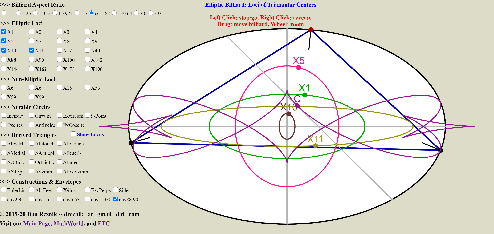

--- 
title: "Triangles and Ellipses: Pages and Media"
author: Dan Reznik
date: "Last update: 2020-10-07 15:29:29"
output:
  bookdown::html_document2:
      theme: cosmo
      highlight: kate
      css: style.css
      toc_depth: 1
      toc: true
      toc_float:
        toc_collapsed: true
        smooth_scroll: yes
      fig_caption: yes
      keep_md: yes
      number_sections: yes
link-citations: yes
bibliography: [elliptic_billiards_v2.bib,authors_rgk_v1.bib]
csl: acm.csl
---

<!--
rmdformats::readthedown:
      number_sections: yes
      toc_depth: 1
      css: style.css
      highlight: tango
-->

<!--
bookdown::html_document2:
      theme: cosmo
      code_folding: show
      highlight: kate
      css: style.css
      toc_depth: 1
      toc: true
      toc_float:
        toc_collapsed: true
        smooth_scroll: yes
      fig_caption: yes
      keep_md: yes
      number_sections: yes
-->

<!-- "default", "cerulean", "journal", "flatly", "darkly", "readable", "spacelab", "united", "cosmo", "lumen", "paper", "sandstone", "simplex", "yeti" -->

<!--  -->

<!--  -->

>I’m going to assume that you love beautiful things and are curious to learn about them. The only things you will need on this journey are common sense and simple human curiosity. --Paul Lockhardt, "A mathematician’s lament" (2009)

Below we provide links to some of the artifacts (webpages, images, videos, applets, code) from ongoing experiments with triangles, billiards, ellipses, and other marvellous geometric objects. The fun and amazement with their beauty truly never ends.

# Our Main Pages
  
1. [Invariants of 3- and N-Periodics in an Elliptic Billiard](index.html), with R. Garcia and J. Koiller.

1. [Loci of N-Periodics and their Derived and Internal Triangles](https://dan-reznik.github.io/billiard-loci/)

1. **new** [Envelopes and Evolutes](https://dan-reznik.github.io/billiard-envelopes/): beautiful curves enveloped by pairs $X_i,X_j$ of Triangle Centers.

1. **new** [Loci of Centers of Ellipse-Mounted Triangles](https://dan-reznik.github.io/ellipse-mounted-triangles/): astounding loci generated by triangle centers when a vertex slides along and ellipse and the other two vertices are held fixed, with M. Helman.

1. **new** [Extremal-Area Pedal and Antipedal Triangles](https://dan-reznik.github.io/extremal-pedal-antipedal/): a discussion on maximal and minimal pedals and antipedals to a triangle, with M. Helman.

# Videos N=3 {.tabset .tabset-fade .tabset-pills}

All videos are available as a single [playlist](https://www.youtube.com/playlist?list=PLTgIq68k2wHFjqCC708m2aNo8LWh6_m4p).

## Original 2011 {-}

<table class="table table-striped table-hover table-condensed table-responsive" style="">
 <thead>
  <tr>
   <th style="text-align:left;position: sticky; top:0; background-color: #FFFFFF;"> Title </th>
   <th style="text-align:left;position: sticky; top:0; background-color: #FFFFFF;"> sound </th>
   <th style="text-align:left;position: sticky; top:0; background-color: #FFFFFF;"> Kimberling Centers </th>
   <th style="text-align:right;position: sticky; top:0; background-color: #FFFFFF;"> Year </th>
   <th style="text-align:left;position: sticky; top:0; background-color: #FFFFFF;"> urls </th>
  </tr>
 </thead>
<tbody>
  <tr>
   <td style="text-align:left;width: 60%; "> 3-Periodic trajectories </td>
   <td style="text-align:left;">  </td>
   <td style="text-align:left;"> -- </td>
   <td style="text-align:right;"> 2011 </td>
   <td style="text-align:left;"> <a href="https://youtu.be/9zAr5-nm7mw" target="_blank">v1</a>, <a href="https://youtu.be/A7mPzrNJHkA" target="_blank">v2</a>, <a href="https://youtu.be/6yXA0dyWhFY" target="_blank">v3</a> </td>
  </tr>
  <tr>
   <td style="text-align:left;width: 60%; "> Locus of incenter is elliptic for family of 3-periodics </td>
   <td style="text-align:left;">  </td>
   <td style="text-align:left;"> 1 </td>
   <td style="text-align:right;"> 2011 </td>
   <td style="text-align:left;"> <a href="https://youtu.be/BBsyM7RnswA" target="_blank">v1</a> </td>
  </tr>
  <tr>
   <td style="text-align:left;width: 60%; "> Locus of the incircle touchpoints is a higher-order curve </td>
   <td style="text-align:left;">  </td>
   <td style="text-align:left;"> 1 </td>
   <td style="text-align:right;"> 2011 </td>
   <td style="text-align:left;"> <a href="https://youtu.be/9xU6T7hQMzs" target="_blank">v1</a> </td>
  </tr>
</tbody>
</table>

## Early Results {-}

<table class="table table-striped table-hover table-condensed table-responsive" style="">
 <thead>
  <tr>
   <th style="text-align:left;position: sticky; top:0; background-color: #FFFFFF;"> Title </th>
   <th style="text-align:left;position: sticky; top:0; background-color: #FFFFFF;"> sound </th>
   <th style="text-align:left;position: sticky; top:0; background-color: #FFFFFF;"> Kimberling Centers </th>
   <th style="text-align:right;position: sticky; top:0; background-color: #FFFFFF;"> Year </th>
   <th style="text-align:left;position: sticky; top:0; background-color: #FFFFFF;"> urls </th>
  </tr>
 </thead>
<tbody>
  <tr>
   <td style="text-align:left;width: 60%; "> Elliptic Loci of X(1) to X(5) and Euler Line </td>
   <td style="text-align:left;">  </td>
   <td style="text-align:left;"> 1,2,3,4,5 </td>
   <td style="text-align:right;"> 2019 </td>
   <td style="text-align:left;"> <a href="https://youtu.be/sMcNzcYaqtg" target="_blank">v1</a> </td>
  </tr>
  <tr>
   <td style="text-align:left;width: 60%; "> Loci of Vertices of Medial, Intouch and Feuerbach Triangles is not elliptic </td>
   <td style="text-align:left;"> T </td>
   <td style="text-align:left;"> 1,5 </td>
   <td style="text-align:right;"> 2019 </td>
   <td style="text-align:left;"> <a href="https://youtu.be/OGvCQbYqJyI" target="_blank">v1</a> </td>
  </tr>
  <tr>
   <td style="text-align:left;width: 60%; "> Mittenpunkt is stationary at center of billiard </td>
   <td style="text-align:left;">  </td>
   <td style="text-align:left;"> 9 </td>
   <td style="text-align:right;"> 2019 </td>
   <td style="text-align:left;"> <a href="https://youtu.be/tMrBqfRBYik" target="_blank">v1</a>, <a href="https://youtu.be/AoCWcza95OA" target="_blank">v2</a> </td>
  </tr>
  <tr>
   <td style="text-align:left;width: 60%; "> Feuerbach Point Sweeps Billiard and its Anti-Complement and Extouch Points sweep caustic </td>
   <td style="text-align:left;"> T </td>
   <td style="text-align:left;"> 1,2,5,11,100 </td>
   <td style="text-align:right;"> 2019 </td>
   <td style="text-align:left;"> <a href="https://youtu.be/TXdg7tUl8lc" target="_blank">v1</a> </td>
  </tr>
  <tr>
   <td style="text-align:left;width: 60%; "> Conservation of Sum and Product of Cosines </td>
   <td style="text-align:left;"> T </td>
   <td style="text-align:left;"> -- </td>
   <td style="text-align:right;"> 2019 </td>
   <td style="text-align:left;"> <a href="https://youtu.be/P8ykpE_ZbZ8" target="_blank">v1</a> </td>
  </tr>
</tbody>
</table>

## N=3 Loci {-}

<table class="table table-striped table-hover table-condensed table-responsive" style="">
 <thead>
  <tr>
   <th style="text-align:left;position: sticky; top:0; background-color: #FFFFFF;"> Title </th>
   <th style="text-align:left;position: sticky; top:0; background-color: #FFFFFF;"> sound </th>
   <th style="text-align:left;position: sticky; top:0; background-color: #FFFFFF;"> Kimberling Centers </th>
   <th style="text-align:right;position: sticky; top:0; background-color: #FFFFFF;"> Year </th>
   <th style="text-align:left;position: sticky; top:0; background-color: #FFFFFF;"> urls </th>
  </tr>
 </thead>
<tbody>
  <tr>
   <td style="text-align:left;width: 60%; "> 3-Periodics and Derived Triangles </td>
   <td style="text-align:left;">  </td>
   <td style="text-align:left;"> -- </td>
   <td style="text-align:right;"> 2019 </td>
   <td style="text-align:left;"> <a href="https://youtu.be/xyroRTEVNDc" target="_blank">v1</a> </td>
  </tr>
  <tr>
   <td style="text-align:left;width: 60%; "> Elliptic Loci of X(1) to X(5) and Euler Line </td>
   <td style="text-align:left;">  </td>
   <td style="text-align:left;"> 1,2,3,4,5 </td>
   <td style="text-align:right;"> 2019 </td>
   <td style="text-align:left;"> <a href="https://youtu.be/sMcNzcYaqtg" target="_blank">v1</a> </td>
  </tr>
  <tr>
   <td style="text-align:left;width: 60%; "> Locus of several triangular centers is elliptic </td>
   <td style="text-align:left;">  </td>
   <td style="text-align:left;"> 1,2,3,4,5 </td>
   <td style="text-align:right;"> 2019 </td>
   <td style="text-align:left;"> <a href="https://youtu.be/f84W2aVnMpU" target="_blank">v1</a> </td>
  </tr>
  <tr>
   <td style="text-align:left;width: 60%; "> Locus of vertices of Feuerbach Triangle is non-elliptic </td>
   <td style="text-align:left;">  </td>
   <td style="text-align:left;"> -- </td>
   <td style="text-align:right;"> 2019 </td>
   <td style="text-align:left;"> <a href="https://youtu.be/YPz0_xbit2I" target="_blank">v1</a> </td>
  </tr>
  <tr>
   <td style="text-align:left;width: 60%; "> Non-Elliptic loci of vertices of Medial, Intouch and Feuerbach triangles </td>
   <td style="text-align:left;"> T </td>
   <td style="text-align:left;"> 1,5,11 </td>
   <td style="text-align:right;"> 2019 </td>
   <td style="text-align:left;"> <a href="https://youtu.be/OGvCQbYqJyI" target="_blank">v1</a> </td>
  </tr>
  <tr>
   <td style="text-align:left;width: 60%; "> Locus of Bevan Point X(40) is similar to billiard </td>
   <td style="text-align:left;">  </td>
   <td style="text-align:left;"> 40 </td>
   <td style="text-align:right;"> 2019 </td>
   <td style="text-align:left;"> <a href="https://youtu.be/NwPioKleiyU" target="_blank">v1</a> </td>
  </tr>
  <tr>
   <td style="text-align:left;width: 60%; "> Locus of Bevan Point X(40) identical to billiard when a/b=golden ratio </td>
   <td style="text-align:left;">  </td>
   <td style="text-align:left;"> 40 </td>
   <td style="text-align:right;"> 2020 </td>
   <td style="text-align:left;"> <a href="https://youtu.be/rg28gGr-Qeo" target="_blank">v1</a> </td>
  </tr>
  <tr>
   <td style="text-align:left;width: 60%; "> Locus of X(59) has 4 self-intersections </td>
   <td style="text-align:left;">  </td>
   <td style="text-align:left;"> 59 </td>
   <td style="text-align:right;"> 2020 </td>
   <td style="text-align:left;"> <a href="https://youtu.be/pl_PqSuhlx0" target="_blank">v1</a> </td>
  </tr>
  <tr>
   <td style="text-align:left;width: 60%; "> Anticomplementary triangle intouchpoints </td>
   <td style="text-align:left;">  </td>
   <td style="text-align:left;"> 1,2,7,9,100,144 </td>
   <td style="text-align:right;"> 2019 </td>
   <td style="text-align:left;"> <a href="https://youtu.be/NzGKU75-Fuo" target="_blank">v1</a>, <a href="https://youtu.be/gwfx6LDJnsE" target="_blank">v2</a> </td>
  </tr>
  <tr>
   <td style="text-align:left;width: 60%; "> Anticomplementary, Medial Triangles and the Intouch Triangle </td>
   <td style="text-align:left;">  </td>
   <td style="text-align:left;"> 1,2,7,9,11,100,142,144 </td>
   <td style="text-align:right;"> 2019 </td>
   <td style="text-align:left;"> <a href="https://youtu.be/xyHUwpvAj3g" target="_blank">v1</a>, <a href="https://youtu.be/e-mToZlkHtc" target="_blank">v2</a> </td>
  </tr>
  <tr>
   <td style="text-align:left;width: 60%; "> The locus of X(140) is a circle over 3-periodics in the Elliptic Billiard </td>
   <td style="text-align:left;"> T </td>
   <td style="text-align:left;"> 3,5,140 </td>
   <td style="text-align:right;"> 2020 </td>
   <td style="text-align:left;"> <a href="https://youtu.be/4g5G9eluxJo" target="_blank">v1</a> </td>
  </tr>
  <tr>
   <td style="text-align:left;width: 60%; "> Circular loci for X(140) and X(547) over 3-periodics in the Elliptic Billiard </td>
   <td style="text-align:left;"> T </td>
   <td style="text-align:left;"> 3,2,5,40,547 </td>
   <td style="text-align:right;"> 2020 </td>
   <td style="text-align:left;"> <a href="https://youtu.be/_umuHLl9cCU" target="_blank">v1</a> </td>
  </tr>
</tbody>
</table>

## Feuerbach {-}

<table class="table table-striped table-hover table-condensed table-responsive" style="">
 <thead>
  <tr>
   <th style="text-align:left;position: sticky; top:0; background-color: #FFFFFF;"> Title </th>
   <th style="text-align:left;position: sticky; top:0; background-color: #FFFFFF;"> sound </th>
   <th style="text-align:left;position: sticky; top:0; background-color: #FFFFFF;"> Kimberling Centers </th>
   <th style="text-align:right;position: sticky; top:0; background-color: #FFFFFF;"> Year </th>
   <th style="text-align:left;position: sticky; top:0; background-color: #FFFFFF;"> urls </th>
  </tr>
 </thead>
<tbody>
  <tr>
   <td style="text-align:left;width: 60%; "> Locus of Feuerbach point, its anticomplement and three extouchpoints </td>
   <td style="text-align:left;"> T </td>
   <td style="text-align:left;"> 1,2,5,11,100 </td>
   <td style="text-align:right;"> 2019 </td>
   <td style="text-align:left;"> <a href="https://youtu.be/TXdg7tUl8lc" target="_blank">v1</a>, <a href="https://youtu.be/NNOktM8tvPM" target="_blank">v2</a>, <a href="https://youtu.be/1gYb5Y3-rQI" target="_blank">v3</a> </td>
  </tr>
  <tr>
   <td style="text-align:left;width: 60%; "> Locus of Excentral and Anticomplementary Triangles and Objects </td>
   <td style="text-align:left;">  </td>
   <td style="text-align:left;"> 1,2,5,11,100 </td>
   <td style="text-align:right;"> 2019 </td>
   <td style="text-align:left;"> <a href="https://youtu.be/50dyxWJhfN4" target="_blank">v1</a>, <a href="https://youtu.be/xSnRd6WWiKc" target="_blank">v2</a> </td>
  </tr>
</tbody>
</table>

## Circumconics {-}

<table class="table table-striped table-hover table-condensed table-responsive" style="">
 <thead>
  <tr>
   <th style="text-align:left;position: sticky; top:0; background-color: #FFFFFF;"> Title </th>
   <th style="text-align:left;position: sticky; top:0; background-color: #FFFFFF;"> sound </th>
   <th style="text-align:left;position: sticky; top:0; background-color: #FFFFFF;"> Kimberling Centers </th>
   <th style="text-align:right;position: sticky; top:0; background-color: #FFFFFF;"> Year </th>
   <th style="text-align:left;position: sticky; top:0; background-color: #FFFFFF;"> urls </th>
  </tr>
 </thead>
<tbody>
  <tr>
   <td style="text-align:left;width: 60%; "> The X(1)- and X(2)-centered circumellipses </td>
   <td style="text-align:left;">  </td>
   <td style="text-align:left;"> 1,2,9 </td>
   <td style="text-align:right;"> 2019 </td>
   <td style="text-align:left;"> <a href="https://youtu.be/AQ2AITmMs-g" target="_blank">v1</a>, <a href="https://youtu.be/P_Io7HsWGnQ" target="_blank">v2</a> </td>
  </tr>
  <tr>
   <td style="text-align:left;width: 60%; "> Locus of Intersection of X(1)- and X(2)-centered circumellipses </td>
   <td style="text-align:left;">  </td>
   <td style="text-align:left;"> 1,2,75,77,100,190 </td>
   <td style="text-align:right;"> 2019 </td>
   <td style="text-align:left;"> <a href="https://youtu.be/PTkpvvsjqNc" target="_blank">v1</a> </td>
  </tr>
  <tr>
   <td style="text-align:left;width: 60%; "> The X(100)-centered Excentral Jerabek Hyperbola </td>
   <td style="text-align:left;">  </td>
   <td style="text-align:left;"> 1,9,100 </td>
   <td style="text-align:right;"> 2019 </td>
   <td style="text-align:left;"> <a href="https://youtu.be/uS0V1YjmEyY" target="_blank">v1</a> </td>
  </tr>
  <tr>
   <td style="text-align:left;width: 60%; "> The Feuerbach and Excentral Hyperbolas </td>
   <td style="text-align:left;">  </td>
   <td style="text-align:left;"> 1,4,7,8,9,11,40, 100,144,1156 </td>
   <td style="text-align:right;"> 2019 </td>
   <td style="text-align:left;"> <a href="https://youtu.be/T5vXNsRcHZg" target="_blank">v1</a>, <a href="https://youtu.be/Pz4tUijYZCA" target="_blank">v2</a> </td>
  </tr>
  <tr>
   <td style="text-align:left;width: 60%; "> The Jerabek Hyperbola and Circumbilliard of the Excentral Triangle </td>
   <td style="text-align:left;">  </td>
   <td style="text-align:left;"> 1,9,40,100, 168,1156 </td>
   <td style="text-align:right;"> 2019 </td>
   <td style="text-align:left;"> <a href="https://youtu.be/7Q1TCbW2jFM" target="_blank">v1</a> </td>
  </tr>
  <tr>
   <td style="text-align:left;width: 60%; "> Peter Moses' Points on the X(9)-centered circumellipse </td>
   <td style="text-align:left;">  </td>
   <td style="text-align:left;"> 88, 100, 162, 190, 651, 653, 655, 658, 660, 662, 673, 771, 799, 823, 897, 1156, 1492, 1821, 2349, 2580, 2581, 3257, 4598, 4599, 4604, 4606, 4607, 8052, 20332, 23707, 24624, 27834, 32680 </td>
   <td style="text-align:right;"> 2019 </td>
   <td style="text-align:left;"> <a href="https://youtu.be/JdcJt5PExsw" target="_blank">v1</a>, <a href="https://youtu.be/86TZzDuRNN0" target="_blank">v2</a> </td>
  </tr>
  <tr>
   <td style="text-align:left;width: 60%; "> Invariants of the X(1)-centered circumellipse </td>
   <td style="text-align:left;">  </td>
   <td style="text-align:left;"> 1,3,100 </td>
   <td style="text-align:right;"> 2019 </td>
   <td style="text-align:left;"> <a href="https://youtu.be/82gYh_3hIe4" target="_blank">v1</a> </td>
  </tr>
  <tr>
   <td style="text-align:left;width: 60%; "> Invariants of the Steiner Circum and Inconics </td>
   <td style="text-align:left;">  </td>
   <td style="text-align:left;"> 2,190 </td>
   <td style="text-align:right;"> 2019 </td>
   <td style="text-align:left;"> <a href="https://youtu.be/YQpX1eZ6O0I" target="_blank">v1</a> </td>
  </tr>
  <tr>
   <td style="text-align:left;width: 60%; "> The Yff Parabola, Contact Triangle &amp; Loci of Vertex and Axis Foot </td>
   <td style="text-align:left;">  </td>
   <td style="text-align:left;"> 4,9,101,190,3234 </td>
   <td style="text-align:right;"> 2020 </td>
   <td style="text-align:left;"> <a href="https://youtu.be/BaQmt3hHVtw" target="_blank">v1</a>, <a href="https://youtu.be/Sm9g5lqhZbk" target="_blank">v2</a> </td>
  </tr>
  <tr>
   <td style="text-align:left;width: 60%; "> Every triangle has a unique Circumbilliard </td>
   <td style="text-align:left;">  </td>
   <td style="text-align:left;"> 9 </td>
   <td style="text-align:right;"> 2019 </td>
   <td style="text-align:left;"> <a href="https://youtu.be/vSCnorIJ2X8" target="_blank">v1</a> </td>
  </tr>
  <tr>
   <td style="text-align:left;width: 60%; "> Circumbilliard of anticomplementary triangle </td>
   <td style="text-align:left;">  </td>
   <td style="text-align:left;"> 1,2,5,7,11,100 </td>
   <td style="text-align:right;"> 2019 </td>
   <td style="text-align:left;"> <a href="https://youtu.be/18RyUdh8qLk" target="_blank">v1</a> </td>
  </tr>
  <tr>
   <td style="text-align:left;width: 60%; "> Orthic Circumbilliard &amp; Locus of Its Mittenpunkt </td>
   <td style="text-align:left;">  </td>
   <td style="text-align:left;"> 4,6,9 </td>
   <td style="text-align:right;"> 2020 </td>
   <td style="text-align:left;"> <a href="https://youtu.be/5KL8st2vIb0" target="_blank">v1</a> </td>
  </tr>
  <tr>
   <td style="text-align:left;width: 60%; "> Circumbilliards of Triangles Derived from 3-Periodics </td>
   <td style="text-align:left;">  </td>
   <td style="text-align:left;"> 7,8,142,168 </td>
   <td style="text-align:right;"> 2020 </td>
   <td style="text-align:left;"> <a href="https://youtu.be/Og7xLgkrLqw" target="_blank">v1</a> </td>
  </tr>
  <tr>
   <td style="text-align:left;width: 60%; "> Feuerbach and Excentral Jerabek Circumhyperbolas: Invariant Focal Length Ratio </td>
   <td style="text-align:left;"> T </td>
   <td style="text-align:left;"> 1,4,9,11,40,100,1156 </td>
   <td style="text-align:right;"> 2020 </td>
   <td style="text-align:left;"> <a href="https://youtu.be/ewioM6-nCpY" target="_blank">v1</a>, <a href="https://youtu.be/QZN82WDTGGY" target="_blank">v2</a> </td>
  </tr>
</tbody>
</table>

## Inconics {-}

<table class="table table-striped table-hover table-condensed table-responsive" style="">
 <thead>
  <tr>
   <th style="text-align:left;position: sticky; top:0; background-color: #FFFFFF;"> Title </th>
   <th style="text-align:left;position: sticky; top:0; background-color: #FFFFFF;"> sound </th>
   <th style="text-align:left;position: sticky; top:0; background-color: #FFFFFF;"> Kimberling Centers </th>
   <th style="text-align:right;position: sticky; top:0; background-color: #FFFFFF;"> Year </th>
   <th style="text-align:left;position: sticky; top:0; background-color: #FFFFFF;"> urls </th>
  </tr>
 </thead>
<tbody>
  <tr>
   <td style="text-align:left;width: 60%; "> Excentral MacBeath Inconic: Invariant Aspect Ratio </td>
   <td style="text-align:left;"> T </td>
   <td style="text-align:left;"> 1,3,40,1742 </td>
   <td style="text-align:right;"> 2020 </td>
   <td style="text-align:left;"> <a href="https://youtu.be/IxrIkW5tj20" target="_blank">v1</a> </td>
  </tr>
  <tr>
   <td style="text-align:left;width: 60%; "> X(3)-Centered Excentral Inconic: Invariant Aspect Ratio </td>
   <td style="text-align:left;"> T </td>
   <td style="text-align:left;"> 3,40,69,2951 </td>
   <td style="text-align:right;"> 2020 </td>
   <td style="text-align:left;"> <a href="https://youtu.be/ojxzOS1Sjjo" target="_blank">v1</a> </td>
  </tr>
</tbody>
</table>

## Convex Combinations {-}

<table class="table table-striped table-hover table-condensed table-responsive" style="">
 <thead>
  <tr>
   <th style="text-align:left;position: sticky; top:0; background-color: #FFFFFF;"> Title </th>
   <th style="text-align:left;position: sticky; top:0; background-color: #FFFFFF;"> sound </th>
   <th style="text-align:left;position: sticky; top:0; background-color: #FFFFFF;"> Kimberling Centers </th>
   <th style="text-align:right;position: sticky; top:0; background-color: #FFFFFF;"> Year </th>
   <th style="text-align:left;position: sticky; top:0; background-color: #FFFFFF;"> urls </th>
  </tr>
 </thead>
<tbody>
  <tr>
   <td style="text-align:left;width: 60%; "> Barycenter with Median, and Incenter with Intouchpoint </td>
   <td style="text-align:left;">  </td>
   <td style="text-align:left;"> 1,2 </td>
   <td style="text-align:right;"> 2019 </td>
   <td style="text-align:left;"> <a href="https://youtu.be/3Gr3Nh5-jHs" target="_blank">v1</a> </td>
  </tr>
  <tr>
   <td style="text-align:left;width: 60%; "> Orthocenter with one altitude foot, and Circumcenter with median </td>
   <td style="text-align:left;">  </td>
   <td style="text-align:left;"> 3,4 </td>
   <td style="text-align:right;"> 2019 </td>
   <td style="text-align:left;"> <a href="https://youtu.be/HZFjkWD_CnE" target="_blank">v1</a> </td>
  </tr>
  <tr>
   <td style="text-align:left;width: 60%; "> Excenter and its corresponding Extouch point </td>
   <td style="text-align:left;">  </td>
   <td style="text-align:left;"> -- </td>
   <td style="text-align:right;"> 2019 </td>
   <td style="text-align:left;"> <a href="https://youtu.be/OD8Ah0hf8yQ" target="_blank">v1</a> </td>
  </tr>
</tbody>
</table>

## Orthic Phenomena {-}

<table class="table table-striped table-hover table-condensed table-responsive" style="">
 <thead>
  <tr>
   <th style="text-align:left;position: sticky; top:0; background-color: #FFFFFF;"> Title </th>
   <th style="text-align:left;position: sticky; top:0; background-color: #FFFFFF;"> sound </th>
   <th style="text-align:left;position: sticky; top:0; background-color: #FFFFFF;"> Kimberling Centers </th>
   <th style="text-align:right;position: sticky; top:0; background-color: #FFFFFF;"> Year </th>
   <th style="text-align:left;position: sticky; top:0; background-color: #FFFFFF;"> urls </th>
  </tr>
 </thead>
<tbody>
  <tr>
   <td style="text-align:left;width: 60%; "> Locus orthic triangle's incenter is a 4-arc ellipse </td>
   <td style="text-align:left;">  </td>
   <td style="text-align:left;"> 4 </td>
   <td style="text-align:right;"> 2019 </td>
   <td style="text-align:left;"> <a href="https://youtu.be/3qJnwpFkUFQ" target="_blank">v1</a> </td>
  </tr>
  <tr>
   <td style="text-align:left;width: 60%; "> Locus of orthocenter, orthic orthocenter, incenter, and orthic orthic's incenter </td>
   <td style="text-align:left;">  </td>
   <td style="text-align:left;"> 1,4 </td>
   <td style="text-align:right;"> 2019 </td>
   <td style="text-align:left;"> <a href="https://youtu.be/HY577AZVi7I" target="_blank">v1</a> </td>
  </tr>
  <tr>
   <td style="text-align:left;width: 60%; "> Excentral of Orthic for Acute and Obtuse Triangles </td>
   <td style="text-align:left;">  </td>
   <td style="text-align:left;"> 4 </td>
   <td style="text-align:right;"> 2019 </td>
   <td style="text-align:left;"> <a href="https://youtu.be/-bLuvICzmqM" target="_blank">v1</a> </td>
  </tr>
</tbody>
</table>

## Stationary Circles {-}

<table class="table table-striped table-hover table-condensed table-responsive" style="">
 <thead>
  <tr>
   <th style="text-align:left;position: sticky; top:0; background-color: #FFFFFF;"> Title </th>
   <th style="text-align:left;position: sticky; top:0; background-color: #FFFFFF;"> sound </th>
   <th style="text-align:left;position: sticky; top:0; background-color: #FFFFFF;"> Kimberling Centers </th>
   <th style="text-align:right;position: sticky; top:0; background-color: #FFFFFF;"> Year </th>
   <th style="text-align:left;position: sticky; top:0; background-color: #FFFFFF;"> urls </th>
  </tr>
 </thead>
<tbody>
  <tr>
   <td style="text-align:left;width: 60%; "> Cosine Circle of Excentral Triangle is Stationary </td>
   <td style="text-align:left;">  </td>
   <td style="text-align:left;"> 9,40 </td>
   <td style="text-align:right;"> 2019 </td>
   <td style="text-align:left;"> <a href="https://youtu.be/ACinCf-D_Ok" target="_blank">v1</a> </td>
  </tr>
  <tr>
   <td style="text-align:left;width: 60%; "> Locus of Intersection of Anti-Tangents is Stationary Circle </td>
   <td style="text-align:left;">  </td>
   <td style="text-align:left;"> 9 </td>
   <td style="text-align:right;"> 2019 </td>
   <td style="text-align:left;"> <a href="https://youtu.be/CrOSI8d8qDc" target="_blank">v1</a> </td>
  </tr>
  <tr>
   <td style="text-align:left;width: 60%; "> Intersections of Excentral Triangle and its Reflection is a Circle </td>
   <td style="text-align:left;">  </td>
   <td style="text-align:left;"> 9 </td>
   <td style="text-align:right;"> 2019 </td>
   <td style="text-align:left;"> <a href="https://youtu.be/hCQIT6_XhaQ" target="_blank">v1</a> </td>
  </tr>
</tbody>
</table>

## Unrolled 3-Periodics {-}

<table class="table table-striped table-hover table-condensed table-responsive" style="">
 <thead>
  <tr>
   <th style="text-align:left;position: sticky; top:0; background-color: #FFFFFF;"> Title </th>
   <th style="text-align:left;position: sticky; top:0; background-color: #FFFFFF;"> sound </th>
   <th style="text-align:left;position: sticky; top:0; background-color: #FFFFFF;"> Kimberling Centers </th>
   <th style="text-align:right;position: sticky; top:0; background-color: #FFFFFF;"> Year </th>
   <th style="text-align:left;position: sticky; top:0; background-color: #FFFFFF;"> urls </th>
  </tr>
 </thead>
<tbody>
  <tr>
   <td style="text-align:left;width: 60%; "> Fixed central billiard </td>
   <td style="text-align:left;">  </td>
   <td style="text-align:left;"> -- </td>
   <td style="text-align:right;"> 2020 </td>
   <td style="text-align:left;"> <a href="https://youtu.be/v7CDrOTFDzo" target="_blank">v1</a> </td>
  </tr>
  <tr>
   <td style="text-align:left;width: 60%; "> Pin P1 and n1 </td>
   <td style="text-align:left;">  </td>
   <td style="text-align:left;"> -- </td>
   <td style="text-align:right;"> 2020 </td>
   <td style="text-align:left;"> <a href="https://youtu.be/20fx69L_gnU" target="_blank">v1</a> </td>
  </tr>
  <tr>
   <td style="text-align:left;width: 60%; "> Pin P1 at origin </td>
   <td style="text-align:left;">  </td>
   <td style="text-align:left;"> -- </td>
   <td style="text-align:right;"> 2020 </td>
   <td style="text-align:left;"> <a href="https://youtu.be/cPDPb7RmXR4" target="_blank">v1</a> </td>
  </tr>
  <tr>
   <td style="text-align:left;width: 60%; "> Pin P_1 at origin and P1'' vertically above it </td>
   <td style="text-align:left;">  </td>
   <td style="text-align:left;"> -- </td>
   <td style="text-align:right;"> 2020 </td>
   <td style="text-align:left;"> <a href="https://youtu.be/uh45MBlOORE" target="_blank">v1</a> </td>
  </tr>
</tbody>
</table>

## Poncelet Family {-}

<table class="table table-striped table-hover table-condensed table-responsive" style="">
 <thead>
  <tr>
   <th style="text-align:left;position: sticky; top:0; background-color: #FFFFFF;"> Title </th>
   <th style="text-align:left;position: sticky; top:0; background-color: #FFFFFF;"> sound </th>
   <th style="text-align:left;position: sticky; top:0; background-color: #FFFFFF;"> Kimberling Centers </th>
   <th style="text-align:right;position: sticky; top:0; background-color: #FFFFFF;"> Year </th>
   <th style="text-align:left;position: sticky; top:0; background-color: #FFFFFF;"> urls </th>
  </tr>
 </thead>
<tbody>
  <tr>
   <td style="text-align:left;width: 60%; "> Poncelet Triangle Inscribed in Ellipse and Circumscribed in Circle </td>
   <td style="text-align:left;">  </td>
   <td style="text-align:left;"> 1,2,3,4,5,11,100 </td>
   <td style="text-align:right;"> 2019 </td>
   <td style="text-align:left;"> <a href="https://youtu.be/I1BFOXN-EUw" target="_blank">v1</a> </td>
  </tr>
  <tr>
   <td style="text-align:left;width: 60%; "> Poncelet Family of Triangles over the Family of N=3 Caustics </td>
   <td style="text-align:left;">  </td>
   <td style="text-align:left;"> 1,2,3,4,5,11,9,100 </td>
   <td style="text-align:right;"> 2019 </td>
   <td style="text-align:left;"> <a href="https://youtu.be/53pCKKd_5qI" target="_blank">v1</a> </td>
  </tr>
  <tr>
   <td style="text-align:left;width: 60%; "> Pencil of N=3 Poncelet Ellipse Pairs: Loci of Triangular Centers </td>
   <td style="text-align:left;">  </td>
   <td style="text-align:left;"> 1,2,3,4,5,6,7,8,9,11,100 </td>
   <td style="text-align:right;"> 2019 </td>
   <td style="text-align:left;"> <a href="https://youtu.be/B5dRXT8Xerw" target="_blank">v1</a> </td>
  </tr>
  <tr>
   <td style="text-align:left;width: 60%; "> Three Geometers Walk into a Bar: the 3-periodic Poncelet-Steiner family has invariant Brocard angle. </td>
   <td style="text-align:left;"> T </td>
   <td style="text-align:left;"> 2 </td>
   <td style="text-align:right;"> 2020 </td>
   <td style="text-align:left;"> <a href="https://youtu.be/2fvGd8wioZY" target="_blank">v1</a> </td>
  </tr>
</tbody>
</table>

## Poristic {-}

<table class="table table-striped table-hover table-condensed table-responsive" style="">
 <thead>
  <tr>
   <th style="text-align:left;position: sticky; top:0; background-color: #FFFFFF;"> Title </th>
   <th style="text-align:left;position: sticky; top:0; background-color: #FFFFFF;"> sound </th>
   <th style="text-align:left;position: sticky; top:0; background-color: #FFFFFF;"> Kimberling Centers </th>
   <th style="text-align:right;position: sticky; top:0; background-color: #FFFFFF;"> Year </th>
   <th style="text-align:left;position: sticky; top:0; background-color: #FFFFFF;"> urls </th>
  </tr>
 </thead>
<tbody>
  <tr>
   <td style="text-align:left;width: 60%; "> Chapple's Porism from (1746) and Weaver (1927) and Odehnal (2011) Invariants </td>
   <td style="text-align:left;"> T </td>
   <td style="text-align:left;"> 1,3,40,1155 </td>
   <td style="text-align:right;"> 2020 </td>
   <td style="text-align:left;"> <a href="https://youtu.be/DS4ryndDK6Q" target="_blank">v1</a> </td>
  </tr>
  <tr>
   <td style="text-align:left;width: 60%; "> Circumbilliard of the Poristic Triangle Family: Invariant Aspect Ratio </td>
   <td style="text-align:left;"> T </td>
   <td style="text-align:left;"> 1,3,9,40 </td>
   <td style="text-align:right;"> 2020 </td>
   <td style="text-align:left;"> <a href="https://youtu.be/yEu2aPiJwQo" target="_blank">v1</a> </td>
  </tr>
  <tr>
   <td style="text-align:left;width: 60%; "> Poristic Triangle Family and the Amazing Invariant Excentral X3-Centered Inconic </td>
   <td style="text-align:left;"> T </td>
   <td style="text-align:left;"> 1,3,9,40,100 </td>
   <td style="text-align:right;"> 2020 </td>
   <td style="text-align:left;"> <a href="https://youtu.be/0VHBjdHXbJc" target="_blank">v1</a> </td>
  </tr>
  <tr>
   <td style="text-align:left;width: 60%; "> Simson Lines from X100 and Excentral Medials are Parallel to L(X1,X3). </td>
   <td style="text-align:left;"> T </td>
   <td style="text-align:left;"> 1,3,40,100 </td>
   <td style="text-align:right;"> 2020 </td>
   <td style="text-align:left;"> <a href="https://youtu.be/DfzPrZ0SRRc" target="_blank">v1</a> </td>
  </tr>
  <tr>
   <td style="text-align:left;width: 60%; "> X1-Centered Circumconic &amp; X40-Centered (Excentral) Inconic: Identical Invariant Axes </td>
   <td style="text-align:left;"> T </td>
   <td style="text-align:left;"> 1,3,40,100 </td>
   <td style="text-align:right;"> 2020 </td>
   <td style="text-align:left;"> <a href="https://youtu.be/hz0qEyVVvaI" target="_blank">v1</a>, <a href="https://youtu.be/PGdQY7f626Y" target="_blank">v2</a> </td>
  </tr>
  <tr>
   <td style="text-align:left;width: 60%; "> Loci of center and foci of the Circumbilliard to the Poristic Family are circles. </td>
   <td style="text-align:left;"> T </td>
   <td style="text-align:left;"> 1,3,9,40,100 </td>
   <td style="text-align:right;"> 2020 </td>
   <td style="text-align:left;"> <a href="https://youtu.be/LGgh11LMGGY" target="_blank">v1</a> </td>
  </tr>
  <tr>
   <td style="text-align:left;width: 60%; "> Aspect Ratios of X10- and Excentral X5-Centered Circumconics are Invariant &amp; Equal </td>
   <td style="text-align:left;"> T </td>
   <td style="text-align:left;"> 1,3,10,40,100 </td>
   <td style="text-align:right;"> 2020 </td>
   <td style="text-align:left;"> <a href="https://youtu.be/-4AAUSFxvmo" target="_blank">v1</a> </td>
  </tr>
  <tr>
   <td style="text-align:left;width: 60%; "> Invariant aspect ratios for the Circumbilliard and Excentral X6-Ctr Circumconic </td>
   <td style="text-align:left;"> T </td>
   <td style="text-align:left;"> 1,3,9,40,100 </td>
   <td style="text-align:right;"> 2020 </td>
   <td style="text-align:left;"> <a href="https://youtu.be/Fy4T-dmu-8s" target="_blank">v1</a> </td>
  </tr>
  <tr>
   <td style="text-align:left;width: 60%; "> Side-by-Side View of Poristic and 3-Periodic Families </td>
   <td style="text-align:left;"> T </td>
   <td style="text-align:left;"> 1,3,9,40,100 </td>
   <td style="text-align:right;"> 2020 </td>
   <td style="text-align:left;"> <a href="https://youtu.be/NvjrX6XKSFw" target="_blank">v1</a> </td>
  </tr>
  <tr>
   <td style="text-align:left;width: 60%; "> Feuerbach and Excentral Jerabek Hyperbolas to Poristic Family have invariant focal length ratio </td>
   <td style="text-align:left;">  </td>
   <td style="text-align:left;"> 1,3,9,11,100 </td>
   <td style="text-align:right;"> 2020 </td>
   <td style="text-align:left;"> <a href="https://youtu.be/bn1tq6NU_y0" target="_blank">v1</a> </td>
  </tr>
  <tr>
   <td style="text-align:left;width: 60%; "> Reference &amp; Excentral Simson Lines have fixed points and are Orthogonal! </td>
   <td style="text-align:left;"> T </td>
   <td style="text-align:left;"> 1,3,40 </td>
   <td style="text-align:right;"> 2020 </td>
   <td style="text-align:left;"> <a href="https://youtu.be/M9NIRnfGtGc" target="_blank">v1</a>, <a href="https://youtu.be/B06SvYfNByE" target="_blank">v2</a> </td>
  </tr>
</tbody>
</table>

## Misc {-}

<table class="table table-striped table-hover table-condensed table-responsive" style="">
 <thead>
  <tr>
   <th style="text-align:left;position: sticky; top:0; background-color: #FFFFFF;"> Title </th>
   <th style="text-align:left;position: sticky; top:0; background-color: #FFFFFF;"> sound </th>
   <th style="text-align:left;position: sticky; top:0; background-color: #FFFFFF;"> Kimberling Centers </th>
   <th style="text-align:right;position: sticky; top:0; background-color: #FFFFFF;"> Year </th>
   <th style="text-align:left;position: sticky; top:0; background-color: #FFFFFF;"> urls </th>
  </tr>
 </thead>
<tbody>
  <tr>
   <td style="text-align:left;width: 60%; "> Loci of Outer Napoleon Equilateral Construction </td>
   <td style="text-align:left;">  </td>
   <td style="text-align:left;"> 13 </td>
   <td style="text-align:right;"> 2019 </td>
   <td style="text-align:left;"> <a href="https://youtu.be/70-E-NZrNCQ" target="_blank">v1</a>, <a href="https://youtu.be/wwuvau5GeqY" target="_blank">v2</a> </td>
  </tr>
  <tr>
   <td style="text-align:left;width: 60%; "> Conservation of Sum and Product of Cosines </td>
   <td style="text-align:left;">  </td>
   <td style="text-align:left;"> -- </td>
   <td style="text-align:right;"> 2019 </td>
   <td style="text-align:left;"> <a href="https://youtu.be/P8ykpE_ZbZ8" target="_blank">v1</a> </td>
  </tr>
  <tr>
   <td style="text-align:left;width: 60%; "> The Miquel Point of the Extouch and Excentral Triangles </td>
   <td style="text-align:left;">  </td>
   <td style="text-align:left;"> 40 </td>
   <td style="text-align:right;"> 2019 </td>
   <td style="text-align:left;"> <a href="https://youtu.be/CKaV_AKZc1U" target="_blank">v1</a>, <a href="https://youtu.be/jDWwrUWVmjg" target="_blank">v2</a> </td>
  </tr>
  <tr>
   <td style="text-align:left;width: 60%; "> An invariant in the parabolic pair associated with the N=3 family </td>
   <td style="text-align:left;">  </td>
   <td style="text-align:left;"> -- </td>
   <td style="text-align:right;"> 2020 </td>
   <td style="text-align:left;"> <a href="https://youtu.be/VpDrCPG6th0" target="_blank">v1</a> </td>
  </tr>
  <tr>
   <td style="text-align:left;width: 60%; "> Non-monotonic X(88) and the X(1)-X(100) envelope </td>
   <td style="text-align:left;">  </td>
   <td style="text-align:left;"> 1,88,100 </td>
   <td style="text-align:right;"> 2020 </td>
   <td style="text-align:left;"> <a href="https://youtu.be/nJLp--JjDZU" target="_blank">v1</a> </td>
  </tr>
  <tr>
   <td style="text-align:left;width: 60%; "> The Thomson Cubic of 3-periodics </td>
   <td style="text-align:left;">  </td>
   <td style="text-align:left;"> 1,2,3,4,6,9 </td>
   <td style="text-align:right;"> 2020 </td>
   <td style="text-align:left;"> <a href="https://youtu.be/uNHIZXgZDOs" target="_blank">v1</a> </td>
  </tr>
  <tr>
   <td style="text-align:left;width: 60%; "> Locus and elliptic envelope of excircle tangents' hexagon (side touchpoints) </td>
   <td style="text-align:left;"> T </td>
   <td style="text-align:left;"> -- </td>
   <td style="text-align:right;"> 2020 </td>
   <td style="text-align:left;"> <a href="https://youtu.be/4XMTSvZtTJo" target="_blank">v1</a> </td>
  </tr>
  <tr>
   <td style="text-align:left;width: 60%; "> Six-Point Conic passes through Sideline Tangents to Excircles </td>
   <td style="text-align:left;"> T </td>
   <td style="text-align:left;"> -- </td>
   <td style="text-align:right;"> 2020 </td>
   <td style="text-align:left;"> <a href="https://youtu.be/kVtTR-aINX4" target="_blank">v1</a> </td>
  </tr>
</tbody>
</table>

## Isogonal and Isotomic {-}

<table class="table table-striped table-hover table-condensed table-responsive" style="">
 <thead>
  <tr>
   <th style="text-align:left;position: sticky; top:0; background-color: #FFFFFF;"> Title </th>
   <th style="text-align:left;position: sticky; top:0; background-color: #FFFFFF;"> sound </th>
   <th style="text-align:left;position: sticky; top:0; background-color: #FFFFFF;"> Kimberling Centers </th>
   <th style="text-align:right;position: sticky; top:0; background-color: #FFFFFF;"> Year </th>
   <th style="text-align:left;position: sticky; top:0; background-color: #FFFFFF;"> urls </th>
  </tr>
 </thead>
<tbody>
  <tr>
   <td style="text-align:left;width: 60%; "> Antiorthic Axis and 5 points on the Billiard </td>
   <td style="text-align:left;">  </td>
   <td style="text-align:left;"> 1,6,9,44,88,100 </td>
   <td style="text-align:right;"> 2019 </td>
   <td style="text-align:left;"> <a href="https://youtu.be/vyHZ8fwyiE8" target="_blank">v1</a> </td>
  </tr>
  <tr>
   <td style="text-align:left;width: 60%; "> Isotomic and Isogonal Conjugates of Billiard with respect to the 3-periodic family </td>
   <td style="text-align:left;">  </td>
   <td style="text-align:left;"> 1,9,144 </td>
   <td style="text-align:right;"> 2019 </td>
   <td style="text-align:left;"> <a href="https://youtu.be/C0fIMK6fuAU" target="_blank">v1</a> </td>
  </tr>
</tbody>
</table>

## Envelopes {-}

<table class="table table-striped table-hover table-condensed table-responsive" style="">
 <thead>
  <tr>
   <th style="text-align:left;position: sticky; top:0; background-color: #FFFFFF;"> Title </th>
   <th style="text-align:left;position: sticky; top:0; background-color: #FFFFFF;"> sound </th>
   <th style="text-align:left;position: sticky; top:0; background-color: #FFFFFF;"> Kimberling Centers </th>
   <th style="text-align:right;position: sticky; top:0; background-color: #FFFFFF;"> Year </th>
   <th style="text-align:left;position: sticky; top:0; background-color: #FFFFFF;"> urls </th>
  </tr>
 </thead>
<tbody>
  <tr>
   <td style="text-align:left;width: 60%; "> Envelope of Antiorthic and Gergonne Lines </td>
   <td style="text-align:left;">  </td>
   <td style="text-align:left;"> 9,44,1155,857,908 </td>
   <td style="text-align:right;"> 2020 </td>
   <td style="text-align:left;"> <a href="https://youtu.be/Q7l6_Z4IyEI" target="_blank">v1</a> </td>
  </tr>
  <tr>
   <td style="text-align:left;width: 60%; "> Evolute of Elliptic Billiard and Envelope of X(1)-X(5) </td>
   <td style="text-align:left;">  </td>
   <td style="text-align:left;"> 1,5,4,9, </td>
   <td style="text-align:right;"> 2020 </td>
   <td style="text-align:left;"> <a href="https://youtu.be/eBStp-7X5yE" target="_blank">v1</a> </td>
  </tr>
  <tr>
   <td style="text-align:left;width: 60%; "> Envelope of 3-Periodic Vertex with Triangle Center </td>
   <td style="text-align:left;">  </td>
   <td style="text-align:left;"> 1,2,3,4,5,6,7,8,10,11,12,20 </td>
   <td style="text-align:right;"> 2020 </td>
   <td style="text-align:left;"> <a href="https://youtu.be/bRY61RdxCkM" target="_blank">v1</a> </td>
  </tr>
  <tr>
   <td style="text-align:left;width: 60%; "> Evolute Triangles of P1(t) with X(i) </td>
   <td style="text-align:left;">  </td>
   <td style="text-align:left;"> 1,3,5,20 </td>
   <td style="text-align:right;"> 2020 </td>
   <td style="text-align:left;"> <a href="https://youtu.be/DhqDdMAlBZM" target="_blank">v1</a> </td>
  </tr>
  <tr>
   <td style="text-align:left;width: 60%; "> Elliptic Envelope of P1(t) with P1(t+pi/2) </td>
   <td style="text-align:left;">  </td>
   <td style="text-align:left;"> -- </td>
   <td style="text-align:right;"> 2020 </td>
   <td style="text-align:left;"> <a href="https://youtu.be/8a4JoddyEyc" target="_blank">v1</a> </td>
  </tr>
  <tr>
   <td style="text-align:left;width: 60%; "> Envelope of 3-Periodic P1 and reflected P2 is Elliptic </td>
   <td style="text-align:left;"> T </td>
   <td style="text-align:left;"> -- </td>
   <td style="text-align:right;"> 2020 </td>
   <td style="text-align:left;"> <a href="https://youtu.be/GJgiUulX1aU" target="_blank">v1</a> </td>
  </tr>
  <tr>
   <td style="text-align:left;width: 60%; "> The Bat-Envelope of X(48) and X(37143) </td>
   <td style="text-align:left;"> T </td>
   <td style="text-align:left;"> 48,37143 </td>
   <td style="text-align:right;"> 2020 </td>
   <td style="text-align:left;"> <a href="https://youtu.be/Kr93eFZnB_U" target="_blank">v1</a> </td>
  </tr>
  <tr>
   <td style="text-align:left;width: 60%; "> Envelopes of Sides of Derived Triangles </td>
   <td style="text-align:left;"> T </td>
   <td style="text-align:left;"> -- </td>
   <td style="text-align:right;"> 2020 </td>
   <td style="text-align:left;"> <a href="https://youtu.be/SJrgWtdX8xU" target="_blank">v1</a> </td>
  </tr>
  <tr>
   <td style="text-align:left;width: 60%; "> Envelope of Simson Lines from X100 and X99 to two N=3 Poncelet Families </td>
   <td style="text-align:left;"> T </td>
   <td style="text-align:left;"> 2,3,9,99,100 </td>
   <td style="text-align:right;"> 2020 </td>
   <td style="text-align:left;"> <a href="https://youtu.be/79veSHrElb4" target="_blank">v1</a> </td>
  </tr>
</tbody>
</table>

## Swans {-}

<table class="table table-striped table-hover table-condensed table-responsive" style="">
 <thead>
  <tr>
   <th style="text-align:left;position: sticky; top:0; background-color: #FFFFFF;"> Title </th>
   <th style="text-align:left;position: sticky; top:0; background-color: #FFFFFF;"> sound </th>
   <th style="text-align:left;position: sticky; top:0; background-color: #FFFFFF;"> Kimberling Centers </th>
   <th style="text-align:right;position: sticky; top:0; background-color: #FFFFFF;"> Year </th>
   <th style="text-align:left;position: sticky; top:0; background-color: #FFFFFF;"> urls </th>
  </tr>
 </thead>
<tbody>
  <tr>
   <td style="text-align:left;width: 60%; "> Motion of X(88) with respect to collinear X(100) and X(1) </td>
   <td style="text-align:left;">  </td>
   <td style="text-align:left;"> 1,88,100 </td>
   <td style="text-align:right;"> 2020 </td>
   <td style="text-align:left;"> <a href="https://youtu.be/DaoNJRcf-0E" target="_blank">v1</a> </td>
  </tr>
  <tr>
   <td style="text-align:left;width: 60%; "> Dance of the Swans: X(88) and X(162) </td>
   <td style="text-align:left;"> T </td>
   <td style="text-align:left;"> 9,88,162 </td>
   <td style="text-align:right;"> 2020 </td>
   <td style="text-align:left;"> <a href="https://youtu.be/ljGTtA1x-Sk" target="_blank">v1</a>, <a href="https://youtu.be/uv_lZSmX9Pk" target="_blank">v2</a> </td>
  </tr>
</tbody>
</table>

## Pedal Invariants {-}

<table class="table table-striped table-hover table-condensed table-responsive" style="">
 <thead>
  <tr>
   <th style="text-align:left;position: sticky; top:0; background-color: #FFFFFF;"> Title </th>
   <th style="text-align:left;position: sticky; top:0; background-color: #FFFFFF;"> sound </th>
   <th style="text-align:left;position: sticky; top:0; background-color: #FFFFFF;"> Kimberling Centers </th>
   <th style="text-align:right;position: sticky; top:0; background-color: #FFFFFF;"> Year </th>
   <th style="text-align:left;position: sticky; top:0; background-color: #FFFFFF;"> urls </th>
  </tr>
 </thead>
<tbody>
  <tr>
   <td style="text-align:left;width: 60%; "> Area Invariants of Pedal and Antipedal Polygons </td>
   <td style="text-align:left;"> T </td>
   <td style="text-align:left;"> -- </td>
   <td style="text-align:right;"> 2020 </td>
   <td style="text-align:left;"> <a href="https://youtu.be/LN623VjeeFQ" target="_blank">v1</a> </td>
  </tr>
</tbody>
</table>

## Ellipse-Mounted {-}

<table class="table table-striped table-hover table-condensed table-responsive" style="">
 <thead>
  <tr>
   <th style="text-align:left;position: sticky; top:0; background-color: #FFFFFF;"> Title </th>
   <th style="text-align:left;position: sticky; top:0; background-color: #FFFFFF;"> sound </th>
   <th style="text-align:left;position: sticky; top:0; background-color: #FFFFFF;"> Kimberling Centers </th>
   <th style="text-align:right;position: sticky; top:0; background-color: #FFFFFF;"> Year </th>
   <th style="text-align:left;position: sticky; top:0; background-color: #FFFFFF;"> urls </th>
  </tr>
 </thead>
<tbody>
  <tr>
   <td style="text-align:left;width: 60%; "> Ellipse-Mounted Triangles: Elliptic locus of the Orthocenter X(4) and suprising area invariance! </td>
   <td style="text-align:left;"> T </td>
   <td style="text-align:left;"> 4 </td>
   <td style="text-align:right;"> 2020 </td>
   <td style="text-align:left;"> <a href="https://youtu.be/Fo-tNRcA-CQ" target="_blank">v1</a> </td>
  </tr>
  <tr>
   <td style="text-align:left;width: 60%; "> Circle-Mounted Triangles: Surprising Loci of the Brocard Points </td>
   <td style="text-align:left;"> T </td>
   <td style="text-align:left;"> -- </td>
   <td style="text-align:right;"> 2020 </td>
   <td style="text-align:left;"> <a href="https://youtu.be/Ms8jC9yOKU4" target="_blank">v1</a> </td>
  </tr>
</tbody>
</table>

## Poncelet {-}

<table class="table table-striped table-hover table-condensed table-responsive" style="">
 <thead>
  <tr>
   <th style="text-align:left;position: sticky; top:0; background-color: #FFFFFF;"> Title </th>
   <th style="text-align:left;position: sticky; top:0; background-color: #FFFFFF;"> sound </th>
   <th style="text-align:left;position: sticky; top:0; background-color: #FFFFFF;"> Kimberling Centers </th>
   <th style="text-align:right;position: sticky; top:0; background-color: #FFFFFF;"> Year </th>
   <th style="text-align:left;position: sticky; top:0; background-color: #FFFFFF;"> urls </th>
  </tr>
 </thead>
<tbody>
  <tr>
   <td style="text-align:left;width: 60%; "> An N=3 Poncelet family (outer circle, inner ellipse) equivalent to Poristic Excentrals </td>
   <td style="text-align:left;"> T </td>
   <td style="text-align:left;"> 3,4,5 </td>
   <td style="text-align:right;"> 2020 </td>
   <td style="text-align:left;"> <a href="https://youtu.be/wUu2iMesv3U" target="_blank">v1</a> </td>
  </tr>
  <tr>
   <td style="text-align:left;width: 60%; "> Between an Ellipse and a Concentric Circle: Poncelet 3-Periodics Identical to Poristic Triangles. </td>
   <td style="text-align:left;"> T </td>
   <td style="text-align:left;"> 1,3 </td>
   <td style="text-align:right;"> 2020 </td>
   <td style="text-align:left;"> <a href="https://youtu.be/ML_AZoX736w" target="_blank">v1</a> </td>
  </tr>
  <tr>
   <td style="text-align:left;width: 60%; "> Between a Circle and a Concentric Ellipse: Poncelet 3-Periodics Identical to Poristic Excentrals. </td>
   <td style="text-align:left;"> T </td>
   <td style="text-align:left;"> 3,4,5 </td>
   <td style="text-align:right;"> 2020 </td>
   <td style="text-align:left;"> <a href="https://youtu.be/xM1SAZO9bDc" target="_blank">v1</a> </td>
  </tr>
  <tr>
   <td style="text-align:left;width: 60%; "> 3-Periodics in a Concentric Homothetic Poncelet Pair: Circular Loci of four Triangle Centers </td>
   <td style="text-align:left;"> T </td>
   <td style="text-align:left;"> 2,13,14,15,16 </td>
   <td style="text-align:right;"> 2020 </td>
   <td style="text-align:left;"> <a href="https://youtu.be/ZwTfwaJJitE" target="_blank">v1</a> </td>
  </tr>
  <tr>
   <td style="text-align:left;width: 60%; "> 3-Periodics in a Homothetic-Rotated Poncelet Pair: stationary orthocenter and loci of X107 and X122 </td>
   <td style="text-align:left;"> T </td>
   <td style="text-align:left;"> 4,107,122 </td>
   <td style="text-align:right;"> 2020 </td>
   <td style="text-align:left;"> <a href="https://youtu.be/fpd_Zot5cKk" target="_blank">v1</a> </td>
  </tr>
  <tr>
   <td style="text-align:left;width: 60%; "> Poncelet 3-Periodic Invariants (Outer Circle, Inner Concentric Ellipse) of the Nine-Point Center II </td>
   <td style="text-align:left;"> T </td>
   <td style="text-align:left;"> 3,5,4 </td>
   <td style="text-align:right;"> 2020 </td>
   <td style="text-align:left;"> <a href="https://youtu.be/8xlYaQfQCTw" target="_blank">v1</a> </td>
  </tr>
  <tr>
   <td style="text-align:left;width: 60%; "> Isodynamic Pedals and Isogonic Antipedals: Equilaterals with Constant Area in the Homothetic Pair </td>
   <td style="text-align:left;"> T </td>
   <td style="text-align:left;"> 2,13,14,15,16,395,396,5463,5464 </td>
   <td style="text-align:right;"> 2020 </td>
   <td style="text-align:left;"> <a href="https://youtu.be/7qoxAaG8sbk" target="_blank">v1</a> </td>
  </tr>
</tbody>
</table>

## Brocard {-}

<table class="table table-striped table-hover table-condensed table-responsive" style="">
 <thead>
  <tr>
   <th style="text-align:left;position: sticky; top:0; background-color: #FFFFFF;"> Title </th>
   <th style="text-align:left;position: sticky; top:0; background-color: #FFFFFF;"> sound </th>
   <th style="text-align:left;position: sticky; top:0; background-color: #FFFFFF;"> Kimberling Centers </th>
   <th style="text-align:right;position: sticky; top:0; background-color: #FFFFFF;"> Year </th>
   <th style="text-align:left;position: sticky; top:0; background-color: #FFFFFF;"> urls </th>
  </tr>
 </thead>
<tbody>
  <tr>
   <td style="text-align:left;width: 60%; "> Poncelet 3-Periodics of Homothetic Pair: Elliptic Loci of Brocard Pts + Vertices of 1st Brocard Tri </td>
   <td style="text-align:left;"> T </td>
   <td style="text-align:left;"> 2 </td>
   <td style="text-align:right;"> 2020 </td>
   <td style="text-align:left;"> <a href="https://youtu.be/13i3JGY-fK4" target="_blank">v1</a> </td>
  </tr>
  <tr>
   <td style="text-align:left;width: 60%; "> It takes 2 to tango: Brocard-Poncelet Porism, stationary Brocard Points and invariant Brocard Angle </td>
   <td style="text-align:left;"> T </td>
   <td style="text-align:left;"> 3,6,39,182 </td>
   <td style="text-align:right;"> 2020 </td>
   <td style="text-align:left;"> <a href="https://youtu.be/JANPPLET0so" target="_blank">v1</a> </td>
  </tr>
  <tr>
   <td style="text-align:left;width: 60%; "> Joined at the hip: Brocard Porism, Steiner Ellipses, and the Homothetic Poncelet Pair </td>
   <td style="text-align:left;"> T </td>
   <td style="text-align:left;"> 2,3,6,182 </td>
   <td style="text-align:right;"> 2020 </td>
   <td style="text-align:left;"> <a href="https://youtu.be/h3GZz7pcJp0" target="_blank">v1</a> </td>
  </tr>
  <tr>
   <td style="text-align:left;width: 60%; "> The Poncelet Homothetic Pair contains an Aspect-Ratio Invariant Brocard Inellipse </td>
   <td style="text-align:left;"> T </td>
   <td style="text-align:left;"> 2,39 </td>
   <td style="text-align:right;"> 2020 </td>
   <td style="text-align:left;"> <a href="https://youtu.be/DIm2qTxGWXE" target="_blank">v1</a> </td>
  </tr>
  <tr>
   <td style="text-align:left;width: 60%; "> Brocard Porism: Locus of 1st, 2nd, 5th, and 7th Brocard Triangles' Vertices are Circles </td>
   <td style="text-align:left;"> T </td>
   <td style="text-align:left;"> 3,6,39,182,9821 </td>
   <td style="text-align:right;"> 2020 </td>
   <td style="text-align:left;"> <a href="https://youtu.be/_bK-BCQv24A" target="_blank">v1</a> </td>
  </tr>
  <tr>
   <td style="text-align:left;width: 60%; "> Russian-Doll nesting of Brocard porisms courtesy of the second Brocard triangle </td>
   <td style="text-align:left;"> T </td>
   <td style="text-align:left;"> 6,39,182 </td>
   <td style="text-align:right;"> 2020 </td>
   <td style="text-align:left;"> <a href="https://youtu.be/T7c4CDHIk7s" target="_blank">v1</a> </td>
  </tr>
  <tr>
   <td style="text-align:left;width: 60%; "> Rusian-doll nesting of Brocard porisms: concyclic sequence of Brocard points and the Beltrami points </td>
   <td style="text-align:left;"> T </td>
   <td style="text-align:left;"> 6,39,182 </td>
   <td style="text-align:right;"> 2020 </td>
   <td style="text-align:left;"> <a href="https://youtu.be/Z3YlEbCFbnA" target="_blank">v1</a> </td>
  </tr>
  <tr>
   <td style="text-align:left;width: 60%; "> Brocard Porism: equilateral Isodynamic Pedals have invariant area ratio + circular centroidal locus </td>
   <td style="text-align:left;"> T </td>
   <td style="text-align:left;"> 3,6,15,16,39,182 </td>
   <td style="text-align:right;"> 2020 </td>
   <td style="text-align:left;"> <a href="https://youtu.be/s4DF-iZZO8Y" target="_blank">v1</a> </td>
  </tr>
  <tr>
   <td style="text-align:left;width: 60%; "> Continuous Family of Brocard Porisms with Stationary Isodynamic Points X15 and X16 </td>
   <td style="text-align:left;"> T </td>
   <td style="text-align:left;"> 3,6,15,182 </td>
   <td style="text-align:right;"> 2020 </td>
   <td style="text-align:left;"> <a href="https://youtu.be/jY_8zxBljuk" target="_blank">v1</a> </td>
  </tr>
  <tr>
   <td style="text-align:left;width: 60%; "> The Family of Second Brocard Triangles in the Brocard Porism </td>
   <td style="text-align:left;"> T </td>
   <td style="text-align:left;"> 3,6,15,39,182 </td>
   <td style="text-align:right;"> 2020 </td>
   <td style="text-align:left;"> <a href="https://youtu.be/Wgwh4-neJp4" target="_blank">v1</a> </td>
  </tr>
  <tr>
   <td style="text-align:left;width: 60%; "> Brocard Porism: Family of Second Brocard Triangles is a second Brocard Porism </td>
   <td style="text-align:left;"> T </td>
   <td style="text-align:left;"> 3,6,15,39,182,39498 </td>
   <td style="text-align:right;"> NA </td>
   <td style="text-align:left;"> <a href="NA" target="_blank">v1</a> </td>
  </tr>
</tbody>
</table>

# Videos N≥3 {.tabset .tabset-fade .tabset-pills}

## Early Results {-}

<table class="table table-striped table-hover table-condensed table-responsive" style="">
 <thead>
  <tr>
   <th style="text-align:left;position: sticky; top:0; background-color: #FFFFFF;"> Title </th>
   <th style="text-align:left;position: sticky; top:0; background-color: #FFFFFF;"> sound </th>
   <th style="text-align:left;position: sticky; top:0; background-color: #FFFFFF;"> N </th>
   <th style="text-align:right;position: sticky; top:0; background-color: #FFFFFF;"> Year </th>
   <th style="text-align:left;position: sticky; top:0; background-color: #FFFFFF;"> urls </th>
  </tr>
 </thead>
<tbody>
  <tr>
   <td style="text-align:left;width: 60%; "> Stationary Circle for N=5 </td>
   <td style="text-align:left;"> T </td>
   <td style="text-align:left;"> 5 </td>
   <td style="text-align:right;"> 2019 </td>
   <td style="text-align:left;"> <a href="https://youtu.be/dINE4aH1cvk" target="_blank">v1</a> </td>
  </tr>
  <tr>
   <td style="text-align:left;width: 60%; "> Stationary Circles </td>
   <td style="text-align:left;">  </td>
   <td style="text-align:left;"> 3 to 8 </td>
   <td style="text-align:right;"> 2019 </td>
   <td style="text-align:left;"> <a href="https://youtu.be/EFeINGIDFrg" target="_blank">v1</a> </td>
  </tr>
  <tr>
   <td style="text-align:left;width: 60%; "> Generalization of the Stationary Mittenpunkt and Caustic-Sweeping Extouchpoints </td>
   <td style="text-align:left;">  </td>
   <td style="text-align:left;"> 4,5 </td>
   <td style="text-align:right;"> 2019 </td>
   <td style="text-align:left;"> <a href="https://youtu.be/Bpc-MrR2IMc" target="_blank">v1</a> </td>
  </tr>
</tbody>
</table>

## Inconics {-}

<table class="table table-striped table-hover table-condensed table-responsive" style="">
 <thead>
  <tr>
   <th style="text-align:left;position: sticky; top:0; background-color: #FFFFFF;"> Title </th>
   <th style="text-align:left;position: sticky; top:0; background-color: #FFFFFF;"> sound </th>
   <th style="text-align:left;position: sticky; top:0; background-color: #FFFFFF;"> N </th>
   <th style="text-align:right;position: sticky; top:0; background-color: #FFFFFF;"> Year </th>
   <th style="text-align:left;position: sticky; top:0; background-color: #FFFFFF;"> urls </th>
  </tr>
 </thead>
<tbody>
  <tr>
   <td style="text-align:left;width: 60%; "> Excentral X(3)-Centered &amp; MacBeath Inconics: Invariant Aspect Ratio </td>
   <td style="text-align:left;"> T </td>
   <td style="text-align:left;"> NULL </td>
   <td style="text-align:right;"> 2020 </td>
   <td style="text-align:left;"> <a href="https://youtu.be/CHbrZvx1I8w" target="_blank">v1</a> </td>
  </tr>
</tbody>
</table>

## N>3 Periodics {-}

<table class="table table-striped table-hover table-condensed table-responsive" style="">
 <thead>
  <tr>
   <th style="text-align:left;position: sticky; top:0; background-color: #FFFFFF;"> Title </th>
   <th style="text-align:left;position: sticky; top:0; background-color: #FFFFFF;"> sound </th>
   <th style="text-align:left;position: sticky; top:0; background-color: #FFFFFF;"> N </th>
   <th style="text-align:right;position: sticky; top:0; background-color: #FFFFFF;"> Year </th>
   <th style="text-align:left;position: sticky; top:0; background-color: #FFFFFF;"> urls </th>
  </tr>
 </thead>
<tbody>
  <tr>
   <td style="text-align:left;width: 60%; "> 4-periodics and Monge's Orthoptic Circle </td>
   <td style="text-align:left;">  </td>
   <td style="text-align:left;"> 4 </td>
   <td style="text-align:right;"> 2019 </td>
   <td style="text-align:left;"> <a href="https://youtu.be/9fI3iM2jrmI" target="_blank">v1</a>, <a href="https://youtu.be/BTSNc_YN0lo" target="_blank">v2</a> </td>
  </tr>
  <tr>
   <td style="text-align:left;width: 60%; "> 4-periodics: Loci of Triangle Centers for Vertex Triad </td>
   <td style="text-align:left;">  </td>
   <td style="text-align:left;"> 4 </td>
   <td style="text-align:right;"> 2019 </td>
   <td style="text-align:left;"> <a href="https://youtu.be/y2bnml8heGg" target="_blank">v1</a> </td>
  </tr>
  <tr>
   <td style="text-align:left;width: 60%; "> 5-periodics: locus of P1,P2,P3 triangle </td>
   <td style="text-align:left;">  </td>
   <td style="text-align:left;"> 5 </td>
   <td style="text-align:right;"> 2019 </td>
   <td style="text-align:left;"> <a href="https://youtu.be/yQMOtAGdrqA" target="_blank">v1</a> </td>
  </tr>
  <tr>
   <td style="text-align:left;width: 60%; "> 5-periodics: locus of P1,P2,P4 triangle </td>
   <td style="text-align:left;">  </td>
   <td style="text-align:left;"> 5 </td>
   <td style="text-align:right;"> 2019 </td>
   <td style="text-align:left;"> <a href="https://youtu.be/2MA1h-dMnw8" target="_blank">v1</a> </td>
  </tr>
  <tr>
   <td style="text-align:left;width: 60%; "> 5-periodics: Loci of Subtriangles (123 and 124) </td>
   <td style="text-align:left;">  </td>
   <td style="text-align:left;"> 5 </td>
   <td style="text-align:right;"> 2019 </td>
   <td style="text-align:left;"> <a href="https://youtu.be/4lj9yQ-e_cE" target="_blank">v1</a> </td>
  </tr>
  <tr>
   <td style="text-align:left;width: 60%; "> Upright 5-periodic family </td>
   <td style="text-align:left;">  </td>
   <td style="text-align:left;"> 5 </td>
   <td style="text-align:right;"> 2019 </td>
   <td style="text-align:left;"> <a href="https://youtu.be/RQE1s2siPSo" target="_blank">v1</a> </td>
  </tr>
  <tr>
   <td style="text-align:left;width: 60%; "> 6-periodic family </td>
   <td style="text-align:left;">  </td>
   <td style="text-align:left;"> 6 </td>
   <td style="text-align:right;"> 2019 </td>
   <td style="text-align:left;"> <a href="https://youtu.be/YZfFGew4azI" target="_blank">v1</a> </td>
  </tr>
  <tr>
   <td style="text-align:left;width: 60%; "> Octagramma Mysticum </td>
   <td style="text-align:left;">  </td>
   <td style="text-align:left;"> 8 </td>
   <td style="text-align:right;"> 2019 </td>
   <td style="text-align:left;"> <a href="https://youtu.be/mDomB-_GiNA" target="_blank">v1</a>, <a href="https://youtu.be/xgdgx0erM58" target="_blank">v2</a> </td>
  </tr>
  <tr>
   <td style="text-align:left;width: 60%; "> Enagramma Mysticum: loci of side intersections </td>
   <td style="text-align:left;">  </td>
   <td style="text-align:left;"> 9 </td>
   <td style="text-align:right;"> 2019 </td>
   <td style="text-align:left;"> <a href="https://youtu.be/ECo1hTCVuDg" target="_blank">v1</a> </td>
  </tr>
  <tr>
   <td style="text-align:left;width: 60%; "> Mittenpunkt-like Construction of a Stationary Point </td>
   <td style="text-align:left;">  </td>
   <td style="text-align:left;"> 4 to 7 </td>
   <td style="text-align:right;"> 2019 </td>
   <td style="text-align:left;"> <a href="https://youtu.be/TV2p7fPlYfE" target="_blank">v1</a> </td>
  </tr>
  <tr>
   <td style="text-align:left;width: 60%; "> Generalized Mittenpunkt and On-Caustic Extouchpoints </td>
   <td style="text-align:left;">  </td>
   <td style="text-align:left;"> 4,5 </td>
   <td style="text-align:right;"> 2019 </td>
   <td style="text-align:left;"> <a href="https://youtu.be/Bpc-MrR2IMc" target="_blank">v1</a> </td>
  </tr>
  <tr>
   <td style="text-align:left;width: 60%; "> Family of Orbits and Their Caustics </td>
   <td style="text-align:left;">  </td>
   <td style="text-align:left;"> 3 to 6 </td>
   <td style="text-align:right;"> 2019 </td>
   <td style="text-align:left;"> <a href="https://youtu.be/Y3q35DObfZU" target="_blank">v1</a> </td>
  </tr>
  <tr>
   <td style="text-align:left;width: 60%; "> Ellipse-Inscribed Parallelogram: invariants of the Pedal Polygon w/ respect to boundary points </td>
   <td style="text-align:left;"> T </td>
   <td style="text-align:left;"> 4 </td>
   <td style="text-align:right;"> 2020 </td>
   <td style="text-align:left;"> <a href="https://youtu.be/7eUQQgR-w3c" target="_blank">v1</a>, <a href="https://youtu.be/sViggJv4xyQ" target="_blank">v2</a> </td>
  </tr>
  <tr>
   <td style="text-align:left;width: 60%; "> Elliptic Billiard with Perpendicular Reflection Rule </td>
   <td style="text-align:left;"> T </td>
   <td style="text-align:left;"> n/a </td>
   <td style="text-align:right;"> 2020 </td>
   <td style="text-align:left;"> <a href="https://youtu.be/0Qqi7ubS9Bw" target="_blank">v1</a> </td>
  </tr>
  <tr>
   <td style="text-align:left;width: 60%; "> Invariant Area Ratios to Minimum-Area Steiner Pedal Polygons </td>
   <td style="text-align:left;"> T </td>
   <td style="text-align:left;"> 5 </td>
   <td style="text-align:right;"> 2020 </td>
   <td style="text-align:left;"> <a href="https://youtu.be/f0JwRlu7iaY" target="_blank">v1</a> </td>
  </tr>
</tbody>
</table>

## Self-Intersecting {-}

<table class="table table-striped table-hover table-condensed table-responsive" style="">
 <thead>
  <tr>
   <th style="text-align:left;position: sticky; top:0; background-color: #FFFFFF;"> Title </th>
   <th style="text-align:left;position: sticky; top:0; background-color: #FFFFFF;"> sound </th>
   <th style="text-align:left;position: sticky; top:0; background-color: #FFFFFF;"> N </th>
   <th style="text-align:right;position: sticky; top:0; background-color: #FFFFFF;"> Year </th>
   <th style="text-align:left;position: sticky; top:0; background-color: #FFFFFF;"> urls </th>
  </tr>
 </thead>
<tbody>
  <tr>
   <td style="text-align:left;width: 60%; "> Self-intersecting 4-periodics (bowtie and tangential polygon) </td>
   <td style="text-align:left;">  </td>
   <td style="text-align:left;"> 4 </td>
   <td style="text-align:right;"> 2020 </td>
   <td style="text-align:left;"> <a href="https://youtu.be/C8W2e6ftfOw" target="_blank">v1</a>, <a href="https://youtu.be/cCYxN7ueGV4" target="_blank">v2</a> </td>
  </tr>
  <tr>
   <td style="text-align:left;width: 60%; "> Self-intersecting 5-periodics (pentagram) </td>
   <td style="text-align:left;">  </td>
   <td style="text-align:left;"> 5 </td>
   <td style="text-align:right;"> 2019 </td>
   <td style="text-align:left;"> <a href="https://youtu.be/ECe4DptduJY" target="_blank">v1</a> </td>
  </tr>
  <tr>
   <td style="text-align:left;width: 60%; "> Self-intersecting 5-periodics (pentagram): Locus of Internal Intersections </td>
   <td style="text-align:left;">  </td>
   <td style="text-align:left;"> 5 </td>
   <td style="text-align:right;"> 2019 </td>
   <td style="text-align:left;"> <a href="https://youtu.be/ZaqvmK22pBM" target="_blank">v1</a> </td>
  </tr>
</tbody>
</table>

## Tangential Polygon {-}

<table class="table table-striped table-hover table-condensed table-responsive" style="">
 <thead>
  <tr>
   <th style="text-align:left;position: sticky; top:0; background-color: #FFFFFF;"> Title </th>
   <th style="text-align:left;position: sticky; top:0; background-color: #FFFFFF;"> sound </th>
   <th style="text-align:left;position: sticky; top:0; background-color: #FFFFFF;"> N </th>
   <th style="text-align:right;position: sticky; top:0; background-color: #FFFFFF;"> Year </th>
   <th style="text-align:left;position: sticky; top:0; background-color: #FFFFFF;"> urls </th>
  </tr>
 </thead>
<tbody>
  <tr>
   <td style="text-align:left;width: 60%; "> Locus of Vertices of the Excentral Polygon </td>
   <td style="text-align:left;">  </td>
   <td style="text-align:left;"> 3 to 6 </td>
   <td style="text-align:right;"> 2019 </td>
   <td style="text-align:left;"> <a href="https://youtu.be/kaYWlBTpUPw" target="_blank">v1</a> </td>
  </tr>
  <tr>
   <td style="text-align:left;width: 60%; "> 5-periodics and feet of excenters </td>
   <td style="text-align:left;">  </td>
   <td style="text-align:left;"> 5 </td>
   <td style="text-align:right;"> 2019 </td>
   <td style="text-align:left;"> <a href="https://youtu.be/PRkhrUNTXd8" target="_blank">v1</a> </td>
  </tr>
  <tr>
   <td style="text-align:left;width: 60%; "> Locus of meetpoints of Excentral-to-Orbit Perpendiculars </td>
   <td style="text-align:left;">  </td>
   <td style="text-align:left;"> 3,4,5 </td>
   <td style="text-align:right;"> 2019 </td>
   <td style="text-align:left;"> <a href="https://youtu.be/NwPioKleiyU" target="_blank">v1</a>, <a href="https://youtu.be/JTasf8JKoH0" target="_blank">v2</a>, <a href="https://youtu.be/ugRFxo0l2OI" target="_blank">v3</a> </td>
  </tr>
</tbody>
</table>

## Pencil of Confocals {-}

<table class="table table-striped table-hover table-condensed table-responsive" style="">
 <thead>
  <tr>
   <th style="text-align:left;position: sticky; top:0; background-color: #FFFFFF;"> Title </th>
   <th style="text-align:left;position: sticky; top:0; background-color: #FFFFFF;"> sound </th>
   <th style="text-align:left;position: sticky; top:0; background-color: #FFFFFF;"> N </th>
   <th style="text-align:right;position: sticky; top:0; background-color: #FFFFFF;"> Year </th>
   <th style="text-align:left;position: sticky; top:0; background-color: #FFFFFF;"> urls </th>
  </tr>
 </thead>
<tbody>
  <tr>
   <td style="text-align:left;width: 60%; "> Tangents from a point on boundary to caustics </td>
   <td style="text-align:left;">  </td>
   <td style="text-align:left;"> -- </td>
   <td style="text-align:right;"> 2019 </td>
   <td style="text-align:left;"> <a href="https://youtu.be/mkhhd536_2w" target="_blank">v1</a> </td>
  </tr>
  <tr>
   <td style="text-align:left;width: 60%; "> Tangents to caustics from billiard's vertex lie on a single circle </td>
   <td style="text-align:left;">  </td>
   <td style="text-align:left;"> -- </td>
   <td style="text-align:right;"> 2019 </td>
   <td style="text-align:left;"> <a href="https://youtu.be/NsZUyDJ6IOs" target="_blank">v1</a> </td>
  </tr>
  <tr>
   <td style="text-align:left;width: 60%; "> Loci of tangents to confocals: point traverses entire elliptic boundary </td>
   <td style="text-align:left;">  </td>
   <td style="text-align:left;"> -- </td>
   <td style="text-align:right;"> 2019 </td>
   <td style="text-align:left;"> <a href="https://youtu.be/EL4vgcJaktc" target="_blank">v1</a> </td>
  </tr>
  <tr>
   <td style="text-align:left;width: 60%; "> Loci of tangents to confocals: point traverses neighborhood of right vertex </td>
   <td style="text-align:left;">  </td>
   <td style="text-align:left;"> -- </td>
   <td style="text-align:right;"> 2019 </td>
   <td style="text-align:left;"> <a href="https://youtu.be/J5CA9UJVflI" target="_blank">v1</a> </td>
  </tr>
  <tr>
   <td style="text-align:left;width: 60%; "> Locus of tangents from ellipse: -45,45 degrees starting points </td>
   <td style="text-align:left;">  </td>
   <td style="text-align:left;"> -- </td>
   <td style="text-align:right;"> 2019 </td>
   <td style="text-align:left;"> <a href="https://youtu.be/lXhnBksS74E" target="_blank">v1</a> </td>
  </tr>
  <tr>
   <td style="text-align:left;width: 60%; "> Locus of tangents from ellipse: 5,95,-45,45 degrees starting points </td>
   <td style="text-align:left;">  </td>
   <td style="text-align:left;"> -- </td>
   <td style="text-align:right;"> 2019 </td>
   <td style="text-align:left;"> <a href="https://youtu.be/Ac0iej_TaEc" target="_blank">v1</a> </td>
  </tr>
</tbody>
</table>

## Stationary Circles {-}

<table class="table table-striped table-hover table-condensed table-responsive" style="">
 <thead>
  <tr>
   <th style="text-align:left;position: sticky; top:0; background-color: #FFFFFF;"> Title </th>
   <th style="text-align:left;position: sticky; top:0; background-color: #FFFFFF;"> sound </th>
   <th style="text-align:left;position: sticky; top:0; background-color: #FFFFFF;"> N </th>
   <th style="text-align:right;position: sticky; top:0; background-color: #FFFFFF;"> Year </th>
   <th style="text-align:left;position: sticky; top:0; background-color: #FFFFFF;"> urls </th>
  </tr>
 </thead>
<tbody>
  <tr>
   <td style="text-align:left;width: 60%; "> 5-periodics and a stationary circle </td>
   <td style="text-align:left;">  </td>
   <td style="text-align:left;"> 5 </td>
   <td style="text-align:right;"> 2019 </td>
   <td style="text-align:left;"> <a href="https://youtu.be/dINE4aH1cvk" target="_blank">v1</a> </td>
  </tr>
  <tr>
   <td style="text-align:left;width: 60%; "> Stationary circles for N=3 to 8 </td>
   <td style="text-align:left;">  </td>
   <td style="text-align:left;"> 3 to 8 </td>
   <td style="text-align:right;"> 2019 </td>
   <td style="text-align:left;"> <a href="https://youtu.be/EFeINGIDFrg" target="_blank">v1</a> </td>
  </tr>
</tbody>
</table>

## Misc {-}

<table class="table table-striped table-hover table-condensed table-responsive" style="">
 <thead>
  <tr>
   <th style="text-align:left;position: sticky; top:0; background-color: #FFFFFF;"> Title </th>
   <th style="text-align:left;position: sticky; top:0; background-color: #FFFFFF;"> sound </th>
   <th style="text-align:left;position: sticky; top:0; background-color: #FFFFFF;"> N </th>
   <th style="text-align:right;position: sticky; top:0; background-color: #FFFFFF;"> Year </th>
   <th style="text-align:left;position: sticky; top:0; background-color: #FFFFFF;"> urls </th>
  </tr>
 </thead>
<tbody>
  <tr>
   <td style="text-align:left;width: 60%; "> Elliptic Billiards in Brazil </td>
   <td style="text-align:left;"> T </td>
   <td style="text-align:left;"> 4 </td>
   <td style="text-align:right;"> 2019 </td>
   <td style="text-align:left;"> <a href="https://youtu.be/PHitZFbps8M" target="_blank">v1</a> </td>
  </tr>
  <tr>
   <td style="text-align:left;width: 60%; "> Reuleaux Triangle: Properties of Negative Pedal Curve, and Exploring its Billiard Trajectories </td>
   <td style="text-align:left;"> T </td>
   <td style="text-align:left;"> n/a </td>
   <td style="text-align:right;"> 2020 </td>
   <td style="text-align:left;"> <a href="https://youtu.be/aGtDyVjlrvM" target="_blank">v1</a> </td>
  </tr>
</tbody>
</table>

## Pedal Invariants {-}

<table class="table table-striped table-hover table-condensed table-responsive" style="">
 <thead>
  <tr>
   <th style="text-align:left;position: sticky; top:0; background-color: #FFFFFF;"> Title </th>
   <th style="text-align:left;position: sticky; top:0; background-color: #FFFFFF;"> sound </th>
   <th style="text-align:left;position: sticky; top:0; background-color: #FFFFFF;"> N </th>
   <th style="text-align:right;position: sticky; top:0; background-color: #FFFFFF;"> Year </th>
   <th style="text-align:left;position: sticky; top:0; background-color: #FFFFFF;"> urls </th>
  </tr>
 </thead>
<tbody>
  <tr>
   <td style="text-align:left;width: 60%; "> Concyclic Feet of Focal Pedals and Invariant Product of Sums of Lengths for odd N </td>
   <td style="text-align:left;"> T </td>
   <td style="text-align:left;"> 5,6 </td>
   <td style="text-align:right;"> 2020 </td>
   <td style="text-align:left;"> <a href="https://youtu.be/OT-xAdbOp8o" target="_blank">v1</a> </td>
  </tr>
  <tr>
   <td style="text-align:left;width: 60%; "> Invariant sum of squared altitudes from each focus to tangential polygon sides </td>
   <td style="text-align:left;"> T </td>
   <td style="text-align:left;"> 3,4,5,6,7,8 </td>
   <td style="text-align:right;"> 2020 </td>
   <td style="text-align:left;"> <a href="https://youtu.be/VUtBRzmbOYU" target="_blank">v1</a> </td>
  </tr>
  <tr>
   <td style="text-align:left;width: 60%; "> Altitude Invariants to N-Periodics and their Tangential Polygons (N=3,4) </td>
   <td style="text-align:left;"> T </td>
   <td style="text-align:left;"> 3,4 </td>
   <td style="text-align:right;"> 2020 </td>
   <td style="text-align:left;"> <a href="https://youtu.be/MvZhWbI6iB8" target="_blank">v1</a> </td>
  </tr>
  <tr>
   <td style="text-align:left;width: 60%; "> Altitude Invariants to N-Periodics and their Tangential Polygons (N=5,6) </td>
   <td style="text-align:left;"> T </td>
   <td style="text-align:left;"> 5,6 </td>
   <td style="text-align:right;"> 2020 </td>
   <td style="text-align:left;"> <a href="https://youtu.be/ZMHLmWXeKrM" target="_blank">v1</a> </td>
  </tr>
  <tr>
   <td style="text-align:left;width: 60%; "> Sum of square altitudes from arbitrary point to N-periodic tangents is invariant </td>
   <td style="text-align:left;"> T </td>
   <td style="text-align:left;"> 5 </td>
   <td style="text-align:right;"> 2020 </td>
   <td style="text-align:left;"> <a href="https://youtu.be/RNmHROZNGj8" target="_blank">v1</a> </td>
  </tr>
  <tr>
   <td style="text-align:left;width: 60%; "> Pedal polygons from each focus have invariant area product </td>
   <td style="text-align:left;"> T </td>
   <td style="text-align:left;"> 5 </td>
   <td style="text-align:right;"> 2020 </td>
   <td style="text-align:left;"> <a href="https://youtu.be/sw8pJFMV00w" target="_blank">v1</a> </td>
  </tr>
  <tr>
   <td style="text-align:left;width: 60%; "> Pedal Polygons for the N-Periodic and its Tangent Polygon: Area Ratio Invariances </td>
   <td style="text-align:left;"> T </td>
   <td style="text-align:left;"> 5,6 </td>
   <td style="text-align:right;"> 2020 </td>
   <td style="text-align:left;"> <a href="https://youtu.be/6F7Y3UKJzdk" target="_blank">v1</a> </td>
  </tr>
  <tr>
   <td style="text-align:left;width: 60%; "> Exploring Amazing Invariants of N-Periodics and their Pedal Polygons </td>
   <td style="text-align:left;"> T </td>
   <td style="text-align:left;"> 3--12 </td>
   <td style="text-align:right;"> 2020 </td>
   <td style="text-align:left;"> <a href="https://youtu.be/2yXbOV7qf7k" target="_blank">v1</a> </td>
  </tr>
  <tr>
   <td style="text-align:left;width: 60%; "> Centroid Stationarity (even N) </td>
   <td style="text-align:left;"> T </td>
   <td style="text-align:left;"> 4,6 </td>
   <td style="text-align:right;"> 2020 </td>
   <td style="text-align:left;"> <a href="https://youtu.be/j_GD_g8aIbg" target="_blank">v1</a> </td>
  </tr>
</tbody>
</table>

## Steiner's Hat {-}

<table class="table table-striped table-hover table-condensed table-responsive" style="">
 <thead>
  <tr>
   <th style="text-align:left;position: sticky; top:0; background-color: #FFFFFF;"> Title </th>
   <th style="text-align:left;position: sticky; top:0; background-color: #FFFFFF;"> sound </th>
   <th style="text-align:left;position: sticky; top:0; background-color: #FFFFFF;"> N </th>
   <th style="text-align:right;position: sticky; top:0; background-color: #FFFFFF;"> Year </th>
   <th style="text-align:left;position: sticky; top:0; background-color: #FFFFFF;"> urls </th>
  </tr>
 </thead>
<tbody>
  <tr>
   <td style="text-align:left;width: 60%; "> Equal sum of distances from each focus to vertices of antipedal polygon </td>
   <td style="text-align:left;"> T </td>
   <td style="text-align:left;"> 3,4,5,6 </td>
   <td style="text-align:right;"> 2020 </td>
   <td style="text-align:left;"> <a href="https://youtu.be/UzBt4R1jGYE" target="_blank">v1</a> </td>
  </tr>
  <tr>
   <td style="text-align:left;width: 60%; "> Pedal Polygons to N-Periodics with respect to a Focus: Concyclic Vertices and Circular Caustic </td>
   <td style="text-align:left;"> T </td>
   <td style="text-align:left;"> 3,4,5,6 </td>
   <td style="text-align:right;"> 2020 </td>
   <td style="text-align:left;"> <a href="https://youtu.be/7TE3a5vEWuU" target="_blank">v1</a> </td>
  </tr>
  <tr>
   <td style="text-align:left;width: 60%; "> The Envelope of Ellipse Antipedals is a Constant-Area Deltoid </td>
   <td style="text-align:left;"> T </td>
   <td style="text-align:left;"> n/a </td>
   <td style="text-align:right;"> 2020 </td>
   <td style="text-align:left;"> <a href="https://youtu.be/wetmchfY5jI" target="_blank">v1</a>, <a href="https://youtu.be/_SuGYRS43EU" target="_blank">v2</a> </td>
  </tr>
  <tr>
   <td style="text-align:left;width: 60%; "> A narrated tour of the Garcia Deltoid: Surprising Invariants and Properties </td>
   <td style="text-align:left;"> T </td>
   <td style="text-align:left;"> n/a </td>
   <td style="text-align:right;"> 2020 </td>
   <td style="text-align:left;"> <a href="https://youtu.be/LxADeM1-WHw" target="_blank">v1</a> </td>
  </tr>
  <tr>
   <td style="text-align:left;width: 60%; "> Properties of Osculating Circles to the Ellipse at the 3 Cusp Pre-Images </td>
   <td style="text-align:left;"> T </td>
   <td style="text-align:left;"> n/a </td>
   <td style="text-align:right;"> 2020 </td>
   <td style="text-align:left;"> <a href="https://youtu.be/NwXc-Vfjs98" target="_blank">v1</a> </td>
  </tr>
  <tr>
   <td style="text-align:left;width: 60%; "> Locus of Cusps and Deltoid Center of Area </td>
   <td style="text-align:left;"> T </td>
   <td style="text-align:left;"> n/a </td>
   <td style="text-align:right;"> 2020 </td>
   <td style="text-align:left;"> <a href="https://youtu.be/rZht21KFXk4" target="_blank">v1</a> </td>
  </tr>
  <tr>
   <td style="text-align:left;width: 60%; "> Concyclic pre-images, osculating circles, and 3 area-invariant triangles </td>
   <td style="text-align:left;"> T </td>
   <td style="text-align:left;"> n/a </td>
   <td style="text-align:right;"> 2020 </td>
   <td style="text-align:left;"> <a href="https://youtu.be/fwyr6LXFS1c" target="_blank">v1</a> </td>
  </tr>
  <tr>
   <td style="text-align:left;width: 60%; "> Rotated Negative Pedal Curve of Ellipse is Area-Invariant </td>
   <td style="text-align:left;"> T </td>
   <td style="text-align:left;"> n/a </td>
   <td style="text-align:right;"> 2020 </td>
   <td style="text-align:left;"> <a href="https://youtu.be/DgADxkqlKSw" target="_blank">v1</a> </td>
  </tr>
</tbody>
</table>

## Area Invariants {-}

<table class="table table-striped table-hover table-condensed table-responsive" style="">
 <thead>
  <tr>
   <th style="text-align:left;position: sticky; top:0; background-color: #FFFFFF;"> Title </th>
   <th style="text-align:left;position: sticky; top:0; background-color: #FFFFFF;"> sound </th>
   <th style="text-align:left;position: sticky; top:0; background-color: #FFFFFF;"> N </th>
   <th style="text-align:right;position: sticky; top:0; background-color: #FFFFFF;"> Year </th>
   <th style="text-align:left;position: sticky; top:0; background-color: #FFFFFF;"> urls </th>
  </tr>
 </thead>
<tbody>
  <tr>
   <td style="text-align:left;width: 60%; "> Amazing Ellipse Pedal and Contrapedal Curves: area invariance for all pedal points on a circle! </td>
   <td style="text-align:left;"> T </td>
   <td style="text-align:left;"> n/a </td>
   <td style="text-align:right;"> 2020 </td>
   <td style="text-align:left;"> <a href="https://youtu.be/UUnvj7VIYso" target="_blank">v1</a> </td>
  </tr>
  <tr>
   <td style="text-align:left;width: 60%; "> Regular Polygons: the Signed Area of the Antipedal Polygon Vanishes along a Circle? </td>
   <td style="text-align:left;"> T </td>
   <td style="text-align:left;"> 3,4,5,6,7,8 </td>
   <td style="text-align:right;"> 2020 </td>
   <td style="text-align:left;"> <a href="https://youtu.be/9PZ6_bHz2UE" target="_blank">v1</a> </td>
  </tr>
  <tr>
   <td style="text-align:left;width: 60%; "> Steiner's Krümmungs-Schwerpunkt implies Area-Invariant Interpolated Pedal Curve over Circles </td>
   <td style="text-align:left;"> T </td>
   <td style="text-align:left;"> -- </td>
   <td style="text-align:right;"> 2020 </td>
   <td style="text-align:left;"> <a href="https://youtu.be/gR8Axe823_M" target="_blank">v1</a> </td>
  </tr>
</tbody>
</table>

## Exotic Billiards {-}

<table class="table table-striped table-hover table-condensed table-responsive" style="">
 <thead>
  <tr>
   <th style="text-align:left;position: sticky; top:0; background-color: #FFFFFF;"> Title </th>
   <th style="text-align:left;position: sticky; top:0; background-color: #FFFFFF;"> sound </th>
   <th style="text-align:left;position: sticky; top:0; background-color: #FFFFFF;"> N </th>
   <th style="text-align:right;position: sticky; top:0; background-color: #FFFFFF;"> Year </th>
   <th style="text-align:left;position: sticky; top:0; background-color: #FFFFFF;"> urls </th>
  </tr>
 </thead>
<tbody>
  <tr>
   <td style="text-align:left;width: 60%; "> Horizontal-Vertical Billiard in a Rhombus and Parallelogram: are there N-Periodics? </td>
   <td style="text-align:left;"> T </td>
   <td style="text-align:left;"> n/a </td>
   <td style="text-align:right;"> 2020 </td>
   <td style="text-align:left;"> <a href="https://youtu.be/XKCYL-8hEVA" target="_blank">v1</a> </td>
  </tr>
</tbody>
</table>

## Poncelet {-}

<table class="table table-striped table-hover table-condensed table-responsive" style="">
 <thead>
  <tr>
   <th style="text-align:left;position: sticky; top:0; background-color: #FFFFFF;"> Title </th>
   <th style="text-align:left;position: sticky; top:0; background-color: #FFFFFF;"> sound </th>
   <th style="text-align:left;position: sticky; top:0; background-color: #FFFFFF;"> N </th>
   <th style="text-align:right;position: sticky; top:0; background-color: #FFFFFF;"> Year </th>
   <th style="text-align:left;position: sticky; top:0; background-color: #FFFFFF;"> urls </th>
  </tr>
 </thead>
<tbody>
  <tr>
   <td style="text-align:left;width: 60%; "> Poncelet Family: Amazing Circular Locus of X3 and the Steiner's Curvature Centroid </td>
   <td style="text-align:left;"> T </td>
   <td style="text-align:left;"> 5 </td>
   <td style="text-align:right;"> 2020 </td>
   <td style="text-align:left;"> <a href="https://youtu.be/601OfxuSDGc" target="_blank">v1</a> </td>
  </tr>
  <tr>
   <td style="text-align:left;width: 60%; "> 5-Periodic Poncelet Families and their Pedal Polygons with Respect to their Curvature Centroids </td>
   <td style="text-align:left;"> T </td>
   <td style="text-align:left;"> 5 </td>
   <td style="text-align:right;"> 2020 </td>
   <td style="text-align:left;"> <a href="https://youtu.be/RP18B827l5I" target="_blank">v1</a> </td>
  </tr>
  <tr>
   <td style="text-align:left;width: 60%; "> Jean-Victor Poncelet &amp; Jakob Steiner walk into a Bierhaus + discover many invariants! Prost! Santé! </td>
   <td style="text-align:left;"> T </td>
   <td style="text-align:left;"> 3,4,5,6 </td>
   <td style="text-align:right;"> 2020 </td>
   <td style="text-align:left;"> <a href="https://youtu.be/30cuWWaZv7A" target="_blank">v1</a> </td>
  </tr>
  <tr>
   <td style="text-align:left;width: 60%; "> N-Periodics on a Homothetic-Rotated Poncelet Pair: All Altitudes Meet at the Center! </td>
   <td style="text-align:left;"> T </td>
   <td style="text-align:left;"> 3,4,5,6,7 </td>
   <td style="text-align:right;"> 2020 </td>
   <td style="text-align:left;"> <a href="https://youtu.be/ttKjzWeG5B8" target="_blank">v1</a> </td>
  </tr>
  <tr>
   <td style="text-align:left;width: 60%; "> 5- and 7-Periodics on a Homothetic-Rotated Poncelet Pair: All Altitudes Meet at the Center </td>
   <td style="text-align:left;"> T </td>
   <td style="text-align:left;"> 5,7 </td>
   <td style="text-align:right;"> 2020 </td>
   <td style="text-align:left;"> <a href="https://youtu.be/gNHiZvBhKF8" target="_blank">v1</a> </td>
  </tr>
  <tr>
   <td style="text-align:left;width: 60%; "> Concentric Poncelet Pair w Incircle: Ratio of Sidelength Product to Perimeter is Invariant for odd N </td>
   <td style="text-align:left;"> T </td>
   <td style="text-align:left;"> 3,5 </td>
   <td style="text-align:right;"> 2020 </td>
   <td style="text-align:left;"> <a href="https://youtu.be/7Jg2nRkkUhQ" target="_blank">v1</a> </td>
  </tr>
  <tr>
   <td style="text-align:left;width: 60%; "> Concentric Poncelet Pair w Circumcircle: Locus of Pseudo-Orthocenter is Circle (odd N) + Invariants </td>
   <td style="text-align:left;"> T </td>
   <td style="text-align:left;"> 3,5 </td>
   <td style="text-align:right;"> 2020 </td>
   <td style="text-align:left;"> <a href="https://youtu.be/3f6YBohQCFg" target="_blank">v1</a> </td>
  </tr>
  <tr>
   <td style="text-align:left;width: 60%; "> Poncelet Invariants:
circular + point loci of the pseudo-circumcenter and pseudo-orthocenter, N=5,6 </td>
   <td style="text-align:left;"> T </td>
   <td style="text-align:left;"> 5,6 </td>
   <td style="text-align:right;"> 2020 </td>
   <td style="text-align:left;"> <a href="https://youtu.be/ZfQEDujbirQ" target="_blank">v1</a> </td>
  </tr>
  <tr>
   <td style="text-align:left;width: 60%; "> Family of 3-Periodics in Five Poncelet Pairs </td>
   <td style="text-align:left;"> T </td>
   <td style="text-align:left;"> 1,2,3,4,9 </td>
   <td style="text-align:right;"> 2020 </td>
   <td style="text-align:left;"> <a href="https://youtu.be/8hkeksAsx0E" target="_blank">v1</a> </td>
  </tr>
</tbody>
</table>

# Interactive Applets {.tabset .tabset-fade .tabset-pills}

A p5.js interactive [applet](https://editor.p5js.org/dreznik/full/i1Lin7lt7) where you can easily inspect loci and other objects connected with the $N=3$ family.

(\#fig:unnamed-chunk-6)The loci of X(i), i=1,5,10,11 and the many-cuspid envelope of X(88)~X(90)

To simulate multiple ray bounces within an Elliptic Billiard, try our Mathematica [CDF](cdf/ray_bounces.cdf). It requires installation of the [Wolfram Player](https://www.wolfram.com/player/).

## Original 2011 {-}

<table class="table table-striped table-hover table-condensed table-responsive" style="">
 <thead>
  <tr>
   <th style="text-align:left;position: sticky; top:0; background-color: #FFFFFF;"> Title </th>
   <th style="text-align:left;position: sticky; top:0; background-color: #FFFFFF;"> N </th>
   <th style="text-align:right;position: sticky; top:0; background-color: #FFFFFF;"> Year </th>
   <th style="text-align:left;position: sticky; top:0; background-color: #FFFFFF;"> url </th>
  </tr>
 </thead>
<tbody>
  <tr>
   <td style="text-align:left;width: 60%; "> Dynamic Billiards in Ellipse </td>
   <td style="text-align:left;"> -- </td>
   <td style="text-align:right;"> 2011 </td>
   <td style="text-align:left;"> <a href="http://demonstrations.wolfram.com/DynamicBilliardsInEllipse/" target="_blank">applet</a> </td>
  </tr>
</tbody>
</table>

## 3-Periodics {-}

<table class="table table-striped table-hover table-condensed table-responsive" style="">
 <thead>
  <tr>
   <th style="text-align:left;position: sticky; top:0; background-color: #FFFFFF;"> Title </th>
   <th style="text-align:left;position: sticky; top:0; background-color: #FFFFFF;"> N </th>
   <th style="text-align:right;position: sticky; top:0; background-color: #FFFFFF;"> Year </th>
   <th style="text-align:left;position: sticky; top:0; background-color: #FFFFFF;"> url </th>
  </tr>
 </thead>
<tbody>
  <tr>
   <td style="text-align:left;width: 60%; "> 3-Periodics in Elliptic Billiard: Experimental Playground </td>
   <td style="text-align:left;"> 3 </td>
   <td style="text-align:right;"> 2019 </td>
   <td style="text-align:left;"> <a href="https://www.wolframcloud.com/objects/user-abf31092-d7c1-4e49-8701-dc65d547b021/triangle%20in%20elliptic%20billiard%20v2" target="_blank">applet</a> </td>
  </tr>
  <tr>
   <td style="text-align:left;width: 60%; "> 3-Periodics and Derived Triangles </td>
   <td style="text-align:left;"> 3 </td>
   <td style="text-align:right;"> 2019 </td>
   <td style="text-align:left;"> <a href="https://www.wolframcloud.com/objects/user-abf31092-d7c1-4e49-8701-dc65d547b021/orbit%20and%20its%20derived%20triangles%20v1" target="_blank">applet</a> </td>
  </tr>
  <tr>
   <td style="text-align:left;width: 60%; "> Ellipse and notables </td>
   <td style="text-align:left;"> 3 </td>
   <td style="text-align:right;"> 2019 </td>
   <td style="text-align:left;"> <a href="https://www.wolframcloud.com/objects/user-abf31092-d7c1-4e49-8701-dc65d547b021/view%20notables" target="_blank">applet</a> </td>
  </tr>
</tbody>
</table>

## N-Periodics {-}

<table class="table table-striped table-hover table-condensed table-responsive" style="">
 <thead>
  <tr>
   <th style="text-align:left;position: sticky; top:0; background-color: #FFFFFF;"> Title </th>
   <th style="text-align:left;position: sticky; top:0; background-color: #FFFFFF;"> N </th>
   <th style="text-align:right;position: sticky; top:0; background-color: #FFFFFF;"> Year </th>
   <th style="text-align:left;position: sticky; top:0; background-color: #FFFFFF;"> url </th>
  </tr>
 </thead>
<tbody>
  <tr>
   <td style="text-align:left;width: 60%; "> Bouncing Rays in Elliptic Billiard </td>
   <td style="text-align:left;"> -- </td>
   <td style="text-align:right;"> 2019 </td>
   <td style="text-align:left;"> <a href="https://www.wolframcloud.com/objects/user-abf31092-d7c1-4e49-8701-dc65d547b021/bounce%20rays%20v1" target="_blank">applet</a> </td>
  </tr>
  <tr>
   <td style="text-align:left;width: 60%; "> Visualizing 3- to 9-periodics, their excentral polygons and caustics </td>
   <td style="text-align:left;"> 3 to 9 </td>
   <td style="text-align:right;"> 2019 </td>
   <td style="text-align:left;"> <a href="https://www.wolframcloud.com/objects/user-abf31092-d7c1-4e49-8701-dc65d547b021/polygonal%20orbits%20and%20envelopes%20v1" target="_blank">applet</a> </td>
  </tr>
  <tr>
   <td style="text-align:left;width: 60%; "> Self-Intersecting 4-Periodics (bowtie) </td>
   <td style="text-align:left;"> 4 </td>
   <td style="text-align:right;"> 2019 </td>
   <td style="text-align:left;"> <a href="https://www.wolframcloud.com/objects/user-abf31092-d7c1-4e49-8701-dc65d547b021/bowtie%20N=4" target="_blank">applet</a> </td>
  </tr>
  <tr>
   <td style="text-align:left;width: 60%; "> Self-Intersecting 5-Periodics (pentagram) </td>
   <td style="text-align:left;"> 5 </td>
   <td style="text-align:right;"> 2019 </td>
   <td style="text-align:left;"> <a href="https://www.wolframcloud.com/objects/user-abf31092-d7c1-4e49-8701-dc65d547b021/pentagram%20N=5" target="_blank">applet</a> </td>
  </tr>
  <tr>
   <td style="text-align:left;width: 60%; "> Relaxation Algorithm for Computing N-Periodics and Caustics </td>
   <td style="text-align:left;"> -- </td>
   <td style="text-align:right;"> 2019 </td>
   <td style="text-align:left;"> <a href="https://www.wolframcloud.com/objects/user-abf31092-d7c1-4e49-8701-dc65d547b021/relaxation%20algorithm%20for%20caustics%20v1" target="_blank">applet</a> </td>
  </tr>
  <tr>
   <td style="text-align:left;width: 60%; "> Octagramma Mysticum: Loci of Intersection of Sides for N Periodics </td>
   <td style="text-align:left;"> 5 to 9 </td>
   <td style="text-align:right;"> 2019 </td>
   <td style="text-align:left;"> <a href="https://www.wolframcloud.com/objects/user-abf31092-d7c1-4e49-8701-dc65d547b021/octagramma%20mysticum%20v2" target="_blank">applet</a> </td>
  </tr>
  <tr>
   <td style="text-align:left;width: 60%; "> N-Periodics and their Envelopes </td>
   <td style="text-align:left;"> 3 to 9 </td>
   <td style="text-align:right;"> 2019 </td>
   <td style="text-align:left;"> <a href="https://www.wolframcloud.com/objects/user-abf31092-d7c1-4e49-8701-dc65d547b021/polygonal%20orbits%20and%20envelopes%20v1" target="_blank">applet</a> </td>
  </tr>
</tbody>
</table>

## Loci of Subtriangles {-}

<table class="table table-striped table-hover table-condensed table-responsive" style="">
 <thead>
  <tr>
   <th style="text-align:left;position: sticky; top:0; background-color: #FFFFFF;"> Title </th>
   <th style="text-align:left;position: sticky; top:0; background-color: #FFFFFF;"> N </th>
   <th style="text-align:right;position: sticky; top:0; background-color: #FFFFFF;"> Year </th>
   <th style="text-align:left;position: sticky; top:0; background-color: #FFFFFF;"> url </th>
  </tr>
 </thead>
<tbody>
  <tr>
   <td style="text-align:left;width: 60%; "> 3-Periodics &amp; Loci. </td>
   <td style="text-align:left;"> 3 </td>
   <td style="text-align:right;"> 2019 </td>
   <td style="text-align:left;"> <a href="https://www.wolframcloud.com/objects/user-abf31092-d7c1-4e49-8701-dc65d547b021/manip%20N=3%20v1" target="_blank">applet</a> </td>
  </tr>
  <tr>
   <td style="text-align:left;width: 60%; "> 4-Periodics &amp; Loci. </td>
   <td style="text-align:left;"> 4 </td>
   <td style="text-align:right;"> 2019 </td>
   <td style="text-align:left;"> <a href="https://www.wolframcloud.com/objects/user-abf31092-d7c1-4e49-8701-dc65d547b021/manip%20N=4%20v1" target="_blank">applet</a> </td>
  </tr>
  <tr>
   <td style="text-align:left;width: 60%; "> 5-Periodics  &amp; Loci. </td>
   <td style="text-align:left;"> 5 </td>
   <td style="text-align:right;"> 2019 </td>
   <td style="text-align:left;"> <a href="https://www.wolframcloud.com/objects/user-abf31092-d7c1-4e49-8701-dc65d547b021/manip%20N=5%20v1" target="_blank">applet</a> </td>
  </tr>
  <tr>
   <td style="text-align:left;width: 60%; "> 6-Periodics &amp; Loci. </td>
   <td style="text-align:left;"> 6 </td>
   <td style="text-align:right;"> 2019 </td>
   <td style="text-align:left;"> <a href="https://www.wolframcloud.com/objects/user-abf31092-d7c1-4e49-8701-dc65d547b021/manip%20N=6%20v1" target="_blank">applet</a> </td>
  </tr>
  <tr>
   <td style="text-align:left;width: 60%; "> 7-Periodics &amp; Loci. </td>
   <td style="text-align:left;"> 7 </td>
   <td style="text-align:right;"> 2019 </td>
   <td style="text-align:left;"> <a href="https://www.wolframcloud.com/objects/user-abf31092-d7c1-4e49-8701-dc65d547b021/manip%20N=7%20v1" target="_blank">applet</a> </td>
  </tr>
  <tr>
   <td style="text-align:left;width: 60%; "> 8-Periodics &amp; Loci. </td>
   <td style="text-align:left;"> 8 </td>
   <td style="text-align:right;"> 2019 </td>
   <td style="text-align:left;"> <a href="https://www.wolframcloud.com/objects/user-abf31092-d7c1-4e49-8701-dc65d547b021/manip%20N=8%20v1" target="_blank">applet</a> </td>
  </tr>
  <tr>
   <td style="text-align:left;width: 60%; "> 9-Periodics &amp; Loci. </td>
   <td style="text-align:left;"> 9 </td>
   <td style="text-align:right;"> 2019 </td>
   <td style="text-align:left;"> <a href="https://www.wolframcloud.com/objects/user-abf31092-d7c1-4e49-8701-dc65d547b021/manip%20N=9%20v1" target="_blank">applet</a> </td>
  </tr>
</tbody>
</table>

## Circumconics {-}

<table class="table table-striped table-hover table-condensed table-responsive" style="">
 <thead>
  <tr>
   <th style="text-align:left;position: sticky; top:0; background-color: #FFFFFF;"> Title </th>
   <th style="text-align:left;position: sticky; top:0; background-color: #FFFFFF;"> N </th>
   <th style="text-align:right;position: sticky; top:0; background-color: #FFFFFF;"> Year </th>
   <th style="text-align:left;position: sticky; top:0; background-color: #FFFFFF;"> url </th>
  </tr>
 </thead>
<tbody>
  <tr>
   <td style="text-align:left;width: 60%; "> Three points, their circumbilliard and the anticomplementary's circumbilliard </td>
   <td style="text-align:left;"> 3 </td>
   <td style="text-align:right;"> 2019 </td>
   <td style="text-align:left;"> <a href="https://www.wolframcloud.com/objects/user-abf31092-d7c1-4e49-8701-dc65d547b021/circumbilliard%20and%20anticomplementary" target="_blank">applet</a> </td>
  </tr>
  <tr>
   <td style="text-align:left;width: 60%; "> Peter Moses' Points on the X(9)-centered circumellipse </td>
   <td style="text-align:left;"> 3 </td>
   <td style="text-align:right;"> 2019 </td>
   <td style="text-align:left;"> <a href="https://www.wolframcloud.com/objects/user-abf31092-d7c1-4e49-8701-dc65d547b021/moses%20billiard%20points%20v1" target="_blank">applet</a> </td>
  </tr>
  <tr>
   <td style="text-align:left;width: 60%; "> Isotomics of Peter Moses' Gergonne Line Points </td>
   <td style="text-align:left;"> 3 </td>
   <td style="text-align:right;"> 2020 </td>
   <td style="text-align:left;"> <a href="https://www.wolframcloud.com/objects/user-abf31092-d7c1-4e49-8701-dc65d547b021/moses%20billiard%20isotomics%20v1" target="_blank">applet</a> </td>
  </tr>
  <tr>
   <td style="text-align:left;width: 60%; "> Feuerbach and Excentral Jerabek Hyperbolas </td>
   <td style="text-align:left;"> 3 </td>
   <td style="text-align:right;"> 2019 </td>
   <td style="text-align:left;"> <a href="https://www.wolframcloud.com/objects/user-abf31092-d7c1-4e49-8701-dc65d547b021/Feuerbach%20and%20Jerabek%20Hyperbolae%20v1" target="_blank">applet</a> </td>
  </tr>
  <tr>
   <td style="text-align:left;width: 60%; "> Tangent at X(100) to X(1)-circumellipse intersects billiard at X(651) </td>
   <td style="text-align:left;"> 3 </td>
   <td style="text-align:right;"> 2019 </td>
   <td style="text-align:left;"> <a href="https://www.wolframcloud.com/objects/user-abf31092-d7c1-4e49-8701-dc65d547b021/tangent%20at%20X100%20to%20X1-circumellipse%20intersects%20billiard%20at%20X651" target="_blank">applet</a> </td>
  </tr>
</tbody>
</table>

## Cosine Circle {-}

<table class="table table-striped table-hover table-condensed table-responsive" style="">
 <thead>
  <tr>
   <th style="text-align:left;position: sticky; top:0; background-color: #FFFFFF;"> Title </th>
   <th style="text-align:left;position: sticky; top:0; background-color: #FFFFFF;"> N </th>
   <th style="text-align:right;position: sticky; top:0; background-color: #FFFFFF;"> Year </th>
   <th style="text-align:left;position: sticky; top:0; background-color: #FFFFFF;"> url </th>
  </tr>
 </thead>
<tbody>
  <tr>
   <td style="text-align:left;width: 60%; "> Excentral Cosine Circle is stationary </td>
   <td style="text-align:left;"> 3 </td>
   <td style="text-align:right;"> 2019 </td>
   <td style="text-align:left;"> <a href="https://www.wolframcloud.com/objects/user-abf31092-d7c1-4e49-8701-dc65d547b021/cosine%20circle%20of%20excentral%20triangle%20is%20stationary%20v1" target="_blank">applet</a> </td>
  </tr>
  <tr>
   <td style="text-align:left;width: 60%; "> Locus of Intersection of Symmetric Tangent with Excentral Triangle is Stationary Circle </td>
   <td style="text-align:left;"> 3 </td>
   <td style="text-align:right;"> 2019 </td>
   <td style="text-align:left;"> <a href="https://www.wolframcloud.com/objects/user-abf31092-d7c1-4e49-8701-dc65d547b021/intersection%20of%20symmetric%20tangents%20with%20excentral%20yields%20stationary%20circle%20v1" target="_blank">applet</a> </td>
  </tr>
  <tr>
   <td style="text-align:left;width: 60%; "> Locus of Six Intersections of Excentral Triangle with its Reflection About the Symmedian is Stationary Cosine Circle </td>
   <td style="text-align:left;"> 3 </td>
   <td style="text-align:right;"> 2019 </td>
   <td style="text-align:left;"> <a href="https://www.wolframcloud.com/objects/user-abf31092-d7c1-4e49-8701-dc65d547b021/intersection%20of%20excentral%20triangle%20with%20its%20reflection%20about%20the%20symmedian%20yields%20six%20points%20on%20stationary%20circle%20v1" target="_blank">applet</a> </td>
  </tr>
</tbody>
</table>

## Isog. & Isot. Conjugs. {-}

<table class="table table-striped table-hover table-condensed table-responsive" style="">
 <thead>
  <tr>
   <th style="text-align:left;position: sticky; top:0; background-color: #FFFFFF;"> Title </th>
   <th style="text-align:left;position: sticky; top:0; background-color: #FFFFFF;"> N </th>
   <th style="text-align:right;position: sticky; top:0; background-color: #FFFFFF;"> Year </th>
   <th style="text-align:left;position: sticky; top:0; background-color: #FFFFFF;"> url </th>
  </tr>
 </thead>
<tbody>
  <tr>
   <td style="text-align:left;width: 60%; "> Inverting a point with respect to an ellipse </td>
   <td style="text-align:left;"> 3 </td>
   <td style="text-align:right;"> 2019 </td>
   <td style="text-align:left;"> <a href="https://www.wolframcloud.com/objects/user-abf31092-d7c1-4e49-8701-dc65d547b021/inversion%20with%20respect%20to%20ellipse" target="_blank">applet</a> </td>
  </tr>
  <tr>
   <td style="text-align:left;width: 60%; "> Isogonal Conjugate of a Point with Respect to a Triangle </td>
   <td style="text-align:left;"> 3 </td>
   <td style="text-align:right;"> 2019 </td>
   <td style="text-align:left;"> <a href="https://www.wolframcloud.com/objects/user-abf31092-d7c1-4e49-8701-dc65d547b021/isogonal%20conjugate" target="_blank">applet</a> </td>
  </tr>
  <tr>
   <td style="text-align:left;width: 60%; "> Isotomic Conjugate of a Point with Respect to a Triangle </td>
   <td style="text-align:left;"> 3 </td>
   <td style="text-align:right;"> 2019 </td>
   <td style="text-align:left;"> <a href="https://www.wolframcloud.com/objects/user-abf31092-d7c1-4e49-8701-dc65d547b021/isotomic%20conjugate" target="_blank">applet</a> </td>
  </tr>
  <tr>
   <td style="text-align:left;width: 60%; "> Isogonal (antiorthic) and Isotomic Axes </td>
   <td style="text-align:left;"> 3 </td>
   <td style="text-align:right;"> 2019 </td>
   <td style="text-align:left;"> <a href="https://www.wolframcloud.com/objects/user-abf31092-d7c1-4e49-8701-dc65d547b021/antiorthic%20and%20isotomic%20axes" target="_blank">applet</a> </td>
  </tr>
</tbody>
</table>

## Tangents to Caustics {-}

<table class="table table-striped table-hover table-condensed table-responsive" style="">
 <thead>
  <tr>
   <th style="text-align:left;position: sticky; top:0; background-color: #FFFFFF;"> Title </th>
   <th style="text-align:left;position: sticky; top:0; background-color: #FFFFFF;"> N </th>
   <th style="text-align:right;position: sticky; top:0; background-color: #FFFFFF;"> Year </th>
   <th style="text-align:left;position: sticky; top:0; background-color: #FFFFFF;"> url </th>
  </tr>
 </thead>
<tbody>
  <tr>
   <td style="text-align:left;width: 60%; "> Locus of Tangents to Pencil of Confocals </td>
   <td style="text-align:left;"> -- </td>
   <td style="text-align:right;"> 2019 </td>
   <td style="text-align:left;"> <a href="https://www.wolframcloud.com/objects/user-abf31092-d7c1-4e49-8701-dc65d547b021/locus%20of%20tangent%20to%20caustics%20v1" target="_blank">applet</a> </td>
  </tr>
  <tr>
   <td style="text-align:left;width: 60%; "> Discrete Set of Tangents to Confocal Caustics </td>
   <td style="text-align:left;"> -- </td>
   <td style="text-align:right;"> 2019 </td>
   <td style="text-align:left;"> <a href="https://www.wolframcloud.com/objects/user-abf31092-d7c1-4e49-8701-dc65d547b021/set%20of%20tangents%20to%20caustics%20v1" target="_blank">applet</a> </td>
  </tr>
</tbody>
</table>

## Misc {-}

<table class="table table-striped table-hover table-condensed table-responsive" style="">
 <thead>
  <tr>
   <th style="text-align:left;position: sticky; top:0; background-color: #FFFFFF;"> Title </th>
   <th style="text-align:left;position: sticky; top:0; background-color: #FFFFFF;"> N </th>
   <th style="text-align:right;position: sticky; top:0; background-color: #FFFFFF;"> Year </th>
   <th style="text-align:left;position: sticky; top:0; background-color: #FFFFFF;"> url </th>
  </tr>
 </thead>
<tbody>
  <tr>
   <td style="text-align:left;width: 60%; "> Elliptic Billiards in Brazil </td>
   <td style="text-align:left;"> 4 </td>
   <td style="text-align:right;"> 2019 </td>
   <td style="text-align:left;"> <a href="https://www.wolframcloud.com/objects/user-abf31092-d7c1-4e49-8701-dc65d547b021/elliptic%20billiards%20in%20brazil%20v1" target="_blank">applet</a> </td>
  </tr>
  <tr>
   <td style="text-align:left;width: 60%; "> Tangent to an Elliptic Billiard and Conservation of Momentum with Respect to Foci </td>
   <td style="text-align:left;"> 3 </td>
   <td style="text-align:right;"> 2019 </td>
   <td style="text-align:left;"> <a href="https://www.wolframcloud.com/objects/user-abf31092-d7c1-4e49-8701-dc65d547b021/tangent%20to%20ellipse%20and%20conservation%20of%20momenta" target="_blank">applet</a> </td>
  </tr>
  <tr>
   <td style="text-align:left;width: 60%; "> Locus of Napoleon Equilateral Summits </td>
   <td style="text-align:left;"> 3 </td>
   <td style="text-align:right;"> 2019 </td>
   <td style="text-align:left;"> <a href="https://www.wolframcloud.com/objects/user-abf31092-d7c1-4e49-8701-dc65d547b021/napoleon%20summits%20v1" target="_blank">applet</a> </td>
  </tr>
  <tr>
   <td style="text-align:left;width: 60%; "> Level Curves of Sum of Distances (or Squared Distances) from 3 points </td>
   <td style="text-align:left;"> 3 </td>
   <td style="text-align:right;"> 2020 </td>
   <td style="text-align:left;"> <a href="https://www.wolframcloud.com/objects/user-abf31092-d7c1-4e49-8701-dc65d547b021/sum%20of%20distances%20of%203%20points%20v1" target="_blank">applet</a> </td>
  </tr>
  <tr>
   <td style="text-align:left;width: 60%; "> Locus of free triangle vertex with two on the ellipse </td>
   <td style="text-align:left;"> 3 </td>
   <td style="text-align:right;"> 2020 </td>
   <td style="text-align:left;"> <a href="https://www.wolframcloud.com/objects/user-abf31092-d7c1-4e49-8701-dc65d547b021/locus%20vertex%20ellipse%20v3" target="_blank">applet</a> </td>
  </tr>
</tbody>
</table>

## Pedal Invariants {-}

<table class="table table-striped table-hover table-condensed table-responsive" style="">
 <thead>
  <tr>
   <th style="text-align:left;position: sticky; top:0; background-color: #FFFFFF;"> Title </th>
   <th style="text-align:left;position: sticky; top:0; background-color: #FFFFFF;"> N </th>
   <th style="text-align:right;position: sticky; top:0; background-color: #FFFFFF;"> Year </th>
   <th style="text-align:left;position: sticky; top:0; background-color: #FFFFFF;"> url </th>
  </tr>
 </thead>
<tbody>
  <tr>
   <td style="text-align:left;width: 60%; "> Demonstration of most N-Periodic Invariants including, pedal, antipedal, and centers of mass </td>
   <td style="text-align:left;"> -- </td>
   <td style="text-align:right;"> 2020 </td>
   <td style="text-align:left;"> <a href="https://www.wolframcloud.com/objects/user-abf31092-d7c1-4e49-8701-dc65d547b021/ngon%20lab%20v1" target="_blank">applet</a> </td>
  </tr>
</tbody>
</table>

## Loci of Ellipse-Mounted Triangles {-}

<table class="table table-striped table-hover table-condensed table-responsive" style="">
 <thead>
  <tr>
   <th style="text-align:left;position: sticky; top:0; background-color: #FFFFFF;"> Title </th>
   <th style="text-align:left;position: sticky; top:0; background-color: #FFFFFF;"> N </th>
   <th style="text-align:right;position: sticky; top:0; background-color: #FFFFFF;"> Year </th>
   <th style="text-align:left;position: sticky; top:0; background-color: #FFFFFF;"> url </th>
  </tr>
 </thead>
<tbody>
  <tr>
   <td style="text-align:left;width: 60%; "> Single Mounting </td>
   <td style="text-align:left;"> 3 </td>
   <td style="text-align:right;"> 2020 </td>
   <td style="text-align:left;"> <a href="https://www.wolframcloud.com/objects/user-abf31092-d7c1-4e49-8701-dc65d547b021/locus%20vertex%20ellipse%20single%20v1" target="_blank">applet</a> </td>
  </tr>
  <tr>
   <td style="text-align:left;width: 60%; "> Sixteen Mountings </td>
   <td style="text-align:left;"> 3 </td>
   <td style="text-align:right;"> 2020 </td>
   <td style="text-align:left;"> <a href="https://www.wolframcloud.com/objects/user-abf31092-d7c1-4e49-8701-dc65d547b021/locus%20vertex%20ellipse%20v1" target="_blank">applet</a> </td>
  </tr>
  <tr>
   <td style="text-align:left;width: 60%; "> p5.js Billiard and Mountings </td>
   <td style="text-align:left;"> 3 </td>
   <td style="text-align:right;"> 2020 </td>
   <td style="text-align:left;"> <a href="https://dan-reznik.github.io/ellipse-mounted-loci-p5js/" target="_blank">applet</a> </td>
  </tr>
</tbody>
</table>

# Image Galleries {.tabset .tabset-fade .tabset-pills}

## Original 2011 {-}

<table class="table table-striped table-hover table-condensed table-responsive" style="">
 <thead>
  <tr>
   <th style="text-align:left;position: sticky; top:0; background-color: #FFFFFF;"> Title </th>
   <th style="text-align:left;position: sticky; top:0; background-color: #FFFFFF;"> N </th>
   <th style="text-align:right;position: sticky; top:0; background-color: #FFFFFF;"> Year </th>
   <th style="text-align:left;position: sticky; top:0; background-color: #FFFFFF;"> urls </th>
  </tr>
 </thead>
<tbody>
  <tr>
   <td style="text-align:left;width: 60%; "> N-Periodics in Elliptic Billiard </td>
   <td style="text-align:left;"> -- </td>
   <td style="text-align:right;"> 2011 </td>
   <td style="text-align:left;"> <a href="https://photos.app.goo.gl/87CHxKmmmkPa9Att5" target="_blank">img</a> </td>
  </tr>
</tbody>
</table>

## 3-Periodic Loci {-}

<table class="table table-striped table-hover table-condensed table-responsive" style="">
 <thead>
  <tr>
   <th style="text-align:left;position: sticky; top:0; background-color: #FFFFFF;"> Title </th>
   <th style="text-align:left;position: sticky; top:0; background-color: #FFFFFF;"> N </th>
   <th style="text-align:right;position: sticky; top:0; background-color: #FFFFFF;"> Year </th>
   <th style="text-align:left;position: sticky; top:0; background-color: #FFFFFF;"> urls </th>
  </tr>
 </thead>
<tbody>
  <tr>
   <td style="text-align:left;width: 60%; "> Loci of X(1)~X(100) for N-Periodics, Derived and Internal Tris </td>
   <td style="text-align:left;"> 3 </td>
   <td style="text-align:right;"> 2019 </td>
   <td style="text-align:left;"> <a href="https://dan-reznik.github.io/billiard-loci/" target="_blank">img</a> </td>
  </tr>
</tbody>
</table>

## Envelopes {-}

<table class="table table-striped table-hover table-condensed table-responsive" style="">
 <thead>
  <tr>
   <th style="text-align:left;position: sticky; top:0; background-color: #FFFFFF;"> Title </th>
   <th style="text-align:left;position: sticky; top:0; background-color: #FFFFFF;"> N </th>
   <th style="text-align:right;position: sticky; top:0; background-color: #FFFFFF;"> Year </th>
   <th style="text-align:left;position: sticky; top:0; background-color: #FFFFFF;"> urls </th>
  </tr>
 </thead>
<tbody>
  <tr>
   <td style="text-align:left;width: 60%; "> Envelopes of lines of center pairs [X(i),X(j)], 1=i=8, i<j>
   <td style="text-align:left;"> 3 </td>
   <td style="text-align:right;"> 2020 </td>
   <td style="text-align:left;"> <a href="https://dan-reznik.github.io/billiard-envelopes/" target="_blank">img</a> </td>
  </j>
</td>
</tr>
</tbody>
</table>

## Free Triangle Vertex on Ellipse {-}

<table class="table table-striped table-hover table-condensed table-responsive" style="">
 <thead>
  <tr>
   <th style="text-align:left;position: sticky; top:0; background-color: #FFFFFF;"> Title </th>
   <th style="text-align:left;position: sticky; top:0; background-color: #FFFFFF;"> N </th>
   <th style="text-align:right;position: sticky; top:0; background-color: #FFFFFF;"> Year </th>
   <th style="text-align:left;position: sticky; top:0; background-color: #FFFFFF;"> urls </th>
  </tr>
 </thead>
<tbody>
  <tr>
   <td style="text-align:left;width: 60%; "> Free Triangle Vertex on Ellipse </td>
   <td style="text-align:left;"> 3 </td>
   <td style="text-align:right;"> 2020 </td>
   <td style="text-align:left;"> <a href="https://dan-reznik.github.io/ellipse-mounted-triangles/" target="_blank">img</a> </td>
  </tr>
</tbody>
</table>

# Code and Data

* R Simulation code can be found [here](code.html)
* Wolfram Mathematica Notebooks for [3-Periodics](math/orbits_v5.nb) and [N-Periodics](math/ngons_v1.nb), and [loci visualization](math/view_loci.nb).
* Original (2011) interactive applet showing trajectories in ellipses can be found [here](http://demonstrations.wolfram.com/DynamicBilliardsInEllipse/)
* Excel spreadsheet for N-Periodic vertices vs starting angle for $N=3,4,\ldots,7, a/b=1.5$ available [here](data/orbitPolys_a15.xlsx)

***

For comments, corrections, suggestions email me at: `dreznik _theat_ gmail _thedot_ com`.

<!--***

# Glossary of Terms {#glossary .tabset .tabset-fade .tabset-pills}

## Classic Centers {-}

1. [Incenter](http://mathworld.wolfram.com/incenter.html), $X_1$
1. [Barycenter / Centroid](http://mathworld.wolfram.com/TriangleCentroid.html), $X_2$
1. [Circumcenter](http://mathworld.wolfram.com/Circumcenter.html), $X_3$
1. [Orthocenter](http://mathworld.wolfram.com/Orthocenter.html), $X_4$
1. [Nine-Point Center](http://mathworld.wolfram.com/Nine-PointCenter.html), $X_5$
1. [Symmedian / Lemoine Point](http://mathworld.wolfram.com/SymmedianPoint.html), $X_6$
1. [Gergonne Point](http://mathworld.wolfram.com/SymmedianPoint.html), $X_7$
1. [Nagel Point](http://mathworld.wolfram.com/NagelPoint.html), $X_8$
1. [Mittenpunkt](http://mathworld.wolfram.com/Mittenpunkt.html), $X_9$
1. [Spieker Center](http://mathworld.wolfram.com/Mittenpunkt.html), $X_{10}$
1. [Feuerbach Point](http://mathworld.wolfram.com/FeuerbachPoint.html), $X_{11}$
  
## Notable Circles {-}
  
1. [Circumcircle](http://mathworld.wolfram.com/Circumcircle.html)
1. [Circumradius](http://mathworld.wolfram.com/Circumradius.html)
1. [Cosine aka. 2nd Lemoine](http://mathworld.wolfram.com/CosineCircle.html)
1. [Incircle](http://mathworld.wolfram.com/Incircle.html)
1. [Inradius](http://mathworld.wolfram.com/Inradius.html)
1. [1st Lemoine](http://mathworld.wolfram.com/FirstLemoineCircle.html)
1. [Nine-Point aka. Euler](http://mathworld.wolfram.com/Nine-PointCircle.html)
1. [Taylor](http://mathworld.wolfram.com/TaylorCircle.html)
1. [Tucker](http://mathworld.wolfram.com/TuckerCircles.html)

## Derived Triangles {-}

1. [Anticomplementary](http://mathworld.wolfram.com/AnticomplementaryTriangle.html)
1. [Cevian](http://mathworld.wolfram.com/CevianTriangle.html)
1. [Contact](http://mathworld.wolfram.com/ContactTriangle.html)
1. [Equilateral Cevian](http://mathworld.wolfram.com/EquilateralCevianTrianglePoint.html)
1. [Euler](http://mathworld.wolfram.com/EulerTriangle.html)
1. [Excentral](http://mathworld.wolfram.com/ExcentralTriangle.html)
1. [Extouch](http://mathworld.wolfram.com/ExtouchTriangle.html)
1. [Feuerbach](http://mathworld.wolfram.com/FeuerbachTriangle.html)
1. [Incentral](http://mathworld.wolfram.com/IncentralTriangle.html)
1. [Malfatti](http://mathworld.wolfram.com/MalfattiTriangle.html)
1. [Medial](http://mathworld.wolfram.com/MedialTriangle.html)
1. [Orthic](http://mathworld.wolfram.com/OrthicTriangle.html)
1. [Pedal](http://mathworld.wolfram.com/PedalTriangle.html)
1. [Symmedial](http://mathworld.wolfram.com/SymmedialTriangle.html)
1. [Tangential](http://mathworld.wolfram.com/TangentialTriangle.html)

## Equilateral Triangles {-}

1. [Circumnormal](http://mathworld.wolfram.com/CircumnormalTriangle.html)
1. [Circumtangential](http://mathworld.wolfram.com/CircumtangentialTriangle.html)
1. [Morley](http://mathworld.wolfram.com/FirstMorleyTriangle.html)
1. [Napoleon](http://mathworld.wolfram.com/OuterNapoleonTriangle.html)
1. [Stammler](http://mathworld.wolfram.com/StammlerTriangle.html)

## Triangle Centers {-}

1. [Barycentric Coordinates](http://mathworld.wolfram.com/BarycentricCoordinates.html)
1. [Kimberling Center](http://mathworld.wolfram.com/KimberlingCenter.html)
1. [Triangular Center](http://mathworld.wolfram.com/TriangleCenter.html)
1. [Trilinear Coordinates](http://mathworld.wolfram.com/TrilinearCoordinates.html)

## Inconics & Circumconics {-}

1. [Brianchon Point](http://mathworld.wolfram.com/BrianchonPoint.html)
1. [Circumconic](http://mathworld.wolfram.com/Circumconic.html)
1. [Circumellipse](http://mathworld.wolfram.com/Circumellipse.html)
1. [Feuerbach Hyperbola](http://mathworld.wolfram.com/FeuerbachHyperbola.html)
1. [Inellipse](http://mathworld.wolfram.com/Inellipse.html)
1. [Jerabek Hyperbola](http://mathworld.wolfram.com/JerabekHyperbola.html)
1. [Mandart's Inellipse](http://mathworld.wolfram.com/MandartInellipse.html)
1. [McBeath Circumconic](http://mathworld.wolfram.com/MacBeathCircumconic.html)
1. [Orthic Inconic](http://mathworld.wolfram.com/OrthicInconic.html)
1. [Steiner Circumellipse](http://mathworld.wolfram.com/ExtouchTriangle.html)
1. [Yff Parabola](http://mathworld.wolfram.com/YffParabola.html)

## Conics {-}

1. [Conic Section](http://mathworld.wolfram.com/ConicSection.html)
1. [Pascal's Theorem](http://mathworld.wolfram.com/PascalsTheorem.html)
1. [Polar](http://mathworld.wolfram.com/Polar.html)

## General {-}

1. [Anticomplement](http://mathworld.wolfram.com/Anticomplement.html)
1. [Antiorthic Axis](http://mathworld.wolfram.com/AntiorthicAxis.html)
1. [Billiards](http://mathworld.wolfram.com/Billiards.html)
1. [Brocard Angle](http://mathworld.wolfram.com/BrocardAngle.html)
1. [Cosine Hexagon](http://mathworld.wolfram.com/CosineCircle.html)
1. [Feuerbach's Theorem](http://mathworld.wolfram.com/FeuerbachsTheorem.html)
1. [Gergonne Line](http://mathworld.wolfram.com/GergonneLine.html)
1. [Inversion Pole](http://mathworld.wolfram.com/InversionPole.html)
1. [Isogonal Conjugate](http://mathworld.wolfram.com/IsogonalConjugate.html)
1. [Isotomic Conjugate](http://mathworld.wolfram.com/IsogotomicConjugate.html)
1. [Pascal Lines](http://mathworld.wolfram.com/PascalLines.html)
1. [Perspector](http://mathworld.wolfram.com/Perspector.html)
1. [Perspectrix](http://mathworld.wolfram.com/Perspectrix.html)
1. [Trilinear Pole](http://mathworld.wolfram.com/TrilinearPole.html)
1. [Trilinear Polar](http://mathworld.wolfram.com/TrilinearPolar.html)
-->

